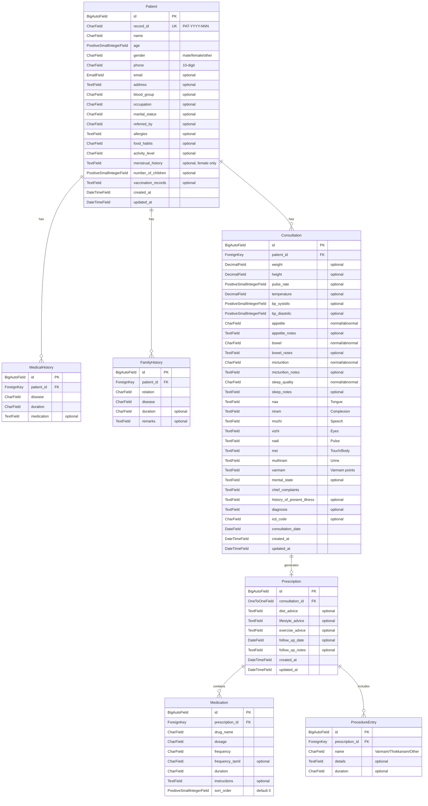

# Phase 1 Data Models & Consultation Flow

## Overview

Implement the Django backend for Phase 1: data models, serializers, viewsets, URLs, and admin configuration for three apps — **patients**, **consultations**, **prescriptions**. This powers the core Siddha consultation flow: register patient, conduct consultation with Envagai Thervu diagnostics, build and print prescription.

The backend is already scaffolded with empty apps, DRF configured (JWT auth, pagination, filtering, OpenAPI), and URL routing wired up. This plan fills in the implementation.

## Problem Statement / Motivation

The backend apps contain placeholder comments — no models, no API endpoints. The frontend UI plan (already written) depends on these APIs:

- `POST/GET /api/v1/patients/` — register and search patients
- `POST/GET /api/v1/consultations/` — create and list consultations
- `POST/GET /api/v1/prescriptions/` — build prescriptions with nested medications/procedures

Without these, the frontend has nothing to talk to.

## ERD — Phase 1 Data Model



## Proposed Solution

### API Endpoint Summary

| Method | Endpoint | Description |
|--------|----------|-------------|
| `GET` | `/api/v1/patients/` | List patients (paginated, searchable by name/phone/record_id) |
| `POST` | `/api/v1/patients/` | Register new patient (with nested medical/family history) |
| `GET` | `/api/v1/patients/{id}/` | Patient detail with visit history |
| `PUT/PATCH` | `/api/v1/patients/{id}/` | Update patient info |
| `GET` | `/api/v1/patients/{id}/consultations/` | All consultations for a patient |
| `GET` | `/api/v1/consultations/` | List recent consultations |
| `POST` | `/api/v1/consultations/` | Create consultation (requires patient_id) |
| `GET` | `/api/v1/consultations/{id}/` | Consultation detail |
| `PUT/PATCH` | `/api/v1/consultations/{id}/` | Update consultation |
| `GET` | `/api/v1/prescriptions/` | List prescriptions |
| `POST` | `/api/v1/prescriptions/` | Create prescription with nested medications/procedures |
| `GET` | `/api/v1/prescriptions/{id}/` | Prescription detail |
| `PUT/PATCH` | `/api/v1/prescriptions/{id}/` | Update prescription |
| `GET` | `/api/v1/prescriptions/{id}/pdf/` | Generate prescription PDF |
| `GET` | `/api/v1/dashboard/stats/` | Dashboard stats (today's patients, pending consults, follow-ups) |

### Architecture Decisions

1. **Nested writable serializers** for Patient (medical/family history) and Prescription (medications/procedures) — DRF handles create/update with nested data
2. **Auto-generated `record_id`** via `save()` override — format: `PAT-{year}-{sequential_number:03d}`
3. **OneToOne** between Consultation and Prescription — a consultation generates at most one prescription
4. **General assessment** (appetite, bowel, etc.) stored as `CharField` with choices + separate `_notes` TextField — supports the Normal/Abnormal toggle + optional notes pattern from the UI
5. **Sort order** on Medication to preserve display order
6. **Soft filtering by patient** on consultations via `?patient=<id>` query parameter
7. **PDF generation** as a custom viewset action (`@action(detail=True)`) using WeasyPrint

## Implementation Phases

### Phase A: Patient Models, Serializers, Viewsets

**Goal:** Full CRUD for patients including nested medical/family history.

**Files to modify:**

| File | Action |
|------|--------|
| `backend/patients/models.py` | Create Patient, MedicalHistory, FamilyHistory models |
| `backend/patients/serializers.py` | Create PatientListSerializer, PatientDetailSerializer (nested write) |
| `backend/patients/views.py` | Create PatientViewSet with search/filter |
| `backend/patients/urls.py` | Wire up router |
| `backend/patients/admin.py` | Register with inline history tables |

**Patient model details:**

```python
# backend/patients/models.py

class Patient(models.Model):
    GENDER_CHOICES = [("male", "Male"), ("female", "Female"), ("other", "Other")]
    BLOOD_GROUP_CHOICES = [
        ("A+", "A+"), ("A-", "A-"), ("B+", "B+"), ("B-", "B-"),
        ("AB+", "AB+"), ("AB-", "AB-"), ("O+", "O+"), ("O-", "O-"),
    ]
    FOOD_HABITS_CHOICES = [
        ("vegetarian", "Vegetarian"),
        ("non_vegetarian", "Non-Vegetarian"),
        ("vegan", "Vegan"),
    ]
    ACTIVITY_LEVEL_CHOICES = [
        ("sedentary", "Sedentary"),
        ("moderate", "Moderate"),
        ("active", "Active"),
    ]
    MARITAL_STATUS_CHOICES = [
        ("single", "Single"), ("married", "Married"),
        ("widowed", "Widowed"), ("divorced", "Divorced"),
    ]

    record_id = models.CharField(max_length=20, unique=True, editable=False)
    name = models.CharField(max_length=255)
    age = models.PositiveSmallIntegerField()
    gender = models.CharField(max_length=10, choices=GENDER_CHOICES)
    phone = models.CharField(max_length=15)
    email = models.EmailField(blank=True, default="")
    address = models.TextField(blank=True, default="")
    blood_group = models.CharField(max_length=5, blank=True, default="", choices=BLOOD_GROUP_CHOICES)
    occupation = models.CharField(max_length=100, blank=True, default="")
    marital_status = models.CharField(max_length=20, blank=True, default="", choices=MARITAL_STATUS_CHOICES)
    referred_by = models.CharField(max_length=255, blank=True, default="")
    allergies = models.TextField(blank=True, default="")
    food_habits = models.CharField(max_length=20, blank=True, default="", choices=FOOD_HABITS_CHOICES)
    activity_level = models.CharField(max_length=20, blank=True, default="", choices=ACTIVITY_LEVEL_CHOICES)
    menstrual_history = models.TextField(blank=True, default="")
    number_of_children = models.PositiveSmallIntegerField(null=True, blank=True)
    vaccination_records = models.TextField(blank=True, default="")
    created_at = models.DateTimeField(auto_now_add=True)
    updated_at = models.DateTimeField(auto_now=True)

    class Meta:
        ordering = ["-created_at"]

    def save(self, *args, **kwargs):
        if not self.record_id:
            year = timezone.now().year
            last = Patient.objects.filter(
                record_id__startswith=f"PAT-{year}-"
            ).order_by("-record_id").first()
            if last:
                last_num = int(last.record_id.split("-")[-1])
                self.record_id = f"PAT-{year}-{last_num + 1:03d}"
            else:
                self.record_id = f"PAT-{year}-001"
        super().save(*args, **kwargs)

    def __str__(self):
        return f"{self.name} ({self.record_id})"
```

**Serializer — nested writable pattern:**

```python
# backend/patients/serializers.py

class MedicalHistorySerializer(serializers.ModelSerializer):
    class Meta:
        model = MedicalHistory
        fields = ["id", "disease", "duration", "medication"]

class FamilyHistorySerializer(serializers.ModelSerializer):
    class Meta:
        model = FamilyHistory
        fields = ["id", "relation", "disease", "duration", "remarks"]

class PatientListSerializer(serializers.ModelSerializer):
    """Lightweight serializer for list views."""
    consultation_count = serializers.IntegerField(read_only=True)
    last_visit = serializers.DateField(read_only=True)

    class Meta:
        model = Patient
        fields = [
            "id", "record_id", "name", "age", "gender", "phone",
            "consultation_count", "last_visit", "created_at",
        ]

class PatientDetailSerializer(serializers.ModelSerializer):
    """Full serializer with nested medical/family history (writable)."""
    medical_history = MedicalHistorySerializer(many=True, required=False)
    family_history = FamilyHistorySerializer(many=True, required=False)

    class Meta:
        model = Patient
        fields = "__all__"
        read_only_fields = ["record_id", "created_at", "updated_at"]

    def create(self, validated_data):
        medical_history_data = validated_data.pop("medical_history", [])
        family_history_data = validated_data.pop("family_history", [])
        patient = Patient.objects.create(**validated_data)
        for mh in medical_history_data:
            MedicalHistory.objects.create(patient=patient, **mh)
        for fh in family_history_data:
            FamilyHistory.objects.create(patient=patient, **fh)
        return patient

    def update(self, instance, validated_data):
        medical_history_data = validated_data.pop("medical_history", None)
        family_history_data = validated_data.pop("family_history", None)
        instance = super().update(instance, validated_data)
        if medical_history_data is not None:
            instance.medical_history.all().delete()
            for mh in medical_history_data:
                MedicalHistory.objects.create(patient=instance, **mh)
        if family_history_data is not None:
            instance.family_history.all().delete()
            for fh in family_history_data:
                FamilyHistory.objects.create(patient=instance, **fh)
        return instance
```

**ViewSet:**

```python
# backend/patients/views.py

class PatientViewSet(viewsets.ModelViewSet):
    queryset = Patient.objects.annotate(
        consultation_count=Count("consultations"),
        last_visit=Max("consultations__consultation_date"),
    )
    filterset_fields = ["gender", "blood_group"]
    search_fields = ["name", "phone", "record_id"]
    ordering_fields = ["name", "created_at", "age"]
    ordering = ["-created_at"]

    def get_serializer_class(self):
        if self.action == "list":
            return PatientListSerializer
        return PatientDetailSerializer

    @action(detail=True, methods=["get"])
    def consultations(self, request, pk=None):
        """List all consultations for this patient."""
        patient = self.get_object()
        consultations = patient.consultations.all().order_by("-consultation_date")
        serializer = ConsultationListSerializer(consultations, many=True)
        return Response(serializer.data)
```

**Admin with inlines:**

```python
# backend/patients/admin.py

class MedicalHistoryInline(admin.TabularInline):
    model = MedicalHistory
    extra = 1

class FamilyHistoryInline(admin.TabularInline):
    model = FamilyHistory
    extra = 1

@admin.register(Patient)
class PatientAdmin(admin.ModelAdmin):
    list_display = ["record_id", "name", "age", "gender", "phone", "created_at"]
    list_filter = ["gender", "blood_group", "created_at"]
    search_fields = ["name", "phone", "record_id"]
    readonly_fields = ["record_id", "created_at", "updated_at"]
    inlines = [MedicalHistoryInline, FamilyHistoryInline]
```

**Success criteria:**
- [x] `POST /api/v1/patients/` creates a patient with auto-generated `record_id`
- [x] Nested medical/family history creates/updates correctly
- [x] `GET /api/v1/patients/` returns paginated list with `consultation_count` and `last_visit`
- [x] Search works for name, phone, and record_id
- [x] `GET /api/v1/patients/{id}/consultations/` returns patient's consultations
- [x] Django admin shows patients with inline history tables
- [x] `record_id` auto-increments per year (PAT-2026-001, PAT-2026-002...)

---

### Phase B: Consultation Models, Serializers, Viewsets

**Goal:** Full CRUD for Siddha consultations with Envagai Thervu diagnostics.

**Files to modify:**

| File | Action |
|------|--------|
| `backend/consultations/models.py` | Create Consultation model |
| `backend/consultations/serializers.py` | Create ConsultationListSerializer, ConsultationDetailSerializer |
| `backend/consultations/views.py` | Create ConsultationViewSet |
| `backend/consultations/urls.py` | Wire up router |
| `backend/consultations/admin.py` | Register with grouped fieldsets |

**Consultation model details:**

```python
# backend/consultations/models.py

class Consultation(models.Model):
    ASSESSMENT_CHOICES = [("normal", "Normal"), ("abnormal", "Abnormal")]

    patient = models.ForeignKey(
        "patients.Patient", on_delete=models.CASCADE, related_name="consultations"
    )

    # Vitals
    weight = models.DecimalField(max_digits=5, decimal_places=2, null=True, blank=True)
    height = models.DecimalField(max_digits=5, decimal_places=2, null=True, blank=True)
    pulse_rate = models.PositiveSmallIntegerField(null=True, blank=True)
    temperature = models.DecimalField(max_digits=4, decimal_places=1, null=True, blank=True)
    bp_systolic = models.PositiveSmallIntegerField(null=True, blank=True)
    bp_diastolic = models.PositiveSmallIntegerField(null=True, blank=True)

    # General Assessment
    appetite = models.CharField(max_length=10, blank=True, default="", choices=ASSESSMENT_CHOICES)
    appetite_notes = models.TextField(blank=True, default="")
    bowel = models.CharField(max_length=10, blank=True, default="", choices=ASSESSMENT_CHOICES)
    bowel_notes = models.TextField(blank=True, default="")
    micturition = models.CharField(max_length=10, blank=True, default="", choices=ASSESSMENT_CHOICES)
    micturition_notes = models.TextField(blank=True, default="")
    sleep_quality = models.CharField(max_length=10, blank=True, default="", choices=ASSESSMENT_CHOICES)
    sleep_notes = models.TextField(blank=True, default="")

    # Envagai Thervu (8 Diagnostic Tools)
    naa = models.TextField(blank=True, default="", help_text="Tongue examination")
    niram = models.TextField(blank=True, default="", help_text="Complexion")
    mozhi = models.TextField(blank=True, default="", help_text="Speech")
    vizhi = models.TextField(blank=True, default="", help_text="Eyes")
    nadi = models.TextField(blank=True, default="", help_text="Pulse - Prakruti, Vikruti, Upadosham")
    mei = models.TextField(blank=True, default="", help_text="Touch/Body - heat, cold, normal")
    muthiram = models.TextField(blank=True, default="", help_text="Urine - Neerkuri, Neikuri")
    varmam = models.TextField(blank=True, default="", help_text="Varmam points assessment")
    mental_state = models.TextField(blank=True, default="", help_text="Attitude/mental state observations")

    # Diagnosis
    chief_complaints = models.TextField(blank=True, default="")
    history_of_present_illness = models.TextField(blank=True, default="")
    diagnosis = models.TextField(blank=True, default="")
    icd_code = models.CharField(max_length=20, blank=True, default="")

    consultation_date = models.DateField()
    created_at = models.DateTimeField(auto_now_add=True)
    updated_at = models.DateTimeField(auto_now=True)

    class Meta:
        ordering = ["-consultation_date", "-created_at"]

    def __str__(self):
        return f"Consultation for {self.patient.name} on {self.consultation_date}"
```

**Key serializer patterns:**

```python
# backend/consultations/serializers.py

class ConsultationListSerializer(serializers.ModelSerializer):
    """Lightweight — used in lists and patient detail timeline."""
    patient_name = serializers.CharField(source="patient.name", read_only=True)
    patient_record_id = serializers.CharField(source="patient.record_id", read_only=True)
    has_prescription = serializers.BooleanField(read_only=True)

    class Meta:
        model = Consultation
        fields = [
            "id", "patient", "patient_name", "patient_record_id",
            "consultation_date", "diagnosis", "has_prescription", "created_at",
        ]

class ConsultationDetailSerializer(serializers.ModelSerializer):
    """Full serializer with all Envagai Thervu fields."""
    patient_name = serializers.CharField(source="patient.name", read_only=True)
    patient_record_id = serializers.CharField(source="patient.record_id", read_only=True)

    class Meta:
        model = Consultation
        fields = "__all__"
        read_only_fields = ["created_at", "updated_at"]
```

**ViewSet:**

```python
# backend/consultations/views.py

class ConsultationViewSet(viewsets.ModelViewSet):
    queryset = Consultation.objects.select_related("patient").annotate(
        has_prescription=Exists(Prescription.objects.filter(consultation=OuterRef("pk")))
    )
    filterset_fields = ["patient", "consultation_date"]
    search_fields = ["patient__name", "patient__record_id", "diagnosis"]
    ordering_fields = ["consultation_date", "created_at"]
    ordering = ["-consultation_date"]

    def get_serializer_class(self):
        if self.action == "list":
            return ConsultationListSerializer
        return ConsultationDetailSerializer
```

**Admin with grouped fieldsets:**

```python
# backend/consultations/admin.py

@admin.register(Consultation)
class ConsultationAdmin(admin.ModelAdmin):
    list_display = ["patient", "consultation_date", "diagnosis", "created_at"]
    list_filter = ["consultation_date"]
    search_fields = ["patient__name", "patient__record_id", "diagnosis"]
    date_hierarchy = "consultation_date"
    fieldsets = [
        ("Patient", {"fields": ["patient", "consultation_date"]}),
        ("Vitals", {"fields": ["weight", "height", "pulse_rate", "temperature", "bp_systolic", "bp_diastolic"]}),
        ("General Assessment", {"fields": [
            "appetite", "appetite_notes", "bowel", "bowel_notes",
            "micturition", "micturition_notes", "sleep_quality", "sleep_notes",
        ]}),
        ("Envagai Thervu", {"fields": [
            "naa", "niram", "mozhi", "vizhi", "nadi", "mei", "muthiram", "varmam", "mental_state",
        ]}),
        ("Diagnosis", {"fields": ["chief_complaints", "history_of_present_illness", "diagnosis", "icd_code"]}),
    ]
```

**Success criteria:**
- [x] `POST /api/v1/consultations/` creates consultation linked to patient
- [x] `GET /api/v1/consultations/` returns paginated list with `has_prescription` flag
- [x] Filter by `?patient=<id>` works
- [x] Search by patient name, record_id, or diagnosis
- [x] Admin shows grouped fieldsets matching the consultation form sections
- [x] `select_related("patient")` avoids N+1 on list views

---

### Phase C: Prescription Models, Serializers, Viewsets

**Goal:** Full CRUD for prescriptions with nested medications and procedures, plus PDF generation.

**Files to modify:**

| File | Action |
|------|--------|
| `backend/prescriptions/models.py` | Create Prescription, Medication, ProcedureEntry models |
| `backend/prescriptions/serializers.py` | Create serializers with nested writable medications/procedures |
| `backend/prescriptions/views.py` | Create PrescriptionViewSet with PDF action |
| `backend/prescriptions/urls.py` | Wire up router |
| `backend/prescriptions/admin.py` | Register with inlines |
| `backend/prescriptions/pdf.py` | PDF generation service using WeasyPrint |
| `backend/prescriptions/templates/prescriptions/pdf.html` | HTML template for prescription PDF |

**Prescription model details:**

```python
# backend/prescriptions/models.py

class Prescription(models.Model):
    consultation = models.OneToOneField(
        "consultations.Consultation", on_delete=models.CASCADE, related_name="prescription"
    )
    diet_advice = models.TextField(blank=True, default="")
    lifestyle_advice = models.TextField(blank=True, default="")
    exercise_advice = models.TextField(blank=True, default="")
    follow_up_date = models.DateField(null=True, blank=True)
    follow_up_notes = models.TextField(blank=True, default="")
    created_at = models.DateTimeField(auto_now_add=True)
    updated_at = models.DateTimeField(auto_now=True)

    def __str__(self):
        return f"Rx for {self.consultation.patient.name} on {self.consultation.consultation_date}"


class Medication(models.Model):
    FREQUENCY_CHOICES = [
        ("OD", "Once daily / ஒரு முறை"),
        ("BD", "Twice daily / காலை-மாலை"),
        ("TDS", "Thrice daily / மூன்று முறை"),
        ("QID", "Four times daily / நான்கு முறை"),
        ("SOS", "As needed / தேவைப்படும்போது"),
        ("HS", "At bedtime / இரவு"),
    ]

    prescription = models.ForeignKey(
        Prescription, on_delete=models.CASCADE, related_name="medications"
    )
    drug_name = models.CharField(max_length=255)
    dosage = models.CharField(max_length=100)
    frequency = models.CharField(max_length=10, choices=FREQUENCY_CHOICES)
    frequency_tamil = models.CharField(max_length=100, blank=True, default="")
    duration = models.CharField(max_length=100)
    instructions = models.TextField(blank=True, default="")
    sort_order = models.PositiveSmallIntegerField(default=0)

    class Meta:
        ordering = ["sort_order", "id"]

    def __str__(self):
        return f"{self.drug_name} - {self.dosage}"


class ProcedureEntry(models.Model):
    prescription = models.ForeignKey(
        Prescription, on_delete=models.CASCADE, related_name="procedures"
    )
    name = models.CharField(max_length=255)
    details = models.TextField(blank=True, default="")
    duration = models.CharField(max_length=100, blank=True, default="")

    class Meta:
        verbose_name_plural = "Procedure entries"

    def __str__(self):
        return self.name
```

**Nested writable serializer:**

```python
# backend/prescriptions/serializers.py

class MedicationSerializer(serializers.ModelSerializer):
    class Meta:
        model = Medication
        fields = ["id", "drug_name", "dosage", "frequency", "frequency_tamil", "duration", "instructions", "sort_order"]

class ProcedureEntrySerializer(serializers.ModelSerializer):
    class Meta:
        model = ProcedureEntry
        fields = ["id", "name", "details", "duration"]

class PrescriptionListSerializer(serializers.ModelSerializer):
    patient_name = serializers.CharField(source="consultation.patient.name", read_only=True)
    patient_record_id = serializers.CharField(source="consultation.patient.record_id", read_only=True)
    consultation_date = serializers.DateField(source="consultation.consultation_date", read_only=True)
    medication_count = serializers.IntegerField(read_only=True)

    class Meta:
        model = Prescription
        fields = [
            "id", "consultation", "patient_name", "patient_record_id",
            "consultation_date", "follow_up_date", "medication_count", "created_at",
        ]

class PrescriptionDetailSerializer(serializers.ModelSerializer):
    medications = MedicationSerializer(many=True, required=False)
    procedures = ProcedureEntrySerializer(many=True, required=False)
    patient_name = serializers.CharField(source="consultation.patient.name", read_only=True)
    patient_record_id = serializers.CharField(source="consultation.patient.record_id", read_only=True)

    class Meta:
        model = Prescription
        fields = "__all__"
        read_only_fields = ["created_at", "updated_at"]

    def create(self, validated_data):
        medications_data = validated_data.pop("medications", [])
        procedures_data = validated_data.pop("procedures", [])
        prescription = Prescription.objects.create(**validated_data)
        for med in medications_data:
            Medication.objects.create(prescription=prescription, **med)
        for proc in procedures_data:
            ProcedureEntry.objects.create(prescription=prescription, **proc)
        return prescription

    def update(self, instance, validated_data):
        medications_data = validated_data.pop("medications", None)
        procedures_data = validated_data.pop("procedures", None)
        instance = super().update(instance, validated_data)
        if medications_data is not None:
            instance.medications.all().delete()
            for med in medications_data:
                Medication.objects.create(prescription=instance, **med)
        if procedures_data is not None:
            instance.procedures.all().delete()
            for proc in procedures_data:
                ProcedureEntry.objects.create(prescription=instance, **proc)
        return instance
```

**ViewSet with PDF action:**

```python
# backend/prescriptions/views.py

class PrescriptionViewSet(viewsets.ModelViewSet):
    queryset = Prescription.objects.select_related(
        "consultation", "consultation__patient"
    ).annotate(
        medication_count=Count("medications"),
    )
    filterset_fields = ["consultation__patient", "follow_up_date"]
    search_fields = ["consultation__patient__name", "consultation__patient__record_id"]
    ordering = ["-created_at"]

    def get_serializer_class(self):
        if self.action == "list":
            return PrescriptionListSerializer
        return PrescriptionDetailSerializer

    @action(detail=True, methods=["get"])
    def pdf(self, request, pk=None):
        """Generate prescription PDF via WeasyPrint."""
        prescription = self.get_object()
        pdf_bytes = generate_prescription_pdf(prescription)
        response = HttpResponse(pdf_bytes, content_type="application/pdf")
        filename = f"rx-{prescription.consultation.patient.record_id}-{prescription.consultation.consultation_date}.pdf"
        response["Content-Disposition"] = f'inline; filename="{filename}"'
        return response
```

**PDF service (WeasyPrint):**

```python
# backend/prescriptions/pdf.py

from django.template.loader import render_to_string
from weasyprint import HTML

def generate_prescription_pdf(prescription):
    """Render prescription as bilingual PDF (Tamil + English)."""
    context = {
        "prescription": prescription,
        "patient": prescription.consultation.patient,
        "consultation": prescription.consultation,
        "medications": prescription.medications.all(),
        "procedures": prescription.procedures.all(),
    }
    html_string = render_to_string("prescriptions/pdf.html", context)
    return HTML(string=html_string).write_pdf()
```

**Success criteria:**
- [x] `POST /api/v1/prescriptions/` creates prescription with nested medications and procedures
- [x] `OneToOneField` prevents duplicate prescriptions per consultation
- [x] Medication `sort_order` preserves display order
- [x] `GET /api/v1/prescriptions/{id}/pdf/` returns a valid PDF
- [x] PDF includes clinic header, patient info, medications table, procedures, advice
- [x] Frequency choices include Tamil translations
- [x] Update replaces nested items (delete-and-recreate pattern)

---

### Phase D: Dashboard Stats Endpoint

**Goal:** Single endpoint powering the dashboard widget cards.

**Files to create:**

| File | Action |
|------|--------|
| `backend/config/views.py` | Add dashboard_stats view (extend existing file with health_check) |
| `backend/config/urls.py` | Add dashboard stats URL |

**Implementation:**

```python
# Added to backend/config/views.py

@api_view(["GET"])
@permission_classes([IsAuthenticated])
def dashboard_stats(request):
    today = timezone.now().date()
    week_start = today - timedelta(days=today.weekday())

    return Response({
        "today_patients": Consultation.objects.filter(consultation_date=today).values("patient").distinct().count(),
        "week_patients": Consultation.objects.filter(consultation_date__gte=week_start).values("patient").distinct().count(),
        "pending_prescriptions": Consultation.objects.filter(
            consultation_date=today, prescription__isnull=True
        ).count(),
        "follow_ups_due": Prescription.objects.filter(follow_up_date=today).count(),
        "total_patients": Patient.objects.count(),
    })
```

**Success criteria:**
- [x] `GET /api/v1/dashboard/stats/` returns JSON with 5 metrics
- [x] Counts are accurate for today and this week
- [x] Pending prescriptions = consultations today without a prescription
- [x] Follow-ups due = prescriptions with follow_up_date = today

---

### Phase E: Migrations, Seed Data, Testing

**Goal:** Generate and run migrations, create seed data for development, write basic tests.

**Tasks:**

| Task | Details |
|------|---------|
| Generate migrations | `python manage.py makemigrations patients consultations prescriptions` |
| Run migrations | `python manage.py migrate` |
| Create seed management command | `backend/patients/management/commands/seed_data.py` — creates 5-10 sample patients with consultations and prescriptions |
| Verify API docs | Check `http://localhost:8000/api/docs/` shows all new endpoints via drf-spectacular |
| Basic model tests | Test `record_id` auto-generation, nested serializer create/update, PDF generation |

**Seed data command:**

```python
# backend/patients/management/commands/seed_data.py

class Command(BaseCommand):
    help = "Create sample data for development"

    def handle(self, *args, **options):
        # Creates 5 patients with Tamil names
        # 2-3 consultations each with varying Envagai Thervu data
        # 1-2 prescriptions with medications and procedures
        # Outputs record_ids for quick testing
```

**Success criteria:**
- [x] All migrations apply cleanly on a fresh database
- [x] `seed_data` command creates realistic sample data
- [x] OpenAPI schema at `/api/docs/` shows all endpoints correctly
- [x] `python manage.py test` passes with basic model and API tests
- [x] No migration conflicts between apps

## Technical Considerations

### Record ID Race Condition

The `save()` override for `record_id` generation has a race condition under concurrent writes. For Phase 1 (single doctor, low traffic) this is fine. If needed later, use `SELECT ... FOR UPDATE` or a database sequence.

### Nested Serializer Update Strategy

Using "delete-and-recreate" for nested medical history and medications on update. This is simpler than diffing individual rows and acceptable for Phase 1 where these lists are small (< 20 items). The trade-off: IDs of nested items change on update. The frontend should not rely on medication/history IDs being stable across edits.

### PDF Generation Performance

WeasyPrint is synchronous and can take 1-2 seconds for PDF generation. For Phase 1, this runs inline in the request. If it becomes slow, move to Django-Q2 async task (already in requirements) with a polling/websocket pattern.

### Database Indexes

DRF's `SearchFilter` performs `LIKE` queries on `search_fields`. For good performance:
- `record_id` — already unique (indexed)
- `phone` — add `db_index=True` on Patient model
- `consultation_date` — add `db_index=True` on Consultation model

### Envagai Thervu Data Structure

Storing each diagnostic tool (naa, niram, etc.) as `TextField` keeps things simple. The UI sends structured notes as text. If we later need structured sub-fields (e.g., tongue color, coating, texture as separate fields), we can either:
1. Add `JSONField` per diagnostic tool
2. Create a separate model per tool

For Phase 1, plain text is sufficient — matches how doctors write it on paper.

## Acceptance Criteria

### Functional Requirements

- [x] Full CRUD for patients with nested medical/family history
- [x] Auto-generated `record_id` in PAT-YYYY-NNN format
- [x] Patient search by name, phone, or record_id
- [x] Full CRUD for consultations linked to patients
- [x] All Envagai Thervu fields captured per consultation
- [x] General assessment with Normal/Abnormal + notes pattern
- [x] Full CRUD for prescriptions with nested medications and procedures
- [x] OneToOne constraint: one prescription per consultation
- [x] Bilingual medication frequency choices
- [x] PDF prescription generation via WeasyPrint
- [x] Dashboard stats endpoint with 5 metrics
- [x] Django admin configured for all models with sensible fieldsets

### Non-Functional Requirements

- [x] All list endpoints paginated (20 per page, per existing DRF config)
- [x] `select_related` / `prefetch_related` on all querysets to prevent N+1
- [x] All endpoints behind JWT authentication
- [x] OpenAPI schema auto-generated by drf-spectacular
- [x] Database indexes on phone and consultation_date

### Quality Gates

- [x] All migrations apply cleanly
- [x] `python manage.py check` passes with no warnings
- [x] `python manage.py test` passes
- [x] No circular imports between apps

## Dependencies & Prerequisites

| Dependency | Status | Notes |
|-----------|--------|-------|
| Django 5 + DRF | Installed | In requirements.txt, venv created |
| PostgreSQL | Configured | Settings point to local DB |
| WeasyPrint | Installed | In requirements.txt, needs system deps (cairo, pango) |
| drf-spectacular | Installed | Already configured in settings |
| django-filter | Installed | Already configured in DRF settings |
| JWT auth | Configured | simplejwt in settings, needs token obtain URLs |

**Missing: JWT token endpoints.** The auth URLs (`/api/v1/auth/token/`, `/api/v1/auth/token/refresh/`) are not yet wired up. Need to add these so the frontend can authenticate. Add to `config/urls.py`:

```python
from rest_framework_simplejwt.views import TokenObtainPairView, TokenRefreshView

urlpatterns += [
    path("api/v1/auth/token/", TokenObtainPairView.as_view(), name="token_obtain_pair"),
    path("api/v1/auth/token/refresh/", TokenRefreshView.as_view(), name="token_refresh"),
]
```

## Risk Analysis

| Risk | Likelihood | Impact | Mitigation |
|------|-----------|--------|------------|
| WeasyPrint system deps missing | Medium | Blocks PDF | Document cairo/pango install in README; test early |
| Record ID race condition | Low (single user) | Duplicate IDs | Acceptable for Phase 1; add DB sequence if needed |
| Nested serializer complexity | Low | Bugs on update | Delete-and-recreate is simple; test thoroughly |
| Tamil font in PDF | Medium | Garbled text | Install Noto Sans Tamil; test with actual Tamil content |

## References

### Internal

- PRD: [siddha-clinic-prd.md](../../siddha-clinic-prd.md) — modules 1-3 define the data model
- UI Plan: [docs/plans/2026-02-16-feat-phase1-clinic-ui-plan.md](2026-02-16-feat-phase1-clinic-ui-plan.md) — ERD, TypeScript types, API patterns
- DRF config: [backend/config/settings/base.py](../../backend/config/settings/base.py) — REST_FRAMEWORK settings
- URL routing: [backend/config/urls.py](../../backend/config/urls.py) — already wired to empty apps
- Requirements: [backend/requirements.txt](../../backend/requirements.txt) — all dependencies listed

### Conventions

- DRF ViewSets with routers (not function-based views)
- Separate list/detail serializers for performance
- `related_name` on all ForeignKey fields
- `blank=True, default=""` for optional text fields (not `null=True`)
- `null=True, blank=True` only for optional numeric/date fields
- `auto_now_add` / `auto_now` for timestamp fields
