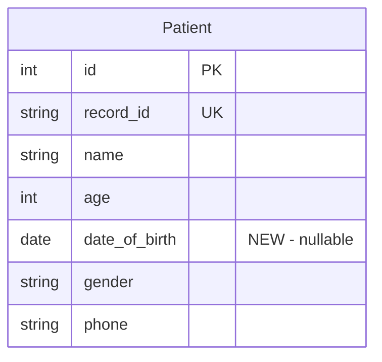

# Phase 1 Polish — DOB, Patient Edit, Validation, Dashboard, Workflow

## Overview

Six focused improvements to complete Phase 1 before moving to Phase 2. These fix dealbreakers for real clinic use: the doctor can't edit patient info after creation, age becomes stale without DOB, duplicate patients pollute data, and the consultation-to-prescription workflow has dead ends.

## Problem Statement

1. **No patient editing** — typos in name, address, or phone can't be corrected after registration
2. **Age is static** — entered manually, never updates. A 45-year-old registered a year ago still shows 45
3. **No duplicate detection** — same phone can create duplicate patient records (but must allow family sharing)
4. **Dashboard is generic** — no recent patients, "Start Consultation" link doesn't help the doctor's workflow
5. **Post-consultation dead end** — after saving a consultation, no clear path to write the prescription
6. **Backend validation gaps** — phone format and age range not validated server-side; API errors not surfaced

## Proposed Solution

Six changes, ordered by dependency and isolation (can be implemented as separate PRs):

1. DOB + Auto-Age (backend migration + frontend form)
2. Patient Edit Page (frontend route + form refactor)
3. Duplicate Phone Warning (backend endpoint + frontend inline check)
4. Dashboard Recent Patients (backend query + frontend list)
5. Consultation-to-Prescription Flow (frontend routing improvements)
6. Backend Validation + Error Display (serializer validators + frontend error handling)

---

## Technical Approach

### Phase 1: DOB + Auto-Age Calculation

**Backend Changes:**

`backend/patients/models.py` — Add field + computed property:
```python
# New field on Patient model
date_of_birth = models.DateField(null=True, blank=True)

# Computed property
@property
def calculated_age(self):
    if self.date_of_birth:
        today = timezone.now().date()
        dob = self.date_of_birth
        return today.year - dob.year - ((today.month, today.day) < (dob.month, dob.day))
    return self.age
```

`backend/patients/serializers.py` — Expose computed age:
```python
class PatientDetailSerializer(serializers.ModelSerializer):
    calculated_age = serializers.IntegerField(read_only=True)
    # ... existing fields ...
```

- [x]Add `date_of_birth` field to Patient model
- [x]Add `calculated_age` property that returns DOB-based age when available, manual `age` otherwise
- [x]Expose `calculated_age` in both PatientDetailSerializer and PatientListSerializer
- [x]Create migration: `0002_add_date_of_birth.py`
- [x]Keep `age` field required for backward compatibility (patients without DOB)

**Frontend Changes:**

`frontend/src/components/patients/PatientForm.tsx`:
- [x]Add date picker for DOB field in "Basic Information" section
- [x]When DOB is entered, auto-calculate age and fill the age field (make age readonly when DOB is present)
- [x]When DOB is cleared, re-enable manual age entry
- [x]Age calculation: `Math.floor((Date.now() - new Date(dob)) / (365.25 * 24 * 60 * 60 * 1000))`

`frontend/src/lib/types.ts`:
- [x]Add `date_of_birth: string | null` to Patient type
- [x]Add `calculated_age: number` to Patient and PatientListItem types
- [x]Add `date_of_birth: string` to PatientFormState

**Edge Cases:**
- Patient born on Feb 29 — age calculation handles via `< (dob.month, dob.day)` tuple comparison
- No DOB entered — `calculated_age` falls back to manual `age` field
- Future DOB entered — frontend validation: DOB must be in the past

**ERD Change:**


---

### Phase 2: Patient Edit Page

**Pattern to Follow:** `frontend/src/app/consultations/[id]/edit/page.tsx` (lines 1-112) — exact same pattern: fetch data, convert numeric-to-string, pass `mode="edit"` and `initialData` to form.

**Frontend Changes:**

`frontend/src/components/patients/PatientForm.tsx` — Refactor to accept edit mode:
- [x]Add props: `mode?: "create" | "edit"`, `patientId?: number`, `initialData?: Partial<PatientFormState>`
- [x]Initialize form state from `initialData` when in edit mode
- [x]Use `PATCH` for edit, `POST` for create (via useMutation hook)
- [x]Omit `record_id` from PATCH payload (read-only)
- [x]Change submit button text: "Register Patient" vs "Save Changes"
- [x]Navigate to `/patients/[id]` on successful save (both modes)

**Gotcha from learnings:** Numeric-to-string conversion required. API returns `age: 45` (number), form needs `age: "45"` (string). Apply `String(field || "")` conversion in the edit page, matching the consultation edit pattern.

`frontend/src/app/patients/[id]/edit/page.tsx` — New page (create):
- [x]Fetch patient data via `api.get<Patient>(/patients/${id}/)`
- [x]Convert API response to PatientFormState (numbers to strings, nulls to empty strings)
- [x]Convert medical_history/family_history arrays: strip `id` field, keep data
- [x]Render PatientForm with `mode="edit"` and `initialData`
- [x]Show loading spinner and error state (same pattern as consultation edit)

`frontend/src/app/patients/[id]/page.tsx` — Add Edit button:
- [x]Add "Edit" button next to "New Consultation" in the quick actions bar
- [x]Style: secondary button with Pencil icon (matching consultation detail page pattern)

**Draft key namespacing** (from learnings):
- Create mode: `patient-draft-new`
- Edit mode: `patient-draft-edit-${patientId}`

---

### Phase 3: Duplicate Phone Number Warning

**Backend Changes:**

`backend/patients/views.py` — Add phone check endpoint:
- [x]Add `@action(detail=False, methods=["get"])` endpoint: `check_phone`
- [x]Accept `?phone=XXXXXXXXXX` query parameter
- [x]Return list of patients matching that phone: `[{id, name, record_id}]`
- [x]Return empty list if no match

```python
@action(detail=False, methods=["get"])
def check_phone(self, request):
    phone = request.query_params.get("phone", "")
    if len(phone) < 10:
        return Response([])
    matches = Patient.objects.filter(phone=phone).values("id", "name", "record_id")[:5]
    return Response(list(matches))
```

**Frontend Changes:**

`frontend/src/components/patients/PatientForm.tsx`:
- [x]Add debounced phone check (500ms delay) when phone field has 10 digits
- [x]Call `GET /api/v1/patients/check_phone/?phone=XXXXXXXXXX`
- [x]Show inline warning below phone field when matches found:
  - Yellow warning banner with patient names and links
  - "This phone number is registered for: **[Name]** (PAT-2026-001). [View patient →]"
  - "If this is a different person (e.g., family member), you can continue."
- [x]Warning is informational only — does NOT block form submission
- [x]In edit mode, exclude the current patient from duplicate results (pass `?exclude=${patientId}`)

**Edge Cases:**
- User types slowly — debounce prevents excessive API calls
- Multiple matches — show all (up to 5), e.g., "3 patients found with this number"
- Edit mode — must exclude self from results
- Partial phone number — only check when exactly 10 digits entered

---

### Phase 4: Dashboard — Recent Patients

**Backend Changes:**

`backend/config/views.py` — Extend `dashboard_stats` response:
- [x]Add `recent_patients` to the response: last 10 patients with consultations, ordered by most recent visit
- [x]Query: `Patient.objects.annotate(last_visit=Max("consultations__consultation_date")).filter(last_visit__isnull=False).order_by("-last_visit")[:10]`
- [x]Return: `[{id, name, record_id, age, last_visit, chief_complaint}]` — include the chief complaint from the latest consultation for context

**Frontend Changes:**

`frontend/src/app/page.tsx` — Add Recent Patients section:
- [x]Add "Recent Patients" card below Quick Actions
- [x]Show list of recent patients with: name, record ID, age, last visit date, latest complaint
- [x]Each row is clickable → navigates to `/patients/[id]`
- [x]If no recent patients, show "No consultations yet. Register your first patient to get started."

Fix "Start Consultation" quick action:
- [x]Change the "Start Consultation" link from `/patients` to `/patients?intent=consult`
- [x](Optional, simpler alternative): Just change the subtitle from "Select a patient first" to "Search for a patient" and keep it linking to `/patients`

**Decision:** Keep it simple — just link to `/patients` with better copy. No need for query parameter plumbing.

---

### Phase 5: Consultation-to-Prescription Flow

The consultation detail page **already handles this well** (`frontend/src/app/consultations/[id]/page.tsx:82-98`):
- Shows "Write Prescription" button when no prescription exists
- Shows "View Prescription" button when prescription exists

**Remaining gap:** After *creating* a new consultation (submit on the form), the user lands on the consultation detail page — which already shows the CTA. However, let me verify this redirect behavior:

`frontend/src/components/consultations/ConsultationForm.tsx`:
- [x]Verify that after successful POST, the form redirects to `/consultations/[id]` (the detail page with the CTA)
- [x]If it redirects elsewhere (e.g., patient detail), change to redirect to consultation detail
- [x]Add a brief success toast or banner: "Consultation saved. Ready to write the prescription?" (optional, low priority)

This phase is mostly verification — the detail page already has the right CTA pattern.

---

### Phase 6: Backend Validation + Frontend Error Display

**Backend Changes:**

`backend/patients/serializers.py` — Add validators:
- [x]Phone validation: must match `^[6-9]\d{9}$` (10-digit Indian mobile)
  ```python
  def validate_phone(self, value):
      import re
      if not re.match(r'^[6-9]\d{9}$', value):
          raise serializers.ValidationError("Enter a valid 10-digit Indian mobile number starting with 6-9.")
      return value
  ```
- [x]Age validation: 0 ≤ age ≤ 150
  ```python
  def validate_age(self, value):
      if value < 0 or value > 150:
          raise serializers.ValidationError("Age must be between 0 and 150.")
      return value
  ```
- [x]DOB validation: must be in the past
  ```python
  def validate_date_of_birth(self, value):
      if value and value > timezone.now().date():
          raise serializers.ValidationError("Date of birth cannot be in the future.")
      return value
  ```

**Frontend Changes:**

`frontend/src/hooks/useMutation.ts`:
- [x]Ensure API error responses (400, 422) are parsed and returned as field-level errors
- [x]Map DRF error format `{ "phone": ["This field must be unique."] }` to form error display

`frontend/src/components/patients/PatientForm.tsx`:
- [x]Display server-side validation errors alongside client-side errors
- [x]When API returns field errors, merge them into the `errors` state
- [x]Show non-field errors (e.g., `non_field_errors`) as a banner above the form

**Edge Cases:**
- Client validates OK but server rejects (e.g., race condition on duplicate check) — server errors must display
- Network failure — show "Unable to connect. Please check your internet connection."
- 500 server error — show generic "Something went wrong. Please try again."

---

## Acceptance Criteria

### DOB + Auto-Age
- [x]Patient registration form has an optional DOB date picker
- [x]When DOB is entered, age auto-calculates and age field becomes read-only
- [x]When DOB is cleared, age field becomes editable again
- [x]Patient detail page shows age (computed from DOB when available)
- [x]Patient list shows correct age (computed)
- [x]Existing patients without DOB continue to work (age field unchanged)

### Patient Edit
- [x]"Edit" button visible on patient detail page
- [x]Edit page loads with all current patient data pre-filled
- [x]Medical history and family history tables pre-populated
- [x]Save updates patient data via PATCH
- [x]Redirects to patient detail page after save
- [x]Cancel returns to patient detail page

### Duplicate Phone Warning
- [x]Warning appears when 10-digit phone matches existing patient(s)
- [x]Warning shows patient name(s) and links to view them
- [x]Warning does NOT block form submission
- [x]In edit mode, current patient is excluded from duplicate check
- [x]Warning disappears when phone is changed

### Dashboard
- [x]Dashboard shows "Recent Patients" list (up to 10)
- [x]Each row shows name, record ID, age, last visit date
- [x]Clicking a row navigates to patient detail
- [x]Empty state message when no consultations exist
- [x]"Start Consultation" quick action has helpful copy

### Consultation Flow
- [x]After creating a consultation, user is redirected to consultation detail page
- [x]Consultation detail page shows "Write Prescription" CTA when no prescription exists

### Validation
- [x]Server rejects invalid phone format with clear message
- [x]Server rejects age outside 0-150 range
- [x]Server rejects future DOB
- [x]Frontend displays server validation errors next to relevant fields
- [x]Network errors show user-friendly message

## Dependencies & Risks

| Risk | Mitigation |
|------|------------|
| Migration on existing data | DOB field is nullable — no data transformation needed |
| PatientForm refactor breaks create flow | Test both create and edit paths after refactor |
| Phone check endpoint performance | Index on `phone` field already exists (`db_index=True`) |
| Auto-age calculation timezone issues | Use server timezone (Django's `timezone.now()`) for backend, browser timezone for frontend |

## Files to Create/Modify

### Create:
- `frontend/src/app/patients/[id]/edit/page.tsx` — Patient edit page

### Modify:
- `backend/patients/models.py` — Add `date_of_birth` field + `calculated_age` property
- `backend/patients/serializers.py` — Add validators, expose `calculated_age` and `date_of_birth`
- `backend/patients/views.py` — Add `check_phone` action
- `backend/patients/migrations/0002_add_date_of_birth.py` — Generated migration
- `backend/config/views.py` — Add `recent_patients` to dashboard stats
- `frontend/src/components/patients/PatientForm.tsx` — Add DOB, edit mode, duplicate warning
- `frontend/src/lib/types.ts` — Add `date_of_birth`, `calculated_age` to types
- `frontend/src/app/patients/[id]/page.tsx` — Add Edit button
- `frontend/src/app/page.tsx` — Add Recent Patients section, update quick action copy
- `frontend/src/hooks/useMutation.ts` — Improve API error handling

## References & Research

### Internal References
- Consultation edit pattern: `frontend/src/app/consultations/[id]/edit/page.tsx` (numeric-to-string conversion, mode/initialData props)
- Django model conventions: `docs/solutions/implementation-patterns/django-drf-backend-patterns-siddha-clinic.md`
- Form editing patterns: `docs/solutions/ui-bugs/missing-clickable-rows-and-edit-capability.md` (draft key namespacing, FK validation guards, numeric conversion gotcha)
- Dashboard stats view: `backend/config/views.py:21-47`
- PatientViewSet: `backend/patients/views.py:10-32`

### Institutional Learnings Applied
- **Numeric-to-string conversion**: API returns numbers, React inputs need strings — convert with `String(field || "")`
- **Draft key namespacing**: Use `patient-draft-new` vs `patient-draft-edit-${id}` to prevent localStorage collisions
- **Replace-all pattern for nested data**: Already implemented in PatientDetailSerializer.update() — `None` = leave untouched, `[]` = clear all
- **Flat `api_view` for dashboard**: Keep using the existing pattern in `config/views.py` rather than forcing into a ViewSet
