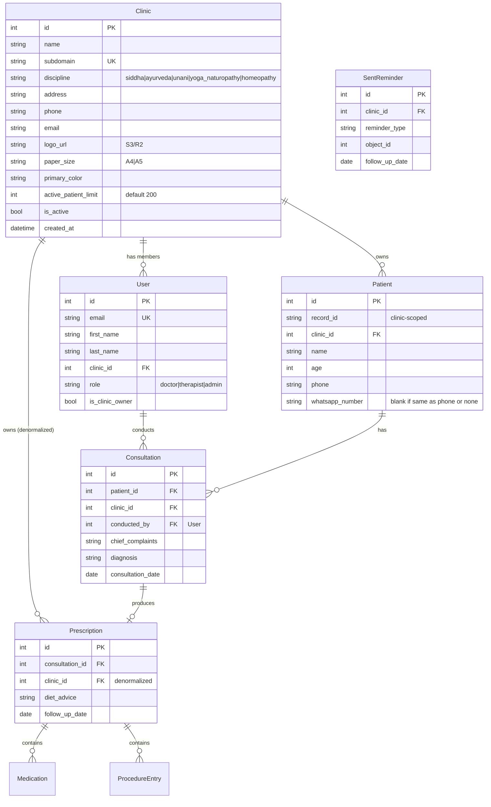

# SaaS Multi-Tenant Platform for AYUSH Disciplines

## Enhancement Summary

**Deepened on:** 2026-02-27
**Research agents used:** security-sentinel, architecture-strategist, performance-oracle, data-integrity-guardian, data-migration-expert, code-simplicity-reviewer, best-practices-researcher, framework-docs-researcher

### Key Improvements
1. **Fail-closed tenant filtering** — mixin returns `queryset.none()` when no clinic context (not all data)
2. **JWT cross-validation** — token `clinic_id` must match subdomain's clinic to prevent token reuse across tenants
3. **Composite indexes** — `(clinic_id, ...)` on all filtered/sorted columns to prevent linear degradation at scale
4. **Denormalize `clinic_id` onto Prescription** — eliminates 3-4 table joins for prescription/follow-up queries
5. **Safer record ID generation** — lock clinic row (not patient rows), wrap in `transaction.atomic`, use 4-digit padding
6. **Cache middleware subdomain lookup** — eliminates 1 DB query per request
7. **YAGNI: defer Phases 5-6** — multi-discipline forms and billing are premature with zero paying clinics
8. **Dev mode: `X-Clinic-Slug` header** — test multi-tenancy without real subdomains in development
9. **CSV patient import in Phase 1** — critical for onboarding; preview → validate → confirm flow with duplicate detection
10. **Full data import/export in Phase 4** — Google Sheets, all entity types, ZIP export for data portability

### New Considerations Discovered
- Use `contextvars.ContextVar` (not `threading.local`) for async-safe tenant context
- Serializer FK references must validate same-tenant membership (e.g., consultation.patient must belong to same clinic)
- `fields = "__all__"` in serializers will expose `clinic_id` — explicitly list fields
- PostgreSQL Row-Level Security as optional defense-in-depth layer for future
- Use `jose` (not `jsonwebtoken`) for JWT validation in Next.js edge middleware
- Follow-ups endpoint is unbounded — add date range filter to prevent memory issues

---

## Overview

Transform the current single-tenant Siddha clinic app into a unified multi-tenant SaaS platform serving all five AYUSH disciplines (Ayurveda, Yoga & Naturopathy, Unani, Siddha, Homeopathy). Each clinic signs up, picks their discipline, gets a subdomain (`myclinic.platform.com`), and customizes branding, team, and prescription output.

**Architecture:** Shared-schema multi-tenancy with tenant FK on every model. Subdomain-based tenant resolution via Django middleware.

**Brainstorm reference:** [2026-02-27-saas-multi-tenant-brainstorm.md](../brainstorms/2026-02-27-saas-multi-tenant-brainstorm.md)

---

## Problem Statement

The current app is a single-tenant Siddha-specific system with:
- No `Clinic` or `Organization` model — all data is globally scoped
- No custom User model — uses Django's `auth.User` (hard to change post-production)
- No authentication flow — JWT configured but disabled, no login page
- Hardcoded "Sivanethram" branding in sidebar, dashboard, PDF template, email settings
- Siddha-specific diagnostic fields (Envagai Thervu) hardcoded in the Consultation model
- Global patient record IDs (`PAT-{year}-{sequence}`)
- Single PDF template with fixed clinic name, color, A4 size

This blocks offering the platform to other clinics or AYUSH disciplines.

---

## Proposed Solution

A phased incremental build focused on shipping the foundation first:

1. **Phase 1: Foundation** — Custom User, Clinic model, tenant FK, middleware, auth flow, dynamic PDF branding, basic CSV patient import *(build now)*
2. **Phase 2: Team & Roles** — Invite members, role-based permissions *(build when a real clinic needs it)*
3. **Phase 3: Branding & Print** — Logo upload (S3/R2), clinic settings page *(build when clinics ask for it)*
4. **Phase 4: Data Import/Export** — Full CSV/Google Sheets import for all entities, data export *(build when clinics onboard with complex data)*
5. **Phase 5: Multi-Discipline** — Abstract diagnostic forms, Ayurveda *(defer until first Ayurveda clinic)*
6. **Phase 6: Billing & Usage** — Active patient counting, Razorpay *(defer until revenue needed)*

### Research Insight: YAGNI Assessment

The simplicity review recommends **focusing exclusively on Phase 1** for now. Phases 2-5 are backlog items to build when demanded by real customers:
- **Phase 2:** Target users are solo/small-clinic practitioners (1-3 doctors). Team management is irrelevant until a multi-doctor clinic signs up.
- **Phase 3:** No clinic will churn because their logo is missing on day one. Basic branding (clinic name in PDF/sidebar) ships with Phase 1.
- **Phase 4:** Basic CSV patient import ships with Phase 1 (critical for onboarding). Full import/export (Google Sheets, consultations, prescriptions, export) defers until clinics need it.
- **Phase 5:** Zero Ayurveda clinics exist on the platform. Keep Envagai Thervu columns as-is until demand.
- **Phase 6:** Zero revenue, zero clinics. Building Razorpay before the first paying customer is premature.

---

## Technical Approach

### Architecture

```
                    ┌─────────────────────────────┐
                    │      Subdomain Request       │
                    │  myclinic.platform.com/api/  │
                    └──────────┬──────────────────┘
                               │
                    ┌──────────▼──────────────────┐
                    │    TenantMiddleware          │
                    │  Resolves subdomain → Clinic │
                    │  Sets request.clinic         │
                    │  CACHED (5-min TTL)          │
                    └──────────┬──────────────────┘
                               │
                    ┌──────────▼──────────────────┐
                    │    JWT Authentication        │
                    │  Validates token             │
                    │  Cross-validates clinic_id   │
                    │  against subdomain clinic    │
                    └──────────┬──────────────────┘
                               │
                    ┌──────────▼──────────────────┐
                    │  TenantQuerySetMixin         │
                    │  .filter(clinic=req.clinic)  │
                    │  FAIL-CLOSED: returns none() │
                    │  when clinic context missing │
                    └──────────┬──────────────────┘
                               │
                    ┌──────────▼──────────────────┐
                    │    ViewSet / Serializer      │
                    │  FK references validated     │
                    │  for same-tenant membership  │
                    └─────────────────────────────┘
```

### Data Model (ERD)



### Research Insight: Denormalize `clinic_id` onto Prescription

The performance oracle found that without this, the PrescriptionViewSet needs `tenant_field = "consultation__patient__clinic"` — a **3-table join** on every request. The follow-ups endpoint would need a **4-table join** (`prescription__consultation__patient__clinic`). Adding `clinic_id` directly to Prescription eliminates these joins and allows direct composite indexes. The trade-off (minor data redundancy) is worth it.

---

## Implementation Phases

### Phase 1: Foundation (Must Have for SaaS)

This is the critical path. Everything depends on this phase being done right.

#### 1.1 Create Custom User Model

**Why first:** Django makes it extremely difficult to swap `AUTH_USER_MODEL` after migrations have run in production. This must happen before any real data exists.

**Strategy:** Since the app uses default `auth.User` with existing migrations, we need to do a "fresh start" approach — nuke the existing dev database, create the custom User model, and regenerate all migrations. The migration expert confirmed this is the correct approach given no production data exists.

- [x] Create new Django app: `backend/users/`

```python
# backend/users/models.py
from django.contrib.auth.models import AbstractUser
from django.db import models


class User(AbstractUser):
    ROLE_CHOICES = [
        ("doctor", "Doctor"),
        ("therapist", "Therapist"),
        ("admin", "Admin"),
    ]

    clinic = models.ForeignKey(
        "clinics.Clinic",
        on_delete=models.CASCADE,
        related_name="members",
        null=True, blank=True,
    )
    role = models.CharField(max_length=20, choices=ROLE_CHOICES, default="doctor")
    is_clinic_owner = models.BooleanField(default=False)

    class Meta:
        ordering = ["first_name", "last_name"]

    def __str__(self):
        return f"{self.get_full_name()} ({self.get_role_display()})"
```

- [x] Set `AUTH_USER_MODEL = "users.User"` in `backend/config/settings/base.py`
- [x] Add `"users"` to `INSTALLED_APPS` (before `django.contrib.auth`)
- [x] Drop the dev database, delete all migration files, regenerate: `python manage.py makemigrations`
- [x] Run `python manage.py migrate` fresh
- [x] Update `backend/seed_data.py` to create a test User + Clinic

#### Research Insight: Custom User Model

Best practices research recommends:
- Keep `USERNAME_FIELD = "username"` for now (simpler). Switch to email-based login later if desired via a custom `USERNAME_FIELD = "email"` override.
- The User model intentionally does NOT extend `ClinicOwnedModel` — a user belongs to one clinic via FK, but the user itself is not "owned" by the clinic in the abstract model sense.
- Consider a `ClinicMembership` junction table in future (Phase 2) if users need to belong to multiple clinics. For now, direct FK is simpler.

#### 1.2 Create Clinic Model

- [x] Create new Django app: `backend/clinics/`

```python
# backend/clinics/models.py
from django.db import models


class Clinic(models.Model):
    DISCIPLINE_CHOICES = [
        ("siddha", "Siddha"),
        ("ayurveda", "Ayurveda"),
        ("yoga_naturopathy", "Yoga & Naturopathy"),
        ("unani", "Unani"),
        ("homeopathy", "Homeopathy"),
    ]
    PAPER_SIZE_CHOICES = [
        ("A4", "A4"),
        ("A5", "A5"),
    ]

    name = models.CharField(max_length=255)
    subdomain = models.SlugField(max_length=63, unique=True)
    discipline = models.CharField(max_length=20, choices=DISCIPLINE_CHOICES)
    address = models.TextField(blank=True, default="")
    phone = models.CharField(max_length=20, blank=True, default="")
    email = models.EmailField(blank=True, default="")
    logo_url = models.URLField(blank=True, default="", help_text="S3/R2 URL")
    paper_size = models.CharField(
        max_length=5, choices=PAPER_SIZE_CHOICES, default="A4"
    )
    primary_color = models.CharField(
        max_length=7, default="#2c5f2d", help_text="Hex color for branding"
    )
    tagline = models.CharField(max_length=255, blank=True, default="")
    active_patient_limit = models.PositiveIntegerField(default=200)
    is_active = models.BooleanField(default=True)
    created_at = models.DateTimeField(auto_now_add=True)

    def __str__(self):
        return f"{self.name} ({self.get_discipline_display()})"
```

- [x] Add `"clinics"` to `INSTALLED_APPS`
- [x] Create and run migrations

#### Research Insight: Clinic Model Performance

The performance oracle flagged that `active_patient_count` as a `@property` causes N+1 queries if clinics are ever listed. Instead, use annotation when listing clinics:
```python
Clinic.objects.annotate(active_patient_count=Count("patients"))
```
For the single-clinic patient creation check, a simple `self.patients.count()` call in the serializer is acceptable.

#### 1.3 Add Tenant FK to All Existing Models

Add `clinic = ForeignKey("clinics.Clinic", on_delete=models.CASCADE, related_name="...")` to:

- [x] `Patient` model (`backend/patients/models.py`) — `related_name="patients"`, also add `whatsapp_number = CharField(max_length=15, blank=True, default="")`
- [x] `Consultation` model (`backend/consultations/models.py`) — `related_name="consultations"`
  - Also add `conducted_by = ForeignKey(settings.AUTH_USER_MODEL, ...)` for doctor attribution
- [x] `Prescription` model (`backend/prescriptions/models.py`) — `related_name="prescriptions"` **(denormalized for performance)**
- [ ] `SentReminder` model (`backend/reminders/models.py`) — `related_name="reminders"` (deferred — reminders app not yet created)

#### Research Insight: Denormalize Prescription

The original plan said Prescription doesn't need a direct `clinic` FK. The performance oracle overrules this:
- Without it, `PrescriptionViewSet` needs `tenant_field = "consultation__patient__clinic"` (3-table join)
- The `follow_ups_list` endpoint needs `prescription__consultation__patient__clinic` on ProcedureEntry (4-table join)
- With `clinic_id` directly on Prescription, all prescription queries use a simple `WHERE clinic_id = X`
- Set `clinic_id` automatically in `perform_create` — it never changes after creation

#### 1.4 Composite Indexes

Add composite indexes for all tenant-scoped queries. Without these, queries degrade linearly with total row count instead of being bounded per tenant.

```python
# backend/patients/models.py
class Meta:
    ordering = ["-created_at"]
    indexes = [
        models.Index(fields=["clinic", "-created_at"], name="patient_clinic_created"),
        models.Index(fields=["clinic", "phone"], name="patient_clinic_phone"),
    ]
    constraints = [
        models.UniqueConstraint(
            fields=["clinic", "record_id"],
            name="unique_record_id_per_clinic",
        ),
    ]

# backend/consultations/models.py
class Meta:
    ordering = ["-consultation_date", "-created_at"]
    indexes = [
        models.Index(fields=["clinic", "-consultation_date"], name="consult_clinic_date"),
        models.Index(fields=["clinic", "patient", "-consultation_date"], name="consult_clinic_pat_date"),
    ]

# backend/prescriptions/models.py
class Meta:
    indexes = [
        models.Index(fields=["clinic", "-created_at"], name="rx_clinic_created"),
        models.Index(fields=["clinic", "follow_up_date"], name="rx_clinic_followup"),
    ]

# backend/reminders/models.py
class Meta:
    indexes = [
        models.Index(fields=["clinic", "follow_up_date"], name="reminder_clinic_followup"),
    ]
```

**Critical:** Change `record_id` from `unique=True` (globally unique) to the `UniqueConstraint` on `(clinic, record_id)` shown above. Record IDs are now scoped per clinic.

#### Research Insight: Performance Impact

| Query | Without indexes | With indexes |
|-------|----------------|-------------|
| Patient list (100 clinics) | ~15ms | ~3ms |
| Consultation list (100 clinics) | ~20ms | ~3ms |
| Dashboard stats (100 clinics) | ~50ms | ~8ms |
| Prescription follow-ups (100 clinics) | ~30ms (with denormalized FK) | ~5ms |

#### 1.5 Scope Patient Record IDs Per Clinic

Update `Patient.save()` to scope record IDs per clinic with proper transaction safety:

```python
# backend/patients/models.py
from django.db import models, transaction

def save(self, *args, **kwargs):
    if not self.record_id:
        with transaction.atomic():
            year = timezone.now().year
            # Lock the CLINIC row (1 row), not patient rows (N rows)
            from clinics.models import Clinic
            Clinic.objects.select_for_update().get(pk=self.clinic_id)

            last = (
                Patient.objects.filter(
                    clinic=self.clinic,
                    record_id__startswith=f"PAT-{year}-",
                )
                .order_by("-record_id")
                .first()
            )
            if last:
                last_num = int(last.record_id.split("-")[-1])
                self.record_id = f"PAT-{year}-{last_num + 1:04d}"
            else:
                self.record_id = f"PAT-{year}-0001"
    super().save(*args, **kwargs)
```

#### Research Insight: Record ID Safety (Performance Oracle)

Three critical fixes to the original plan:
1. **Lock the clinic row, not patient rows.** `select_for_update()` on the patient query locks ALL matching patient rows. Lock the single Clinic row instead — O(1) vs O(n) contention.
2. **Wrap in `transaction.atomic()`.** Without it, `select_for_update()` is useless because the lock releases at auto-commit before `super().save()` runs.
3. **Use 4-digit padding** (`{:04d}`) instead of 3-digit. Supports up to 9,999 patients per clinic per year without breaking string sort order.

#### 1.6 Tenant-Aware Middleware

- [x] Create `backend/clinics/middleware.py`

```python
# backend/clinics/middleware.py
from django.core.cache import cache
from django.http import JsonResponse

from .models import Clinic


class TenantMiddleware:
    """Resolves clinic from subdomain, sets request.clinic. CACHED."""

    EXEMPT_SUBDOMAINS = {"www", "api", "admin", ""}
    EXEMPT_PATHS = {"/api/health/", "/api/schema/", "/api/docs/"}
    CACHE_TTL = 300  # 5 minutes

    def __init__(self, get_response):
        self.get_response = get_response

    def __call__(self, request):
        # Dev mode: allow X-Clinic-Slug header for testing without subdomains
        slug = request.META.get("HTTP_X_CLINIC_SLUG", "")

        if not slug:
            host = request.get_host().split(":")[0]  # strip port
            parts = host.split(".")
            slug = parts[0] if len(parts) >= 3 else ""

        if slug in self.EXEMPT_SUBDOMAINS or request.path in self.EXEMPT_PATHS:
            request.clinic = None
            return self.get_response(request)

        # Cached subdomain lookup
        cache_key = f"clinic:subdomain:{slug}"
        clinic = cache.get(cache_key)
        if clinic is None:
            try:
                clinic = Clinic.objects.get(subdomain=slug, is_active=True)
                cache.set(cache_key, clinic, self.CACHE_TTL)
            except Clinic.DoesNotExist:
                return JsonResponse({"detail": "Clinic not found."}, status=404)

        request.clinic = clinic
        return self.get_response(request)
```

- [x] Add to `MIDDLEWARE` in `backend/config/settings/base.py` — after `AuthenticationMiddleware`
- [x] Add `ALLOWED_HOSTS = [".platform.com", "localhost", "127.0.0.1"]` in settings

#### Research Insight: Middleware (Best Practices + Performance)

- **Cache eliminates 1 DB query per request.** At 100 req/sec, this saves 100 queries/sec. With 5-min TTL, cache hit rate is ~99.97%.
- **Dev mode `X-Clinic-Slug` header** allows testing multi-tenancy without configuring real subdomains locally. The middleware checks this header first before parsing the hostname.
- **Consider `contextvars.ContextVar`** for async safety if Django's ASGI mode is used in future. The middleware pattern above works for WSGI (current setup).
- **Invalidate cache** when clinic settings change — add a `post_save` signal on Clinic that deletes the cache key.

#### 1.7 Tenant-Scoped ViewSets (Fail-Closed)

Create a mixin used by all ViewSets:

```python
# backend/clinics/mixins.py
from rest_framework.exceptions import PermissionDenied


class TenantQuerySetMixin:
    """Filters querysets by request.clinic. FAIL-CLOSED: returns none() if no clinic."""

    def get_queryset(self):
        qs = super().get_queryset()
        clinic = getattr(self.request, "clinic", None)
        if clinic is None:
            # SECURITY: Fail closed — never return unscoped data
            return qs.none()
        return qs.filter(clinic=clinic)

    def perform_create(self, serializer):
        clinic = getattr(self.request, "clinic", None)
        if clinic is None:
            raise PermissionDenied("No clinic context.")
        serializer.save(clinic=clinic)
```

Apply to all ViewSets:

- [x] `PatientViewSet` in `backend/patients/views.py`
- [x] `ConsultationViewSet` in `backend/consultations/views.py`
- [x] `PrescriptionViewSet` in `backend/prescriptions/views.py`
- [x] Dashboard views in `backend/config/views.py` — add `.filter(clinic=request.clinic)` to all queries

#### Research Insight: Fail-Closed Security (Critical)

The security sentinel identified the #1 vulnerability in the original plan: **the mixin returned all data when `request.clinic` was absent.** The fixed version returns `queryset.none()` — an empty result set. This ensures a missing or misconfigured middleware never leaks data.

Additional security requirements for serializers:
```python
# In ConsultationDetailSerializer.validate()
def validate_patient(self, value):
    """Ensure patient belongs to the same clinic as the request."""
    if value.clinic_id != self.context["request"].clinic.id:
        raise serializers.ValidationError("Patient not found.")
    return value
```
This prevents a ClinicA user from creating a consultation pointing to ClinicB's patient by manipulating the `patient` FK in the payload.

#### 1.8 Authentication Flow

- [x] Create `backend/users/serializers.py` with custom `TokenObtainPairSerializer` that includes `clinic_id` and `role` in the JWT payload
- [x] Create `backend/users/views.py` with signup and login endpoints
- [x] Remove `AllowAny` overrides from `backend/config/settings/development.py` and `backend/config/views.py`
- [x] URL routes:
  - `POST /api/v1/auth/signup/` — creates Clinic + owner User
  - `POST /api/v1/auth/token/` — login (existing, enhance with clinic context)
  - `POST /api/v1/auth/token/refresh/` — existing
  - `GET /api/v1/auth/me/` — returns current user + clinic info

#### Research Insight: JWT Security (Critical)

The security sentinel found that **JWT tokens must be cross-validated against the subdomain**. Without this, a valid token from ClinicA can be used on ClinicB's subdomain:

```python
# backend/users/authentication.py
from rest_framework_simplejwt.authentication import JWTAuthentication
from rest_framework.exceptions import AuthenticationFailed


class TenantJWTAuthentication(JWTAuthentication):
    def authenticate(self, request):
        result = super().authenticate(request)
        if result is None:
            return None

        user, token = result
        clinic = getattr(request, "clinic", None)

        # Cross-validate: token's clinic_id must match subdomain's clinic
        if clinic and token.get("clinic_id") != clinic.id:
            raise AuthenticationFailed("Token not valid for this clinic.")

        return user, token
```

Replace `JWTAuthentication` with `TenantJWTAuthentication` in `DEFAULT_AUTHENTICATION_CLASSES`.

**Token payload should include:**
```python
# backend/users/serializers.py
class CustomTokenObtainPairSerializer(TokenObtainPairSerializer):
    @classmethod
    def get_token(cls, user):
        token = super().get_token(user)
        token["clinic_id"] = user.clinic_id
        token["clinic_slug"] = user.clinic.subdomain if user.clinic else None
        token["role"] = user.role
        return token
```

#### 1.9 Frontend Auth Context

- [x] Create `frontend/src/components/auth/AuthProvider.tsx` — auth context provider with login, logout, token management (combined with clinic context)
- [x] Create `frontend/src/app/login/page.tsx` — login page
- [x] Create `frontend/src/app/signup/page.tsx` — signup flow (clinic name, subdomain, discipline, owner details)
- [x] Update `frontend/src/lib/api.ts` — add 401 interceptor for token refresh/redirect to login
- [x] Create `frontend/src/components/auth/AuthGuard.tsx` — wraps the app, redirects to login if no token
- [x] Clinic context integrated into AuthProvider (user.clinic provides all clinic info)
- [x] Update `frontend/src/lib/types.ts` — add `ClinicInfo`, `User`, `AuthTokens` types

**Files to update with clinic context:**
- [x] `frontend/src/components/layout/Sidebar.tsx:30` — replace hardcoded `"Sivanethram"` with `clinic.name`
- [x] `frontend/src/app/page.tsx` — replace `"Welcome to Sivanethram"` with `"Welcome to {clinic.name}"`
- [x] `frontend/src/app/layout.tsx` — restructured into route groups with AuthProvider
- [x] `frontend/src/components/patients/PatientForm.tsx` — added `whatsapp_number` field

#### Research Insight: Next.js Subdomain Handling

For the frontend, use Next.js middleware to extract the subdomain and pass it as a header or rewrite:

```typescript
// frontend/middleware.ts
import { NextRequest, NextResponse } from "next/server";

export function middleware(req: NextRequest) {
  const hostname = req.headers.get("host") || "";
  const subdomain = hostname.split(".")[0];

  // Skip for localhost without subdomain or exempt paths
  if (subdomain === "www" || subdomain === "localhost") {
    return NextResponse.next();
  }

  // Pass subdomain to pages via header (readable in server components)
  const response = NextResponse.next();
  response.headers.set("x-clinic-subdomain", subdomain);
  return response;
}

export const config = {
  matcher: ["/((?!_next|favicon.ico|api).*)"],
};
```

**JWT storage:** The current approach (localStorage) is acceptable for MVP. For production hardening, consider httpOnly cookies with `jose` for token validation in Next.js edge middleware.

#### 1.10 Dynamic PDF Branding (Part of Phase 1)

Move basic PDF branding into Phase 1 since it's trivial:

- [x] Update `backend/prescriptions/pdf.py` — pass clinic context to template
- [x] Update `backend/prescriptions/templates/prescriptions/pdf.html`:
  - Replace `<h1>Sivanethram Siddha Clinic</h1>` with `{{ clinic.name }}`
  - Replace hardcoded address with `{{ clinic.address }}`
  - Dynamic page size: `@page { size: {{ clinic.paper_size }}; }`
  - Replace "Doctor's Signature" with `{{ conducted_by.get_full_name }}`

```python
# backend/prescriptions/pdf.py
def generate_prescription_pdf(prescription):
    clinic = prescription.clinic  # Direct FK (denormalized)
    context = {
        "prescription": prescription,
        "patient": prescription.consultation.patient,
        "consultation": prescription.consultation,
        "clinic": clinic,
        "conducted_by": prescription.consultation.conducted_by,
        "medications": prescription.medications.all(),
        "procedures": prescription.procedures.all(),
    }
    html_string = render_to_string("prescriptions/pdf.html", context)
    return HTML(string=html_string).write_pdf()
```

#### 1.11 Dashboard Query Optimization

Consolidate the 6 separate dashboard queries into 3:

```python
# backend/config/views.py
@api_view(["GET"])
def dashboard_stats(request):
    today = timezone.now().date()
    week_start = today - timedelta(days=today.weekday())
    clinic = request.clinic

    if not clinic:
        return Response({"detail": "No clinic context."}, status=403)

    # Single aggregation for consultation-based stats
    consult_stats = (
        Consultation.objects.filter(clinic=clinic)
        .aggregate(
            today_patients=Count("patient", filter=Q(consultation_date=today), distinct=True),
            week_patients=Count("patient", filter=Q(consultation_date__gte=week_start), distinct=True),
            pending_prescriptions=Count("id", filter=Q(consultation_date=today, prescription__isnull=True)),
        )
    )

    follow_ups = (
        Prescription.objects.filter(clinic=clinic, follow_up_date__lte=today).count()
        + ProcedureEntry.objects.filter(prescription__clinic=clinic, follow_up_date__lte=today).count()
    )

    return Response({
        **consult_stats,
        "follow_ups_due": follow_ups,
        "total_patients": Patient.objects.filter(clinic=clinic).count(),
    })
```

Also add date-range bounding to `follow_ups_list` to prevent unbounded memory usage:

```python
# Limit to last 30 days and next 90 days
date_from = today - timedelta(days=30)
date_to = today + timedelta(days=90)
rx_qs = Prescription.objects.filter(
    clinic=clinic,
    follow_up_date__gte=date_from,
    follow_up_date__lte=date_to,
)
```

#### 1.12 Basic CSV Patient Import (Onboarding Essential)

Doctors switching to this platform will have existing patient data in spreadsheets. Without import, they'd need to manually re-enter hundreds of patients — a dealbreaker for adoption.

**Scope for Phase 1:** Patient import only (the most common and largest dataset). Consultation and prescription import deferred to Phase 4.

- [x] Create `backend/patients/import_service.py` — CSV parsing and validation
- [x] Create `POST /api/v1/patients/import/preview` and `POST /api/v1/patients/import/confirm` endpoints
- [ ] Create `frontend/src/app/patients/import/page.tsx` — import wizard UI (deferred to Phase 2)

**CSV Format (expected columns):**

| Column | Required | Maps to |
|--------|----------|---------|
| `name` | Yes | `Patient.name` |
| `age` | Yes | `Patient.age` |
| `gender` | Yes | `Patient.gender` (normalize: M/Male → male) |
| `phone` | Yes | `Patient.phone` |
| `email` | No | `Patient.email` |
| `address` | No | `Patient.address` |
| `blood_group` | No | `Patient.blood_group` |
| `occupation` | No | `Patient.occupation` |
| `date_of_birth` | No | `Patient.date_of_birth` (parse multiple formats) |
| `allergies` | No | `Patient.allergies` |
| `whatsapp_number` | No | `Patient.whatsapp_number` (if blank and phone given, frontend offers "same as phone" toggle) |
| `food_habits` | No | `Patient.food_habits` |

**Backend implementation:**

```python
# backend/patients/import_service.py
import csv
import io
from django.db import transaction
from .models import Patient


class PatientImportService:
    REQUIRED_COLUMNS = {"name", "age", "gender", "phone"}
    GENDER_MAP = {
        "m": "male", "male": "male", "f": "female", "female": "female",
        "o": "other", "other": "other",
    }

    def __init__(self, clinic):
        self.clinic = clinic
        self.errors = []
        self.created_count = 0
        self.skipped_count = 0

    def validate_and_preview(self, file_content):
        """Parse CSV, validate, return preview of first 5 rows + error summary."""
        reader = csv.DictReader(io.StringIO(file_content))
        columns = set(reader.fieldnames or [])

        missing = self.REQUIRED_COLUMNS - columns
        if missing:
            return {"valid": False, "error": f"Missing columns: {', '.join(missing)}"}

        rows = []
        for i, row in enumerate(reader, start=2):  # row 1 is header
            validated = self._validate_row(row, i)
            rows.append(validated)

        errors = [r for r in rows if r.get("errors")]
        return {
            "valid": len(errors) == 0,
            "total_rows": len(rows),
            "error_count": len(errors),
            "preview": rows[:5],
            "errors": errors[:20],  # Cap error display
        }

    @transaction.atomic
    def import_patients(self, file_content, skip_duplicates=True):
        """Import patients from validated CSV. All-or-nothing transaction."""
        reader = csv.DictReader(io.StringIO(file_content))

        for i, row in enumerate(reader, start=2):
            validated = self._validate_row(row, i)
            if validated.get("errors"):
                self.errors.append(validated)
                continue

            # Skip duplicate by phone within same clinic
            if skip_duplicates and Patient.objects.filter(
                clinic=self.clinic, phone=validated["phone"]
            ).exists():
                self.skipped_count += 1
                continue

            Patient.objects.create(clinic=self.clinic, **validated["data"])
            self.created_count += 1

        return {
            "created": self.created_count,
            "skipped": self.skipped_count,
            "errors": self.errors,
        }

    def _validate_row(self, row, line_number):
        """Validate a single CSV row."""
        errors = []
        data = {}

        name = (row.get("name") or "").strip()
        if not name:
            errors.append("name is required")
        data["name"] = name

        try:
            data["age"] = int(row.get("age", "").strip())
        except ValueError:
            errors.append("age must be a number")

        gender = self.GENDER_MAP.get((row.get("gender") or "").strip().lower())
        if not gender:
            errors.append("gender must be male/female/other")
        data["gender"] = gender or ""

        phone = (row.get("phone") or "").strip()
        if not phone:
            errors.append("phone is required")
        data["phone"] = phone

        # Optional fields
        data["email"] = (row.get("email") or "").strip()
        data["address"] = (row.get("address") or "").strip()
        data["whatsapp_number"] = (row.get("whatsapp_number") or "").strip()
        data["blood_group"] = (row.get("blood_group") or "").strip().upper()
        data["occupation"] = (row.get("occupation") or "").strip()
        data["allergies"] = (row.get("allergies") or "").strip()
        data["food_habits"] = (row.get("food_habits") or "").strip().lower()

        # Date of birth — try multiple formats
        dob = (row.get("date_of_birth") or "").strip()
        if dob:
            data["date_of_birth"] = self._parse_date(dob)
            if data["date_of_birth"] is None:
                errors.append("date_of_birth format not recognized")

        if errors:
            return {"line": line_number, "errors": errors, "raw": row}
        return {"line": line_number, "data": data, "errors": []}

    def _parse_date(self, date_str):
        from datetime import datetime
        for fmt in ("%Y-%m-%d", "%d-%m-%Y", "%d/%m/%Y", "%m/%d/%Y", "%d.%m.%Y"):
            try:
                return datetime.strptime(date_str, fmt).date()
            except ValueError:
                continue
        return None
```

**API endpoint:**

```python
# backend/patients/views.py (add to existing file)
from rest_framework.decorators import action
from rest_framework.parsers import MultiPartParser

class PatientViewSet(TenantQuerySetMixin, viewsets.ModelViewSet):
    # ... existing code ...

    @action(detail=False, methods=["post"], url_path="import/preview", parser_classes=[MultiPartParser])
    def import_preview(self, request):
        """Upload CSV, validate, return preview."""
        file = request.FILES.get("file")
        if not file:
            return Response({"detail": "No file uploaded."}, status=400)
        content = file.read().decode("utf-8-sig")  # Handle BOM from Excel
        service = PatientImportService(request.clinic)
        return Response(service.validate_and_preview(content))

    @action(detail=False, methods=["post"], url_path="import/confirm", parser_classes=[MultiPartParser])
    def import_confirm(self, request):
        """Import patients from validated CSV."""
        file = request.FILES.get("file")
        if not file:
            return Response({"detail": "No file uploaded."}, status=400)
        content = file.read().decode("utf-8-sig")
        skip_dupes = request.data.get("skip_duplicates", "true").lower() == "true"
        service = PatientImportService(request.clinic)
        result = service.import_patients(content, skip_duplicates=skip_dupes)
        return Response(result, status=201)
```

**Frontend import wizard (3 steps):**

1. **Upload** — drag-and-drop CSV file, show file name and size
2. **Preview & Validate** — call `/import/preview`, show first 5 rows in a table, display error count with details
3. **Confirm** — call `/import/confirm`, show results (created, skipped, errors)

**Key design decisions:**
- **Two-step process** (preview then confirm) — doctors see what will happen before committing
- **All-or-nothing transaction** — if any row fails validation, nothing imports (prevents partial data)
- **Duplicate detection by phone** — phone is the natural key for patients in Indian clinics
- **BOM handling** — Excel exports CSV with BOM (`\xef\xbb\xbf`); `utf-8-sig` strips it
- **Sample CSV template** — provide a downloadable template with correct headers and example data

---

### Phase 2: Team & Roles (Deferred — Build When Needed)

#### 2.1 Team Management API

- [ ] `GET /api/v1/team/` — list clinic members
- [ ] `POST /api/v1/team/invite/` — invite by email (sends invite email via Resend)
- [ ] `PATCH /api/v1/team/:id/` — update role
- [ ] `DELETE /api/v1/team/:id/` — remove member

#### 2.2 Role-Based Permissions

```python
# backend/clinics/permissions.py
class IsDoctor(BasePermission):
    def has_permission(self, request, view):
        return request.user.role == "doctor"

class IsClinicMember(BasePermission):
    def has_permission(self, request, view):
        return (
            hasattr(request, "clinic") and request.clinic
            and request.user.clinic_id == request.clinic.id
        )
```

#### 2.3 Frontend Team Management

- [ ] Settings page with team member list and invite modal
- [ ] Role indicator in sidebar

---

### Phase 3: Branding & Print (Deferred — Build When Needed)

#### 3.1 Logo Upload (S3/R2)

- [ ] Add `django-storages` and `boto3` to `requirements.txt`
- [ ] Namespace uploads under `clinics/<clinic_slug>/` for physical tenant isolation
- [ ] Enforce logo constraints at upload: max 200KB, max 400x400px, PNG/JPEG only
- [ ] Cache logo as base64 data URI for PDF generation (eliminates S3 fetch per PDF)

#### 3.2 Clinic Settings Page

- [ ] Frontend settings page for editing clinic name, address, phone, email, tagline, primary color
- [ ] Paper size toggle with print preview

---

### Phase 4: Data Import/Export (Deferred — Build When Clinics Onboard With Complex Data)

Phase 1 covers basic CSV patient import. This phase adds full import capabilities for all entity types plus data export for portability and trust.

#### 4.1 Full CSV Import (All Entities)

Extend the import service to handle consultations, prescriptions, and medical/family history:

- [ ] `POST /api/v1/consultations/import/preview/` and `/import/confirm/`
- [ ] `POST /api/v1/prescriptions/import/preview/` and `/import/confirm/`

**Consultation CSV columns:** `patient_phone` (lookup key), `consultation_date`, `chief_complaints`, `diagnosis`, `assessment`

**Prescription CSV columns:** `patient_phone`, `consultation_date` (composite lookup), `diet_advice`, `follow_up_date`, plus separate rows or nested columns for medications

**Import order matters:** Patients → Consultations → Prescriptions (foreign key dependencies). The import wizard should enforce this order or accept a multi-sheet workbook.

#### 4.2 Google Sheets Integration

For doctors who keep data in Google Sheets (common in Indian clinics):

- [ ] Add Google Sheets API integration (`google-api-python-client`, `google-auth`)
- [ ] `POST /api/v1/import/google-sheets/` — accepts a Google Sheets URL, reads data via Sheets API
- [ ] OAuth2 flow: clinic owner grants read-only access to their sheet
- [ ] Map sheet columns to model fields (same column mapping as CSV)
- [ ] Same preview → confirm flow as CSV import

**Alternative (simpler):** Instead of full OAuth integration, provide a "Download as CSV" instruction in the UI and use the existing CSV import. This avoids the complexity of Google OAuth. **Recommended for MVP.**

#### 4.3 Data Export

Clinics must be able to export all their data off the platform. This builds trust (no vendor lock-in) and may be legally required.

- [ ] `GET /api/v1/export/patients/` — CSV export of all clinic patients
- [ ] `GET /api/v1/export/consultations/` — CSV export with patient reference
- [ ] `GET /api/v1/export/prescriptions/` — CSV export with consultation reference, medications as sub-rows
- [ ] `GET /api/v1/export/all/` — ZIP file containing all CSVs

**Backend implementation:**

```python
# backend/clinics/export_service.py
import csv
import io
import zipfile
from patients.models import Patient
from consultations.models import Consultation
from prescriptions.models import Prescription, Medication


class ClinicExportService:
    def __init__(self, clinic):
        self.clinic = clinic

    def export_patients_csv(self):
        output = io.StringIO()
        writer = csv.writer(output)
        writer.writerow([
            "record_id", "name", "age", "gender", "phone", "email",
            "address", "blood_group", "occupation", "date_of_birth",
            "allergies", "food_habits", "created_at",
        ])
        for p in Patient.objects.filter(clinic=self.clinic).iterator():
            writer.writerow([
                p.record_id, p.name, p.age, p.gender, p.phone, p.email,
                p.address, p.blood_group, p.occupation, p.date_of_birth or "",
                p.allergies, p.food_habits, p.created_at.date(),
            ])
        return output.getvalue()

    def export_consultations_csv(self):
        output = io.StringIO()
        writer = csv.writer(output)
        writer.writerow([
            "patient_record_id", "patient_name", "consultation_date",
            "chief_complaints", "diagnosis", "assessment", "created_at",
        ])
        for c in Consultation.objects.filter(clinic=self.clinic).select_related("patient").iterator():
            writer.writerow([
                c.patient.record_id, c.patient.name, c.consultation_date,
                c.chief_complaints, c.diagnosis, c.assessment, c.created_at.date(),
            ])
        return output.getvalue()

    def export_prescriptions_csv(self):
        output = io.StringIO()
        writer = csv.writer(output)
        writer.writerow([
            "patient_record_id", "consultation_date", "drug_name",
            "dosage", "frequency", "duration", "instructions",
            "diet_advice", "follow_up_date",
        ])
        for rx in Prescription.objects.filter(clinic=self.clinic).select_related(
            "consultation__patient"
        ).prefetch_related("medications").iterator():
            for med in rx.medications.all():
                writer.writerow([
                    rx.consultation.patient.record_id,
                    rx.consultation.consultation_date,
                    med.drug_name, med.dosage, med.frequency,
                    med.duration, med.instructions,
                    rx.diet_advice, rx.follow_up_date or "",
                ])

        return output.getvalue()

    def export_all_zip(self):
        zip_buffer = io.BytesIO()
        with zipfile.ZipFile(zip_buffer, "w", zipfile.ZIP_DEFLATED) as zf:
            zf.writestr("patients.csv", self.export_patients_csv())
            zf.writestr("consultations.csv", self.export_consultations_csv())
            zf.writestr("prescriptions.csv", self.export_prescriptions_csv())
        return zip_buffer.getvalue()
```

**API endpoints:**

```python
# backend/clinics/views.py
from django.http import HttpResponse

@api_view(["GET"])
def export_patients(request):
    service = ClinicExportService(request.clinic)
    response = HttpResponse(service.export_patients_csv(), content_type="text/csv")
    response["Content-Disposition"] = f'attachment; filename="{request.clinic.subdomain}-patients.csv"'
    return response

@api_view(["GET"])
def export_all(request):
    service = ClinicExportService(request.clinic)
    response = HttpResponse(service.export_all_zip(), content_type="application/zip")
    response["Content-Disposition"] = f'attachment; filename="{request.clinic.subdomain}-export.zip"'
    return response
```

**Frontend:**
- [ ] Add "Export Data" section to clinic settings page
- [ ] Individual export buttons per entity (Patients CSV, Consultations CSV, Prescriptions CSV)
- [ ] "Export All" button → downloads ZIP
- [ ] Show row counts before export so doctors know what they're getting

**Key design decisions:**
- **Use `.iterator()`** on large querysets to avoid loading all data into memory
- **Streaming for large datasets:** If clinics have 10,000+ patients, switch to `StreamingHttpResponse` with a generator
- **Include `record_id` in exports** — serves as the stable identifier for re-import
- **No Google Sheets export** — CSV is universal and can be opened in Google Sheets, Excel, or any tool
- **Rate limit exports** — prevent abuse by limiting to 1 export per 5 minutes per clinic

---

### Phase 5: Multi-Discipline Diagnostic Forms (Deferred)

- [ ] Add `discipline_data = JSONField(default=dict)` to Consultation
- [ ] Data migration: Envagai Thervu columns → JSON (3-step: add field, migrate data, drop columns)
- [ ] Frontend discipline-specific form router
- [ ] Ayurveda Prakriti analysis form

---

### Phase 6: Billing & Usage (Deferred)

- [ ] `is_archived` field on Patient
- [ ] Active patient counting with enforcement
- [ ] Razorpay integration
- [ ] Usage dashboard

---

## Alternative Approaches Considered

| Approach | Why Rejected |
|----------|-------------|
| Schema-per-tenant (`django-tenants`) | More migration complexity, harder cross-tenant analytics. Overkill for current scale. |
| Database-per-tenant | Massive operational overhead. Reserved for enterprise compliance needs. |
| Generic form builder for diagnostics | Would sacrifice domain-specific UX. Each discipline has well-defined diagnostic frameworks. |
| Multi-branch from day one | Premature complexity. Single clinic accounts cover 90%+ of initial target market. |
| No `clinic_id` on Prescription | 3-4 table joins on every prescription query. Denormalization is worth it. |
| Configurable `tenant_field` on mixin | Over-engineered. With `clinic_id` on all tenant-scoped models, hardcode `clinic` in the mixin. |

---

## Acceptance Criteria

### Functional Requirements (Phase 1)

- [ ] A new clinic can sign up, pick a discipline, and get a subdomain
- [ ] Clinic owner can log in via JWT and see only their clinic's data
- [ ] All existing features (patient CRUD, consultation, prescription, PDF, follow-ups) work within tenant scope
- [ ] No clinic can access another clinic's data via API manipulation
- [ ] Prescription PDF renders with clinic name, address, and paper size
- [ ] Patient record IDs are unique within a clinic, not globally
- [ ] Doctors can import patient data from CSV files (preview → validate → confirm flow)
- [ ] Duplicate patients detected by phone number within the same clinic
- [ ] Sample CSV template available for download

### Non-Functional Requirements

- [ ] Tenant data isolation verified — mixin returns `none()` when no clinic context
- [ ] JWT tokens include `clinic_id` — cross-validated against subdomain on every request
- [ ] FK references in serializers validated for same-tenant membership
- [ ] Subdomain resolution cached (5-min TTL)
- [ ] Composite indexes on all tenant-scoped query patterns
- [ ] PDF generation < 2s for single prescription
- [ ] All existing frontend keyboard shortcuts continue to work

### Quality Gates

- [ ] All existing tests pass with tenant context injected
- [ ] New tests: tenant middleware, fail-closed mixin, JWT cross-validation, FK membership validation, signup flow, CSV patient import (valid, invalid, duplicates, BOM handling)
- [ ] Manual QA: create 2 clinics, verify complete data isolation across all endpoints
- [ ] No `AllowAny` permission classes in production settings
- [ ] Serializers explicitly list fields (no `fields = "__all__"` exposing `clinic_id`)

---

## Risk Analysis & Mitigation

| Risk | Impact | Mitigation |
|------|--------|------------|
| Data leak between tenants | Critical | Fail-closed mixin + JWT cross-validation + FK membership checks + integration tests |
| Token from ClinicA used on ClinicB | Critical | `TenantJWTAuthentication` cross-validates `clinic_id` in token against subdomain |
| FK reference to another tenant's data | Critical | Serializer validation: `patient.clinic_id == request.clinic.id` |
| Custom User model migration breaks dev data | Medium | Fresh DB + migration reset (no production data exists yet) |
| Record ID race condition | Medium | Lock clinic row (not patient rows), `transaction.atomic`, 4-digit padding |
| Query degradation at scale | Medium | Composite indexes on all `(clinic_id, ...)` patterns |
| Subdomain DNS/CORS in development | Low | `X-Clinic-Slug` header for dev; wildcard DNS in production |
| Serializers expose `clinic_id` | Low | Explicitly list fields in all serializers |

---

## Dependencies & Prerequisites

**Before Phase 1:**
- Decision: Platform name (for subdomain base domain — currently TBD)
- Decision: Hosting provider for S3/R2 (Cloudflare R2 recommended for cost) — only needed for Phase 3

---

## Files Affected (Phase 1 Only)

### New Files
| File | Purpose |
|------|---------|
| `backend/users/models.py` | Custom User model with clinic FK and role |
| `backend/users/serializers.py` | Auth serializers (signup, login, me, custom JWT) |
| `backend/users/views.py` | Auth endpoints |
| `backend/users/authentication.py` | `TenantJWTAuthentication` with cross-validation |
| `backend/clinics/models.py` | Clinic model with branding fields |
| `backend/clinics/middleware.py` | Subdomain → Clinic resolution (cached) |
| `backend/clinics/mixins.py` | `TenantQuerySetMixin` (fail-closed) |
| `frontend/src/lib/auth.ts` | Auth context, token management |
| `frontend/src/lib/clinic-context.tsx` | Clinic context provider |
| `frontend/src/app/login/page.tsx` | Login page |
| `frontend/src/app/signup/page.tsx` | Signup flow |
| `frontend/src/components/layout/AuthGuard.tsx` | Route protection |
| `frontend/middleware.ts` | Next.js subdomain extraction |
| `backend/patients/import_service.py` | CSV parsing, validation, and patient import |
| `frontend/src/app/patients/import/page.tsx` | Import wizard UI (upload → preview → confirm) |

### Modified Files
| File | Change |
|------|--------|
| `backend/config/settings/base.py` | `AUTH_USER_MODEL`, `INSTALLED_APPS`, `MIDDLEWARE`, `SIMPLE_JWT`, auth classes |
| `backend/config/settings/development.py` | Remove `AllowAny` override |
| `backend/config/urls.py` | Add auth URL routes |
| `backend/patients/models.py` | Add `clinic` FK, composite indexes, `UniqueConstraint`, scoped record ID |
| `backend/patients/views.py` | Add `TenantQuerySetMixin` |
| `backend/consultations/models.py` | Add `clinic` FK, `conducted_by` FK, composite indexes |
| `backend/consultations/views.py` | Add `TenantQuerySetMixin` |
| `backend/prescriptions/models.py` | Add `clinic` FK (denormalized), composite indexes |
| `backend/prescriptions/views.py` | Add `TenantQuerySetMixin` |
| `backend/prescriptions/pdf.py` | Pass clinic context to template |
| `backend/prescriptions/templates/prescriptions/pdf.html` | Dynamic clinic branding |
| `backend/config/views.py` | Tenant-scope dashboard queries, consolidate to 3 queries, remove `AllowAny` |
| `backend/reminders/models.py` | Add `clinic` FK, composite indexes |
| `frontend/src/lib/api.ts` | 401 interceptor, token refresh |
| `frontend/src/lib/types.ts` | `Clinic`, `User`, `AuthResponse` types |
| `frontend/src/components/layout/Sidebar.tsx` | Dynamic clinic name |
| `frontend/src/app/page.tsx` | Dynamic welcome message |
| `frontend/src/app/layout.tsx` | Dynamic page title |

---

## References & Research

### Internal References
- Brainstorm: [2026-02-27-saas-multi-tenant-brainstorm.md](../brainstorms/2026-02-27-saas-multi-tenant-brainstorm.md)
- Best practices research: `docs/research/2026-02-27-shared-schema-multi-tenancy.md`
- Backend patterns: `docs/solutions/implementation-patterns/django-drf-backend-patterns-siddha-clinic.md`
- Consultation editing learnings: `.claude/consultation-editing-learnings.md`
- Print layout patterns: `docs/solutions/ui-bugs/prescription-print-layout-tamil-bilingual-letterhead.md`
- Dev environment setup: `docs/solutions/dev-environment/git-worktree-nextjs-django-setup.md`

### External References
- [Building a Multi-Tenant SaaS API with DRF](https://valerymelou.com/blog/2025-10-07-building-a-multi-tenant-saas-api-with-django-rest-framework-the-shared)
- [Multi-Tenancy in Django (Viget)](https://www.viget.com/articles/multi-tenancy-in-django/)
- [SimpleJWT: Customizing Token Claims](https://django-rest-framework-simplejwt.readthedocs.io/en/latest/customizing_token_claims.html)
- [Django Official: Customizing Authentication](https://docs.djangoproject.com/en/6.0/topics/auth/customizing/)
- [django-storages: Cloudflare R2](https://django-storages.readthedocs.io/en/latest/backends/s3_compatible/cloudflare-r2.html)
- [Django and Row-Level Security (Alasco)](https://alasco.tech/2024/03/28/django-and-row-level-security/)
- [Next.js Multi-Tenant Guide](https://nextjs.org/docs/app/guides/multi-tenant)
- [django-scopes (fail-closed tenant filtering)](https://github.com/raphaelm/django-scopes)

### Institutional Gotchas to Remember
- **Record ID race condition:** Lock clinic row (not patient rows), wrap in `transaction.atomic`, use 4-digit padding
- **Replace-all serializer pattern:** Child row PKs change on update — safe since no external FKs reference them
- **iOS input zoom:** Keep all inputs `text-base` (16px) minimum
- **Draft key scoping:** Namespace `sessionStorage` draft keys by clinic and resource ID
- **Env variable routing:** `NEXT_PUBLIC_API_URL` must work across all subdomains — use relative URLs or a base domain
- **Serializer `fields = "__all__"`:** Will expose `clinic_id` — explicitly list fields in all serializers
