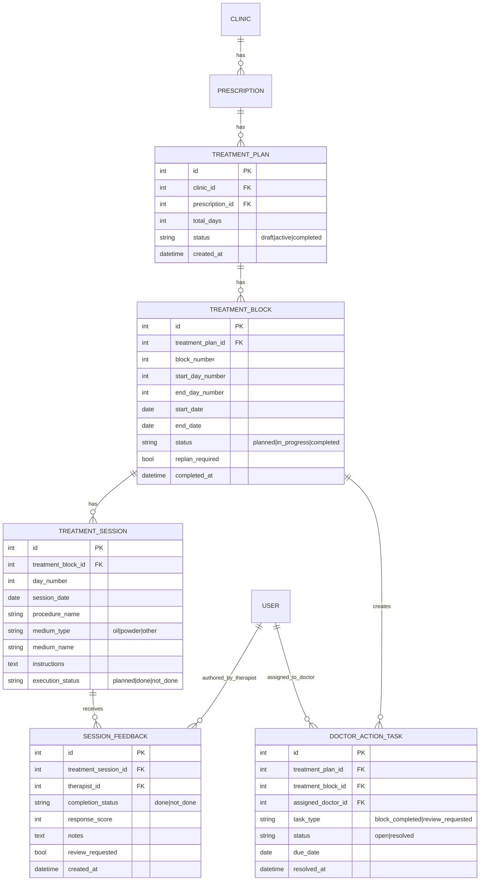

# feat: Add block-based treatment planning and follow-ups work queues

## Overview

Add a structured, block-based treatment planning workflow for Ayurveda/Siddha procedures and expose it through the existing follow-ups surface as two role-focused tabs:

- `Therapist Worklist`: execute prescribed sessions and submit session feedback
- `Doctor Actions`: review feedback-driven plan gaps and create next treatment block

This plan carries forward the brainstorm decisions (see brainstorm: `docs/brainstorms/2026-02-28-ayurveda-siddha-treatment-plan-workflow-brainstorm.md`):

- Hybrid plan structure (single-day + day-range entries)
- Therapist can execute and report only (no treatment edits)
- Feedback payload: done/not done + symptom response score + notes
- Re-plan trigger is completion of current active block (not fixed Day 5)
- Follow-ups page is the primary operational queue
- Two-tab UX for clarity

## Problem Statement

Current prescription procedures are flat entries under `ProcedureEntry` and cannot represent a multi-day treatment journey with block checkpoints, completion tracking, and doctor re-planning tasks.

Existing backend follow-up APIs already expose due items (`backend/config/views.py:72-123`), but frontend has no follow-ups route or sidebar item (`frontend/src/components/layout/Sidebar.tsx:22-29`). As a result, therapists and doctors lack a shared operational queue for treatment progression.

## Proposed Solution

Introduce treatment-plan entities linked to prescriptions/consultations to track:

- plan blocks (date range)
- day-level sessions (what to perform each day)
- therapist execution feedback
- doctor action tasks when a block completes or therapist requests review

Then extend the follow-ups API to return role-filtered task streams and build a follow-ups page with two tabs.

## Technical Approach

### Architecture

Reuse existing architecture patterns:

- Tenant isolation via `request.clinic` + query filtering (`backend/clinics/mixins.py:4-13`)
- Role enforcement via DRF permissions (`backend/clinics/permissions.py:29-38`)
- Dashboard utility endpoints in `config/views.py`
- Frontend data fetching with `useApi` and mutation flows with `useMutation`

Add a new domain app for treatment workflow (`backend/treatments/`) instead of overloading `ProcedureEntry` so day/block logic remains explicit and testable.

### ERD

## Implementation Phases

### Phase 1: Data Foundations

- [x] Create `backend/treatments/` app with models:
  - `TreatmentPlan`
  - `TreatmentBlock`
  - `TreatmentSession`
  - `SessionFeedback`
  - `DoctorActionTask`
- [x] Add tenant-safe FKs (`clinic` on top-level entities and tenant validations in serializers)
- [x] Add composite constraints and indexes:
  - unique `(treatment_plan, block_number)`
  - unique `(treatment_block, day_number)`
  - unique open doctor task per `(treatment_block, task_type)`
- [x] Add admin registrations in `backend/treatments/admin.py`

Deliverables:

- `backend/treatments/models.py`
- `backend/treatments/migrations/0001_initial.py`
- `backend/treatments/admin.py`

### Phase 2: Doctor Planning APIs

- [x] Add serializers in `backend/treatments/serializers.py` for:
  - hybrid session creation (`single_day` and `day_range` expansion)
  - block creation and update (doctor-only)
  - validation that expanded days do not overlap existing sessions
- [x] Add viewset/actions in `backend/treatments/views.py`:
  - `POST /api/v1/treatments/plans/` create plan + first block
  - `POST /api/v1/treatments/plans/{id}/blocks/` add next block
  - `GET /api/v1/treatments/plans/{id}/` details for patient timeline
- [x] Wire routes in `backend/treatments/urls.py` and include in `backend/config/urls.py`

Role rules:

- doctors: create/update plan and blocks
- therapists/admin: read-only plan visibility

### Phase 3: Therapist Execution + Feedback APIs

- [x] Add therapist endpoint to submit feedback per session:
  - `POST /api/v1/treatments/sessions/{id}/feedback/`
- [x] Store exactly brainstorm-approved fields:
  - `completion_status` (`done`/`not_done`)
  - `response_score` (bounded integer, e.g., 1-5)
  - `notes`
  - `review_requested` (boolean)
- [x] On feedback save:
  - update `TreatmentSession.execution_status`
  - if `review_requested=true`, create/open `DoctorActionTask(task_type=review_requested)`
  - if all sessions in active block are completed, mark block completed and create/open `DoctorActionTask(task_type=block_completed)`

### Phase 4: Follow-ups API Unification

- [x] Replace current monolithic `follow_ups_list` response shape with typed queue items:
  - therapist queue items (session execution)
  - doctor queue items (action tasks)
- [x] Keep existing prescription/procedure follow-up items for backward compatibility during rollout
- [x] Add query params to `GET /api/v1/dashboard/follow-ups/`:
  - `tab=therapist|doctor|all`
  - `status=open|resolved` (doctor tab)
- [x] Ensure strict tenant and role filtering

Files:

- `backend/config/views.py`
- `backend/config/urls.py`
- `backend/prescriptions/tests.py` (or new `backend/treatments/tests.py`)

### Phase 5: Frontend Follow-ups Page + Navigation

- [x] Add new route page: `frontend/src/app/(dashboard)/follow-ups/page.tsx`
- [x] Add sidebar nav item in `frontend/src/components/layout/Sidebar.tsx`
- [x] Add API types in `frontend/src/lib/types.ts`:
  - `FollowUpQueueItem`
  - `TherapistWorklistItem`
  - `DoctorActionItem`
- [x] Build two-tab UI:
  - `Therapist Worklist` tab with execute/report action
  - `Doctor Actions` tab with create-next-block CTA
- [x] Add task count badge near Follow-ups nav item
- [x] Keep dashboard card `Follow-ups Due` and link it to `/follow-ups`

### Phase 6: Re-plan UX and Guardrails

- [x] Doctor action card must remain open until next block is created
- [x] Prevent therapist edits to session plan fields in UI and API
- [x] Show timeline context (current block range, completed days, pending days)
- [x] Add empty states per role and per tab

## Alternative Approaches Considered

### A. Keep using `ProcedureEntry` only

Pros:

- minimal schema change
- lower migration effort

Cons:

- poor representation for day/block lifecycle
- weak auditability for therapist execution feedback
- difficult to implement reliable re-plan triggers

Rejected because it cannot satisfy hybrid scheduling and role-safe execution at quality.

### B. Build separate standalone workflow page/module from scratch

Pros:

- cleaner conceptual separation

Cons:

- duplicates existing follow-up mental model and API surface
- higher UI/navigation complexity

Rejected per brainstorm decision to reuse follow-ups surface.

## System-Wide Impact

### Interaction Graph

1. Doctor creates plan block:
   - `POST /treatments/plans/{id}/blocks/` -> serializer validates hybrid entries -> sessions expanded -> persisted
2. Therapist submits feedback:
   - `POST /treatments/sessions/{id}/feedback/` -> feedback saved -> session status updated -> block completion check -> doctor task creation
3. Doctor opens follow-ups page:
   - `GET /dashboard/follow-ups/?tab=doctor` -> returns open action tasks -> doctor adds next block -> task resolved

### Error & Failure Propagation

- Validation errors (overlap, invalid day range, role violation) return DRF 400/403 at serializer/permission boundary.
- Block-completion task creation should run in one atomic transaction with feedback save to avoid partial state.
- Fail-closed behavior must continue when clinic context is missing (`No clinic context`, 403).

### State Lifecycle Risks

- Partial failure risk: feedback saved but task not created.
  - Mitigation: `transaction.atomic()` around feedback + session + block + task updates.
- Duplicate tasks risk during concurrent therapist submissions.
  - Mitigation: unique DB constraint on open task key and idempotent `get_or_create` pattern.

### API Surface Parity

Surfaces to keep consistent:

- `dashboard stats` count (`follow_ups_due`) must include new open treatment tasks where relevant.
- `follow-ups list` endpoint remains the single queue endpoint used by dashboard and follow-ups page.
- Existing prescription/procedure follow-up contracts should not break without frontend migration.

### Integration Test Scenarios

- Therapist submits final pending session in a block; doctor task is auto-created exactly once.
- Therapist requests review before block ends; doctor task appears in Doctor Actions immediately.
- Doctor adds next block; previous open block-completed task transitions to resolved.
- Cross-tenant access attempt to treatment plan/session returns not found/forbidden.
- Non-doctor attempts to edit plan block receives 403.

## Acceptance Criteria

### Functional Requirements

- [x] Doctor can create treatment plans using hybrid entries (single-day + day-range).
- [x] Therapist can view assigned sessions and submit only execution feedback (done/not_done, response score, notes).
- [x] Completion of current active block creates mandatory doctor action to define next block.
- [x] Therapist can request doctor review at any point from session feedback.
- [x] Follow-ups page exists and shows two tabs: Therapist Worklist and Doctor Actions.
- [x] Doctor action remains open until next block is created.

### Non-Functional Requirements

- [x] Tenant isolation enforced for every treatment query and mutation.
- [x] Role authorization enforced server-side (doctor write, therapist execute/report only).
- [ ] Endpoints respond within existing dashboard expectations (<500ms for typical clinic data size).

### Quality Gates

- [x] Backend tests for models, serializers, permissions, and follow-ups aggregation.
- [ ] Frontend tests for tab rendering, role filtering, and action transitions.
- [x] No duplicate URL path definitions introduced (apply URL uniqueness check pattern from `docs/solutions/logic-errors/django-duplicate-url-pattern-shadowing-405.md`).

## Dependencies & Risks

Dependencies:

- Existing tenant middleware and role model stay unchanged (`backend/clinics/middleware.py`, `backend/users/models.py:5-20`).
- Follow-ups endpoint remains in `config/views.py` and is extended, not replaced abruptly.

Risks:

- Queue complexity creep if legacy and new follow-up items are mixed without typing.
- Race conditions on block completion from simultaneous therapist submissions.
- Doctor adoption risk if follow-ups navigation remains hidden.

Mitigations:

- Explicit item typing in API response.
- Atomic writes + uniqueness constraints.
- Sidebar + dashboard entry points to follow-ups.

## Resource Requirements

- Backend: 1 engineer (models, API, tests)
- Frontend: 1 engineer (follow-ups page, tabs, API wiring)
- QA/UAT: therapist + doctor workflow validation with realistic 15/21-day samples

## Future Considerations

- Optional score dimensions (pain/sleep/stiffness separately)
- Notification channels (SMS/WhatsApp/email) once in-app workflow stabilizes
- Template library for common Ayurveda/Siddha treatment plans

## Documentation Plan

- Add API contract section to `frontend/README.md` for follow-ups queue item types
- Add operational note in project docs for therapist vs doctor permissions
- Add migration and rollback notes in release checklist

## SpecFlow Analysis (Feature Flow Completeness)

User flow coverage:

- Doctor seeds initial block
- Therapist executes daily sessions and reports response
- System auto-detects block completion and opens doctor action
- Doctor defines next block and closes action

Gap checks applied:

- Missing plan created before therapist starts -> therapist tab shows empty-state with guidance
- Block completed but doctor action unresolved -> persistent doctor card
- Manual review request before block end -> doctor action appears without waiting for completion
- Unauthorized role actions -> blocked at API and hidden in UI

## Success Metrics

- 100% of completed blocks generate exactly one doctor action task.
- >=90% therapist sessions include response score + notes in pilot clinics.
- Reduction in ad-hoc messaging between therapist and doctor for next-block planning.

## Rollout Strategy

1. Release backend models/APIs behind feature flag (`treatment_workflow_enabled` per clinic).
2. Enable follow-ups page UI for pilot clinics.
3. Monitor queue counts and task resolution lag for 1 week.
4. Enable by default for Ayurveda/Siddha clinics.

## Sources & References

### Origin

- **Origin brainstorm:** `docs/brainstorms/2026-02-28-ayurveda-siddha-treatment-plan-workflow-brainstorm.md`
  - Carried forward decisions: hybrid planning, therapist execute/report only, block-completion-triggered doctor action, follow-ups as workflow surface, two-tab UX

### Internal References

- Follow-ups API baseline: `backend/config/views.py:72-123`
- Dashboard follow-up count: `backend/config/views.py:58-69`
- Dashboard follow-up card: `frontend/src/app/(dashboard)/page.tsx:42-46`
- Sidebar currently missing follow-ups link: `frontend/src/components/layout/Sidebar.tsx:22-29`
- Prescription/Procedure current flat model: `backend/prescriptions/models.py:69-77`
- Doctor-write permission pattern: `backend/clinics/permissions.py:29-38`
- Tenant queryset fail-closed behavior: `backend/clinics/mixins.py:4-13`
- Dashboard route for follow-ups already registered: `backend/config/urls.py:24-25`

### Institutional Learnings

- Multi-tenant and migration safety patterns: `docs/solutions/best-practices/phase5-multi-discipline-research.md`
- URL collision prevention pattern: `docs/solutions/logic-errors/django-duplicate-url-pattern-shadowing-405.md`
