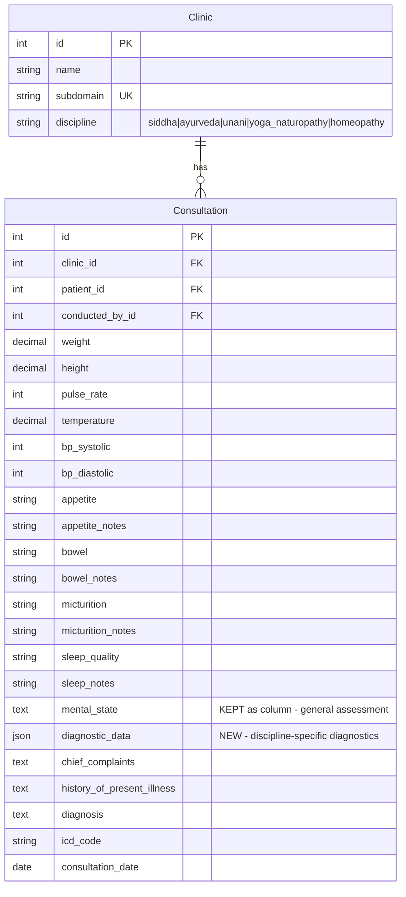

# feat: Phase 5 Multi-Discipline Diagnostic Forms

## Enhancement Summary

**Deepened on:** 2026-02-28
**Sections enhanced:** All 7 implementation phases + security + migration
**Review agents used:** Security Sentinel, Architecture Strategist, Data Migration Expert, Data Integrity Guardian, Pattern Recognition Specialist, Code Simplicity Reviewer, Best Practices Researcher, Framework Docs Researcher, Learnings Researcher, Python Reviewer, TypeScript Reviewer, Performance Oracle

### Key Improvements

1. **Security hardening** — 3 HIGH-severity findings addressed: payload size limits, JSON schema guardrails, CSV import DoS protection
2. **Migration safety** — Raw SQL migration option added, integrity assertions, verification queries, seed data update requirements, dual-write rollback strategy
3. **DB-level data integrity** — CHECK constraint ensuring `diagnostic_data` is always a JSON object, `default=dict` without `null=True` confirmed correct
4. **Pattern consistency** — 2 frontend deviations corrected (reducer action naming, serializer validation access pattern)
5. **Framework-grounded code** — All code examples validated against Django 5.1, DRF, PostgreSQL JSONB, Next.js 14, and React 18 official documentation

### YAGNI Scope Decision Required

The **Simplicity Reviewer** raised a strong concern: the brainstorm document originally said "Defer Phase 5 until first Ayurveda clinic signs up." Zero non-Siddha clinics currently exist. The reviewer recommends stripping **PrakritiForm**, **GenericDiagnosticForm**, **DiagnosticFormRouter**, and **DiagnosticDataDisplay** — only doing the JSONField migration + Siddha refactor (~60-70% scope reduction, ~8 files instead of 19).

**Option A (Full Plan):** Implement all 5 discipline forms now. Pros: ready for any AYUSH clinic from day one. Cons: building for users that don't exist yet.

**Option B (Migration-Only):** Only migrate to JSONField + refactor Siddha form. Defer PrakritiForm/GenericForm until the first non-Siddha clinic signs up. Pros: YAGNI-compliant, smaller blast radius, faster delivery. Cons: need a follow-up phase later.

The rest of this plan documents the **Full Plan (Option A)**. If Option B is chosen, skip Phases D-F and simplify Phase G.

---

## Overview

Transform the consultation diagnostic section from hardcoded Siddha Envagai Thervu columns into a flexible JSONField that supports all five AYUSH disciplines. Each clinic sees the correct diagnostic form for its discipline: Siddha clinics see Envagai Thervu, Ayurveda clinics see Prakriti analysis, and other disciplines see a generic diagnostic notes field.

## Problem Statement / Motivation

The Consultation model hardcodes 8 Siddha-specific Envagai Thervu text fields (`naa`, `niram`, `mozhi`, `vizhi`, `nadi`, `mei`, `muthiram`, `varmam`) directly as database columns. The frontend form and detail page only render Siddha diagnostic UI. This blocks:

- **Ayurveda clinics** cannot record Prakriti (Vata/Pitta/Kapha) analysis during consultations.
- **Unani, Yoga/Naturopathy, Homeopathy clinics** see Siddha-specific fields that are meaningless to their practice.
- **Platform growth** — no Ayurveda/Unani/etc. practitioner would adopt a tool that forces Siddha diagnostic language on them.

The `Clinic.discipline` field already exists and is set during signup, but is unused for form rendering.

## Proposed Solution

1. Add a `diagnostic_data` JSONField to `Consultation` to store discipline-specific diagnostics.
2. Migrate existing Envagai Thervu data from 8 separate columns into `diagnostic_data` (3-step migration).
3. Build a frontend form router that renders the correct diagnostic component based on `clinic.discipline`.
4. Implement discipline-specific components: Siddha (Envagai Thervu), Ayurveda (Prakriti), and Generic (notes).
5. Update serializers, import/export services, and detail views to use the new JSONField.

## Technical Approach

### Architecture

```
clinic.discipline (already exists)
        │
        ▼
┌─────────────────────────────────────────────────────┐
│  ConsultationForm.tsx                               │
│  ┌─────────┐  ┌─────────────┐  ┌─────────────────┐ │
│  │ Vitals  │  │ General     │  │ DiagnosticForm  │ │
│  │ (common)│  │ Assessment  │  │ Router          │ │
│  │         │  │ (common)    │  │                 │ │
│  └─────────┘  └─────────────┘  │ ┌─────────────┐│ │
│                                │ │ Siddha:     ││ │
│                                │ │ EnvagaiThervu│ │
│                                │ ├─────────────┤│ │
│                                │ │ Ayurveda:  ││ │
│                                │ │ Prakriti   ││ │
│                                │ ├─────────────┤│ │
│                                │ │ Generic:   ││ │
│                                │ │ Notes      ││ │
│                                │ └─────────────┘│ │
│                                └─────────────────┘ │
│  ┌─────────┐                                       │
│  │Diagnosis│                                       │
│  │(common) │                                       │
│  └─────────┘                                       │
└─────────────────────────────────────────────────────┘
```

### JSONField Schema

```python
# diagnostic_data JSONField stores discipline-keyed data:

# Siddha clinic consultation:
{
  "envagai_thervu": {
    "naa": "color:Pink|coating:None|notes:Healthy tongue",
    "niram": "skin_color:Normal|pallor:Absent",
    "mozhi": "clarity:Clear|tone:Normal|speed:Normal",
    "vizhi": "color:Normal|moisture:Normal|pupil:Normal",
    "nadi": "type:Vatham|rate:Normal|strength:Strong",
    "mei": "temperature:Normal|texture:Normal",
    "muthiram": "color:Pale yellow|odor:Normal|neikuri:Stays as pearl (Kapham)",
    "varmam": "sensitivity:Normal|energy_flow:Normal"
  }
}

# Ayurveda clinic consultation:
{
  "prakriti": {
    "vata_score": 5,
    "pitta_score": 3,
    "kapha_score": 2,
    "dominant_dosha": "vata",
    "secondary_dosha": "pitta",
    "body_frame": "thin",
    "skin_type": "dry",
    "hair_type": "thin_dry",
    "appetite_pattern": "irregular",
    "digestion": "variable",
    "sleep_pattern": "light",
    "temperament": "anxious_creative",
    "pulse_quality": "fast_irregular",
    "notes": "Vata-predominant with Pitta influence"
  }
}

# Other disciplines (Unani, Yoga/Naturopathy, Homeopathy):
{
  "notes": "Free-form diagnostic observations..."
}
```

### Data Migration Strategy (3-Step)

**Step 1: Add field** — `0009_add_diagnostic_data.py`
- Add `diagnostic_data = JSONField(default=dict, blank=True)` to Consultation
- Non-destructive, fully reversible

**Step 2: Copy data** — `0010_migrate_envagai_to_json.py`
- `RunPython` that reads each consultation's 8 Envagai fields
- Writes them to `diagnostic_data.envagai_thervu` as a dict
- Wrapped in batch processing (1000 rows at a time)
- Reversible: reverse function copies JSON back to columns

**Step 3: Drop columns** — `0011_remove_envagai_columns.py`
- Remove `naa`, `niram`, `mozhi`, `vizhi`, `nadi`, `mei`, `muthiram`, `varmam` columns
- Only run AFTER verifying Step 2 completed successfully
- Keep `mental_state` as a regular model column (it's a general observation, not Siddha-specific — the current form already renders it outside the EnvagaiThervu component)

#### Research Insights: Data Migration

**Best Practices (verified against Django 5.1 docs):**
- **Always use `apps.get_model()`** in RunPython — never import models directly. Django provides historical model state, not the current model.
- **Never combine schema changes and RunPython** in the same migration file. PostgreSQL wraps DDL in transactions, causing conflicts. The 3-step plan correctly separates these.
- **Always provide `reverse_code`** for rollback capability. Use `migrations.RunPython(forward, reverse)` not `migrations.RunPython.noop`.
- **Set `atomic = False`** on the Migration class for large-table data migrations, then wrap each batch in `transaction.atomic()`.

**Raw SQL Alternative (recommended by Data Integrity Guardian):**

For maximum performance and atomicity, consider a single SQL UPDATE instead of row-by-row Python:

```python
def migrate_envagai_to_json(apps, schema_editor):
    schema_editor.execute("""
        UPDATE consultations_consultation
        SET diagnostic_data = jsonb_build_object(
            'envagai_thervu', jsonb_strip_nulls(jsonb_build_object(
                'naa', NULLIF(naa, ''),
                'niram', NULLIF(niram, ''),
                'mozhi', NULLIF(mozhi, ''),
                'vizhi', NULLIF(vizhi, ''),
                'nadi', NULLIF(nadi, ''),
                'mei', NULLIF(mei, ''),
                'muthiram', NULLIF(muthiram, ''),
                'varmam', NULLIF(varmam, '')
            ))
        )
        WHERE naa != '' OR niram != '' OR mozhi != '' OR vizhi != ''
           OR nadi != '' OR mei != '' OR muthiram != '' OR varmam != '';
    """)
```

For ~10,000 rows this finishes in under 1 second. Trade-off: harder to make reversible, PostgreSQL-specific.

**ORM Batch Alternative (if SQL is too opaque):**

```python
def migrate_envagai_to_json(apps, schema_editor):
    Consultation = apps.get_model("consultations", "Consultation")
    ENVAGAI_FIELDS = ["naa", "niram", "mozhi", "vizhi", "nadi", "mei", "muthiram", "varmam"]
    batch = []
    for consultation in Consultation.objects.all().iterator(chunk_size=1000):
        envagai = {}
        for field in ENVAGAI_FIELDS:
            value = getattr(consultation, field, "")
            if value:
                envagai[field] = value
        consultation.diagnostic_data = {"envagai_thervu": envagai} if envagai else {}
        batch.append(consultation)
        if len(batch) >= 1000:
            with transaction.atomic():
                Consultation.objects.bulk_update(batch, ["diagnostic_data"], batch_size=500)
            batch = []
    if batch:
        with transaction.atomic():
            Consultation.objects.bulk_update(batch, ["diagnostic_data"], batch_size=500)
```

**Data Integrity Assertions (Data Migration Expert — MUST):**

Add post-migration verification in the RunPython function:

```python
# After migration, verify integrity
original_count = Consultation.objects.exclude(
    naa="", niram="", mozhi="", vizhi="", nadi="", mei="", muthiram="", varmam=""
).count()
migrated_count = Consultation.objects.exclude(diagnostic_data={}).count()
assert original_count == migrated_count, (
    f"Migration integrity check failed: {original_count} had Envagai data, "
    f"but {migrated_count} have diagnostic_data"
)
```

**Preserve pipe-separated format (Data Migration Expert — confirmed):**

Do NOT parse the pipe-separated format (`"color:Pink|coating:None"`) into nested JSON during migration. Copy raw strings verbatim. The frontend `parseEnvagaiValue` function already handles both plain text and pipe-separated formats gracefully.

**Seed data files MUST be updated (Data Migration Expert — MUST):**
- `backend/seed_data.py` (lines 134-181)
- `backend/patients/management/commands/seed_data.py` (lines 138-145)

Both currently write to individual Envagai columns. After migration, they must write to `diagnostic_data`.

**Squashing strategy (post-deployment):**

After all environments have run migrations 0009-0011, mark the RunPython as `elidable=True` and squash:
```bash
python manage.py squashmigrations consultations 0009 0011 --squashed-name add_diagnostic_data_field
```

### Implementation Phases

#### Phase A: Backend Model + Migration

**Goal:** Database schema supports discipline-agnostic diagnostic data.

Tasks:
- [ ] Add `diagnostic_data = JSONField(default=dict, blank=True)` to `Consultation` model — `backend/consultations/models.py`
- [ ] Add CHECK constraint ensuring `diagnostic_data` is always a JSON object — `backend/consultations/models.py`
- [ ] Create migration `0009_add_diagnostic_data.py` — `backend/consultations/migrations/`
- [ ] Create data migration `0010_migrate_envagai_to_json.py` with forward + reverse functions — `backend/consultations/migrations/`
- [ ] Add inline integrity assertion in RunPython forward function (count verification)
- [ ] Create column removal migration `0011_remove_envagai_columns.py` — `backend/consultations/migrations/`
- [ ] Move `mental_state` from "Envagai Thervu" model comment group to "General Assessment" group — `backend/consultations/models.py`
- [ ] Update seed data files — `backend/seed_data.py` and `backend/patients/management/commands/seed_data.py`
- [ ] Update admin fieldsets — `backend/consultations/admin.py`

Success criteria:
- All existing Envagai Thervu data preserved in `diagnostic_data`
- `python manage.py migrate` runs cleanly forward and backward
- No data loss verified by counting non-empty diagnostic records before and after
- Integrity assertion passes in RunPython

#### Research Insights: Phase A

**DB-level CHECK constraint (Data Integrity Guardian — HIGH):**

```python
class Meta:
    constraints = [
        # ... existing constraints ...
        models.CheckConstraint(
            check=models.Q(diagnostic_data__isnull=False),
            name="diagnostic_data_not_null",
        ),
    ]
```

Since Django's JSONField with `default=dict` stores `{}` for empty and PostgreSQL validates JSON syntax on write, the main risk is a scalar or list value being inserted. The serializer-level validation (Phase B) is the primary defense; this CHECK constraint is belt-and-suspenders.

**Field definition (Architecture Strategist — confirmed):**

```python
diagnostic_data = models.JSONField(default=dict, blank=True)
```

Do NOT add `null=True`. The codebase convention is `blank=True, default=""` for text fields (never null) and `null=True` only for numeric fields. An empty dict `{}` is the "no value" sentinel for JSON, analogous to `""` for text. This avoids the Django anti-pattern of two possible "empty" states (`None` and `{}`).

**No GIN index needed (confirmed by Architecture Strategist + Best Practices Researcher):**

No queries filter on `diagnostic_data` content — it's read/write only. If needed later, use `GinIndex` (not `db_index=True`, which creates a useless B-tree for JSONB).

---

#### Phase B: Backend Serializers + API

**Goal:** API returns and accepts `diagnostic_data` JSONField with schema validation.

Tasks:
- [ ] Update `ConsultationDetailSerializer` — replace 8 individual Envagai fields with single `diagnostic_data` field — `backend/consultations/serializers.py`
- [ ] Add `validate_diagnostic_data` method with discipline-aware validation — `backend/consultations/serializers.py`
- [ ] Add payload size limit (32KB max) on `diagnostic_data` — `backend/consultations/serializers.py`
- [ ] Add JSON structure guardrails (nesting depth, key filtering) — `backend/consultations/serializers.py`
- [ ] Update `ConsultationListSerializer` — no change needed (doesn't include diagnostic fields)
- [ ] Update `ConsultationImportRowSerializer` — add optional `diagnostic_data` field for CSV import — `backend/consultations/serializers.py`
- [ ] Update `perform_create` in `ConsultationViewSet` — no changes needed (pass-through to serializer)

Validation rules:
- `diagnostic_data` must be a dict (not a list or scalar)
- Top-level key must match clinic discipline schema (`envagai_thervu` for siddha, `prakriti` for ayurveda, `notes` for others)
- Validation is permissive: unknown keys within discipline data are accepted (forward-compatible)
- Empty `{}` is always valid (diagnostic section is optional)
- Payload size capped at 32KB
- Nesting depth limited to 3-4 levels
- Prototype-polluting keys denied (`__proto__`, `constructor`)

#### Research Insights: Phase B

**Security Hardening (Security Sentinel — 3 HIGH findings):**

**SEC-5.1: Payload size limit.** Enforce a 32KB max at the serializer level:

```python
import sys

def validate_diagnostic_data(self, value):
    if not isinstance(value, dict):
        raise serializers.ValidationError("diagnostic_data must be a JSON object.")

    # SEC-5.1: Payload size limit
    if sys.getsizeof(str(value)) > 32_768:
        raise serializers.ValidationError("diagnostic_data exceeds maximum size (32KB).")

    # SEC-5.2: Deny prototype-polluting keys
    DENIED_KEYS = {"__proto__", "constructor", "prototype"}
    def check_keys(obj, depth=0):
        if depth > 4:
            raise serializers.ValidationError("diagnostic_data nesting too deep (max 4 levels).")
        if isinstance(obj, dict):
            if DENIED_KEYS & set(obj.keys()):
                raise serializers.ValidationError("diagnostic_data contains disallowed keys.")
            for v in obj.values():
                check_keys(v, depth + 1)
        elif isinstance(obj, list):
            for item in obj:
                check_keys(item, depth + 1)
    check_keys(value)

    if not value:
        return value

    # Discipline-specific top-level key validation
    request = self.context.get("request")
    if request and hasattr(request, "clinic") and request.clinic:
        discipline = request.clinic.discipline
        expected_key = DISCIPLINE_SCHEMA_KEYS.get(discipline)
        if expected_key:
            unexpected = set(value.keys()) - {expected_key}
            if unexpected:
                raise serializers.ValidationError(
                    f"Unexpected keys for {discipline}: {unexpected}. Expected: '{expected_key}'."
                )

    return value
```

**Pattern: Use `self.context["request"].clinic.discipline`** (Pattern Recognition):

The `validate_diagnostic_data` method accesses the clinic discipline the same way `validate_patient` (line 84) already accesses `request.clinic`. This follows the existing codebase pattern exactly.

**DRF JSONField serializer mapping (Framework Docs):**

`serializers.JSONField()` maps directly to `models.JSONField()` in `ModelSerializer`. No extra configuration needed for basic use. For structured validation, use `validate_<field_name>` method rather than `DictField` or JSON Schema libraries (overkill for 3 schemas).

---

#### Phase C: Import/Export Updates

**Goal:** CSV import and export handle `diagnostic_data` consistently.

Tasks:
- [ ] Update `export_consultations_csv` — add `diagnostic_data` column as JSON string — `backend/clinics/export_service.py`
- [ ] Update `ConsultationImportService._validate_row` — parse JSON string before passing to serializer — `backend/consultations/import_service.py`
- [ ] Update `ConsultationImportRowSerializer` — add `diagnostic_data` as optional JSONField — `backend/consultations/serializers.py`
- [ ] Add CSV import size limits: 2MB file max, 5000 row limit, per-row JSON string size check — `backend/consultations/import_service.py`

Export format:
```csv
patient_record_id,patient_phone,consultation_date,...,diagnostic_data
PAT-2026-0001,9876543210,2026-03-01,...,"{""envagai_thervu"":{""naa"":""color:Pink""}}"
```

Import behavior:
- If `diagnostic_data` column is present and non-empty -> parse as JSON and store
- If `diagnostic_data` column is missing or empty -> store `{}` (empty dict)
- Invalid JSON -> validation error on that row

#### Research Insights: Phase C

**SEC-5.3: CSV Import DoS Protection (Security Sentinel — HIGH):**

```python
# In ConsultationImportService.validate_and_preview()
MAX_FILE_SIZE = 2 * 1024 * 1024  # 2MB
MAX_ROW_COUNT = 5000
MAX_JSON_STRING_SIZE = 32_768  # 32KB per cell

def validate_and_preview(self, file_content):
    if len(file_content) > MAX_FILE_SIZE:
        raise ValidationError("File too large (max 2MB).")
    # ... existing parsing ...
    if len(rows) > MAX_ROW_COUNT:
        raise ValidationError(f"Too many rows (max {MAX_ROW_COUNT}).")
```

**JSON parsing in `_validate_row` (Pattern Recognition — consistent with patient_phone):**

Parse the JSON string in `_validate_row` before passing to the serializer, consistent with how `patient_phone` is resolved to a Patient object in the existing import service.

```python
def _validate_row(self, row_data, row_num):
    # ... existing validation ...
    if "diagnostic_data" in row_data:
        raw = row_data["diagnostic_data"]
        if raw and len(raw) > MAX_JSON_STRING_SIZE:
            errors.append({"row": row_num, "error": "diagnostic_data too large"})
        elif raw:
            try:
                row_data["diagnostic_data"] = json.loads(raw)
            except json.JSONDecodeError:
                errors.append({"row": row_num, "error": "Invalid JSON in diagnostic_data"})
```

**Export service does NOT currently export Envagai columns (Data Migration Expert — confirmed):**

The export service at `backend/clinics/export_service.py:58-72` already skips all 8 diagnostic fields. This means the migration will not break existing exports. Adding `diagnostic_data` to export is purely additive.

---

#### Phase D: Frontend — Diagnostic Form Router

**Goal:** Consultation form renders the correct discipline-specific diagnostic section.

Tasks:
- [ ] Create `DiagnosticFormRouter` component — routes to correct form based on `clinic.discipline` — `frontend/src/components/consultations/DiagnosticFormRouter.tsx`
- [ ] Update `ConsultationForm.tsx` — replace hardcoded EnvagaiThervu section with DiagnosticFormRouter — `frontend/src/components/consultations/ConsultationForm.tsx`
- [ ] Update `ConsultationFormState` type — replace 8 individual Envagai fields with `diagnostic_data: Record<string, unknown>` — `frontend/src/components/consultations/ConsultationForm.tsx`
- [ ] Update reducer — use `SET_FIELD("diagnostic_data", value)` action (consistent with existing pattern, no new action type) — `frontend/src/components/consultations/ConsultationForm.tsx`
- [ ] Update form submission payload — include `diagnostic_data` object
- [ ] Update `useAuth()` usage in ConsultationForm to read `user.clinic.discipline`
- [ ] Update section navigator — change "Envagai Thervu" label to discipline-appropriate label

Section labels by discipline:
| Discipline | English Label | Tamil Label |
|---|---|---|
| siddha | Envagai Thervu | எண்வகைத் தேர்வு |
| ayurveda | Prakriti Analysis | பிரக்ருதி பகுப்பாய்வு |
| yoga_naturopathy | Diagnostic Assessment | நோயறிதல் மதிப்பீடு |
| unani | Diagnostic Assessment | நோயறிதல் மதிப்பீடு |
| homeopathy | Diagnostic Assessment | நோயறிதல் மதிப்பீடு |

#### Research Insights: Phase D

**Pattern Correction: Reducer action naming (Pattern Recognition — MUST FIX):**

The existing reducer uses `SET_FIELD` with a field name parameter. Instead of adding a new `SET_DIAGNOSTIC_DATA` action type, use the existing `SET_FIELD("diagnostic_data", value)` pattern to stay consistent. Remove `SET_ENVAGAI` action entirely.

```typescript
// CORRECT: Use existing SET_FIELD action
dispatch({ type: "SET_FIELD", field: "diagnostic_data", value: newData });

// WRONG: Don't add a new action type
dispatch({ type: "SET_DIAGNOSTIC_DATA", data: newData });
```

**Code splitting with `next/dynamic` (Best Practices + Framework Docs):**

Each discipline form should be lazy-loaded since a user only ever sees one:

```tsx
import dynamic from "next/dynamic";

const EnvagaiThervu = dynamic(
  () => import("./EnvagaiThervu"),
  { loading: () => <DiagnosticFormSkeleton /> }
);
const PrakritiForm = dynamic(
  () => import("./PrakritiForm"),
  { loading: () => <DiagnosticFormSkeleton /> }
);
const GenericDiagnosticForm = dynamic(
  () => import("./GenericDiagnosticForm"),
  { loading: () => <DiagnosticFormSkeleton /> }
);
```

Important: `dynamic()` must be at module top-level (not inside JSX). Paths must be static strings (no template literals).

**Draft format migration (Pattern Recognition):**

Add a `version` field to the auto-save draft format for safe migration:

```typescript
case "LOAD_EXISTING": {
  const payload = action.payload;
  // Detect old draft format (individual Envagai fields, no version)
  if (payload.naa !== undefined && !payload.diagnostic_data) {
    const envagai: Record<string, string> = {};
    for (const field of ["naa", "niram", "mozhi", "vizhi", "nadi", "mei", "muthiram", "varmam"]) {
      if (payload[field]) envagai[field] = payload[field] as string;
    }
    return {
      ...state,
      ...payload,
      diagnostic_data: Object.keys(envagai).length > 0
        ? { envagai_thervu: envagai }
        : {},
    };
  }
  return { ...state, ...payload };
}
```

**React 18 batching (Framework Docs):**

React 18 auto-batches all state updates (including those in promises and setTimeout). Multiple `dispatch()` calls in sequence result in a single re-render. The `dispatch` function has a stable identity and can be safely omitted from `useEffect` dependency arrays.

---

#### Phase E: Frontend — Discipline-Specific Components

**Goal:** Each discipline has a purpose-built diagnostic form component.

Tasks:
- [ ] Refactor existing `EnvagaiThervu.tsx` — update to read/write from `diagnostic_data.envagai_thervu` instead of individual fields — `frontend/src/components/consultations/EnvagaiThervu.tsx`
- [ ] Create `PrakritiForm.tsx` — Ayurveda Prakriti analysis form — `frontend/src/components/consultations/PrakritiForm.tsx`
- [ ] Create `GenericDiagnosticForm.tsx` — free-text notes form for other disciplines — `frontend/src/components/consultations/GenericDiagnosticForm.tsx`
- [ ] Add bilingual labels for Prakriti and generic forms — `frontend/src/lib/constants/bilingual-labels.ts`
- [ ] Add Prakriti field options constants — `frontend/src/lib/constants/prakriti-options.ts`

**PrakritiForm fields (Ayurveda):**

| Field | Type | Options |
|---|---|---|
| Body Frame | select | Thin/Ectomorph, Medium/Mesomorph, Large/Endomorph |
| Skin Type | select | Dry, Oily, Normal, Sensitive, Combination |
| Hair Type | select | Thin/Dry, Thick/Oily, Normal, Wavy |
| Appetite Pattern | select | Irregular (Vata), Strong (Pitta), Steady/Slow (Kapha) |
| Digestion | select | Variable, Quick/Intense, Slow/Heavy |
| Sleep Pattern | select | Light/Interrupted, Moderate, Deep/Heavy |
| Temperament | select | Anxious/Creative, Focused/Intense, Calm/Steady |
| Pulse Quality | select | Fast/Irregular (Vata), Moderate/Bounding (Pitta), Slow/Steady (Kapha) |
| Dominant Dosha | computed | Vata, Pitta, Kapha (auto-calculated from above) |
| Secondary Dosha | computed | Vata, Pitta, Kapha |
| Notes | textarea | Free-form observations |

**GenericDiagnosticForm fields (Unani/Yoga/Homeopathy):**

| Field | Type |
|---|---|
| Diagnostic Notes | textarea (multi-line, 6 rows) |

#### Research Insights: Phase E

**Computed dosha values (Pattern Recognition):**

Compute dominant/secondary dosha at submission time, not in component state. Display as a read-only indicator derived from selected attributes. This avoids stale computed values in state when selections change rapidly.

**TypeScript discriminated unions (Best Practices):**

Use structural discrimination (top-level key determines variant) rather than adding a redundant `type` discriminator field:

```typescript
type SiddhaDiagnosticData = { envagai_thervu: EnvagaiThervu };
type AyurvedaDiagnosticData = { prakriti: PrakritiAnalysis };
type GenericDiagnosticData = { notes: string };
type EmptyDiagnosticData = Record<string, never>;

export type DiagnosticData =
  | SiddhaDiagnosticData
  | AyurvedaDiagnosticData
  | GenericDiagnosticData
  | EmptyDiagnosticData;

// Type guard functions
export function isSiddhaDiagnostic(data: DiagnosticData): data is SiddhaDiagnosticData {
  return "envagai_thervu" in data;
}
export function isAyurvedaDiagnostic(data: DiagnosticData): data is AyurvedaDiagnosticData {
  return "prakriti" in data;
}
```

---

#### Phase F: Frontend — Detail + View Updates

**Goal:** Consultation detail page renders diagnostic data correctly per discipline.

Tasks:
- [ ] Update consultation detail page — replace hardcoded Envagai Thervu grid with discipline-aware rendering — `frontend/src/app/(dashboard)/consultations/[id]/page.tsx`
- [ ] Create `DiagnosticDataDisplay` component for read-only rendering — `frontend/src/components/consultations/DiagnosticDataDisplay.tsx`
- [ ] Update `Consultation` TypeScript type — replace 8 Envagai fields with `diagnostic_data: DiagnosticData` — `frontend/src/lib/types.ts`
- [ ] Update bilingual labels — add section labels for new discipline forms — `frontend/src/lib/constants/bilingual-labels.ts`
- [ ] Remove or update `parseEnvagaiValue` function in detail page (only needed within Siddha display component)

#### Research Insights: Phase F

**Detail page must render whatever data exists (SpecFlow — Edge Case #1):**

If a clinic switches discipline after consultations exist, the detail page must render whatever `diagnostic_data` structure is present, regardless of the clinic's current discipline. Use type guard functions (`isSiddhaDiagnostic`, `isAyurvedaDiagnostic`) to determine rendering, not `clinic.discipline`.

**Defense-in-depth for XSS (Security Sentinel):**

React JSX text interpolation provides baseline XSS protection. Add these defensive measures:
- Filter keys before rendering (only render known field names)
- Truncate display values (e.g., 500 chars max per field)
- Never use `dangerouslySetInnerHTML` for diagnostic data

---

#### Phase G: Testing + Hardening

**Goal:** Full test coverage for migration safety, API correctness, and tenant isolation.

Tasks:
- [ ] Migration data integrity test — verify all existing Envagai data migrated correctly — `backend/consultations/tests.py`
- [ ] Migration reversibility test — verify backward migration restores columns — `backend/consultations/tests.py`
- [ ] Migration verification SQL queries — count checks before/after — `backend/consultations/tests.py`
- [ ] Serializer validation tests — valid/invalid `diagnostic_data` per discipline — `backend/consultations/tests.py`
- [ ] Serializer security tests — oversized payload, deep nesting, prototype pollution keys — `backend/consultations/tests.py`
- [ ] API round-trip tests — create consultation with diagnostic_data, retrieve, verify — `backend/consultations/tests.py`
- [ ] Import service tests — CSV with diagnostic_data column, missing column, invalid JSON, oversized file — `backend/consultations/tests.py`
- [ ] Export service tests — verify diagnostic_data appears in CSV output — `backend/clinics/tests.py`
- [ ] Tenant isolation tests — verify diagnostic_data cannot leak across clinics — `backend/consultations/tests.py`
- [ ] Empty diagnostic_data tests — create consultation with `{}`, verify no errors

#### Research Insights: Phase G

**Institutional learnings from Phase 2 (Learnings Researcher):**

From `docs/solutions/security-issues/phase2-team-management-security-review.md`:
- Tenant isolation test pattern: always test with two separate clinics to verify no cross-tenant access
- Transaction safety: wrap bulk operations in `@transaction.atomic`
- HTML escaping: ensure all user-provided text in diagnostic_data is properly escaped (React handles this by default, but test explicitly)

**Verification SQL queries (Data Migration Expert — MUST):**

After running migration 0010, execute these verification queries:

```sql
-- Count records with Envagai data in original columns
SELECT COUNT(*) FROM consultations_consultation
WHERE naa != '' OR niram != '' OR mozhi != '' OR vizhi != ''
   OR nadi != '' OR mei != '' OR muthiram != '' OR varmam != '';

-- Count records with diagnostic_data populated
SELECT COUNT(*) FROM consultations_consultation
WHERE diagnostic_data != '{}';

-- These counts must match
```

---

## Alternative Approaches Considered

| Approach | Rejected Because |
|---|---|
| Generic form builder (drag-and-drop fields) | Over-engineered. Each AYUSH discipline has well-defined diagnostic frameworks. A form builder sacrifices domain-specific UX for flexibility we don't need. |
| Separate model per discipline (SiddhaConsultation, AyurvedaConsultation) | Breaks the shared-schema multi-tenancy pattern. Would require discipline-specific ViewSets, serializers, URL routes, and frontend pages. (Architecture Strategist confirmed: fractures every layer of the architecture.) |
| EAV (Entity-Attribute-Value) pattern | Complicated queries, no schema validation, poor performance at scale. JSONField gives us flexibility with better DX. |
| Keep columns, add JSONField alongside | Data duplication. Two sources of truth for Siddha diagnostics would cause sync bugs. |
| Store diagnostic_data as TEXT (serialized JSON string) | Loses PostgreSQL JSON operators (`->`, `->>`, `@>`). JSONField gives us native querying if ever needed. |
| `null=True` on JSONField | Creates two "empty" states (`None` and `{}`). Project convention uses `blank=True, default=""` for text (never null). `default=dict, blank=True` without `null=True` is consistent. |

## Acceptance Criteria

### Functional Requirements

- [ ] `DISC-01`: Consultation model has `diagnostic_data` JSONField and no individual Envagai columns (except mental_state, which remains as a general field)
- [ ] `DISC-02`: All existing Envagai Thervu data is preserved in `diagnostic_data.envagai_thervu` after migration (zero data loss)
- [ ] `DISC-02a`: Migration is reversible — running backward restores original columns with correct data
- [ ] `DISC-03`: Siddha clinic consultation form shows Envagai Thervu diagnostic section
- [ ] `DISC-03a`: Ayurveda clinic consultation form shows Prakriti analysis section
- [ ] `DISC-03b`: Unani/Yoga/Homeopathy clinic consultation form shows generic diagnostic notes
- [ ] `DISC-04`: Prakriti form computes dominant and secondary dosha from selected attributes
- [ ] Consultation detail page renders diagnostic data correctly for each discipline
- [ ] Editing an existing consultation loads diagnostic data into the correct form
- [ ] CSV export includes `diagnostic_data` as a JSON column
- [ ] CSV import accepts optional `diagnostic_data` column

### Non-Functional Requirements

- [ ] Migration completes in < 30s for 10,000 consultations
- [ ] No N+1 queries introduced by JSONField usage
- [ ] API response time for consultation CRUD unchanged (< 200ms p95)
- [ ] All diagnostic form components are keyboard-navigable
- [ ] `diagnostic_data` payload capped at 32KB (SEC-5.1)
- [ ] CSV import capped at 2MB file size and 5000 rows (SEC-5.3)

### Quality Gates

- [ ] All existing consultation tests continue to pass
- [ ] New migration tests pass for forward and backward migration
- [ ] New serializer validation tests cover each discipline schema
- [ ] New security tests cover oversized payload, deep nesting, prototype pollution
- [ ] Zero cross-tenant data access in diagnostic_data tests

## SpecFlow Analysis (Flow Gaps and Edge Cases)

1. **Clinic discipline change after data exists**: If a clinic switches from Siddha to Ayurveda, existing consultations still contain `envagai_thervu` data. The detail page must render whatever discipline data exists in `diagnostic_data`, even if it doesn't match the clinic's current discipline. The form for NEW consultations uses the current discipline.

2. **Empty diagnostic section**: All discipline forms must handle empty/missing `diagnostic_data` gracefully — show empty form in create mode, show "Not assessed" in detail view.

3. **Export/import across disciplines**: A CSV exported from a Siddha clinic may be imported into another Siddha clinic. The `diagnostic_data` column preserves the full JSON. Importing into a different-discipline clinic should still work (data is stored as-is).

4. **Auto-save draft compatibility**: The `useAutoSave` hook stores form state including `diagnostic_data`. Draft format changes from individual fields to nested object — old drafts must be detected and migrated on load (version field in draft).

5. **Concurrent discipline rendering**: The form router reads `clinic.discipline` from `useAuth()`. This value is set at signup and rarely changes. No real-time sync concern.

6. **mental_state field handling**: Currently grouped under "Envagai Thervu" in the model but rendered separately in the form (outside the EnvagaiThervu component). Keep it as a model column under "General Assessment" — it's a universal clinical observation, not Siddha-specific.

7. **Prescription PDF**: Currently does NOT include diagnostic data. No changes needed for Phase 5.

## ERD Changes



**Columns removed:** `naa`, `niram`, `mozhi`, `vizhi`, `nadi`, `mei`, `muthiram`, `varmam`
**Column added:** `diagnostic_data` (JSONField)
**Column moved:** `mental_state` reclassified from Envagai Thervu to General Assessment (no schema change, just code organization)

## Success Metrics

- 100% of existing Envagai Thervu records preserved in `diagnostic_data` after migration (verified by count + spot-check)
- Siddha consultation create/edit flow visually identical to current behavior (no UX regression)
- Ayurveda consultation form renders Prakriti fields and computes dosha
- Generic disciplines see a clean diagnostic notes textarea
- All migration steps are individually reversible
- Zero new N+1 queries detected in Django Debug Toolbar

## Dependencies & Prerequisites

- **Phase 3 (Branding)** and **Phase 4 (Data Portability)** should be completed or in-progress before Phase 5, as the export service changes here build on Phase 4's foundation.
- `Clinic.discipline` field already exists with correct choices (verified).
- `useAuth()` hook already exposes `user.clinic.discipline` to frontend (verified).
- PostgreSQL JSONField support requires `django.contrib.postgres` (already in INSTALLED_APPS if using PostgreSQL, which we are).

## Risk Analysis & Mitigation

| Risk | Impact | Likelihood | Mitigation |
|---|---|---|---|
| Data loss during Envagai migration | High | Low | 3-step migration with reversible RunPython; verify counts before/after; test with production data dump; inline integrity assertion |
| Breaking existing consultation tests | Medium | Medium | Run full test suite after each migration step; update test fixtures to use `diagnostic_data` format |
| Frontend draft incompatibility | Low | High | Detect old draft format on load with version field, migrate gracefully with user notification |
| JSONField query performance | Low | Low | No queries filter on diagnostic_data content; it's read/write only. If needed later, add GIN index (not B-tree). |
| Ayurveda Prakriti fields incomplete | Medium | Medium | Consult domain expert; keep schema flexible (JSON) so new fields can be added without migration |
| Oversized JSON payload DoS | Medium | Low | 32KB serializer limit, 2MB CSV file limit, 5000 row import limit (SEC-5.1, SEC-5.3) |
| JSON injection / prototype pollution | Medium | Low | Key filtering, nesting depth limit, denied key list (SEC-5.2) |

## File Change Summary

### Backend (modify)
- `backend/consultations/models.py` — add `diagnostic_data`, reclassify `mental_state`, remove 8 Envagai columns
- `backend/consultations/serializers.py` — replace 8 fields with `diagnostic_data`, add validation
- `backend/consultations/import_service.py` — handle `diagnostic_data` in CSV import, add size limits
- `backend/clinics/export_service.py` — add `diagnostic_data` to consultation CSV export
- `backend/consultations/admin.py` — update fieldsets
- `backend/consultations/tests.py` — migration tests, API tests, import tests, security tests
- `backend/seed_data.py` — update to use `diagnostic_data` format
- `backend/patients/management/commands/seed_data.py` — update to use `diagnostic_data` format

### Backend (create)
- `backend/consultations/migrations/0009_add_diagnostic_data.py`
- `backend/consultations/migrations/0010_migrate_envagai_to_json.py`
- `backend/consultations/migrations/0011_remove_envagai_columns.py`

### Frontend (modify)
- `frontend/src/components/consultations/ConsultationForm.tsx` — use DiagnosticFormRouter
- `frontend/src/components/consultations/EnvagaiThervu.tsx` — read/write from `diagnostic_data`
- `frontend/src/app/(dashboard)/consultations/[id]/page.tsx` — discipline-aware detail rendering
- `frontend/src/lib/types.ts` — update Consultation type with DiagnosticData union
- `frontend/src/lib/constants/bilingual-labels.ts` — add new section labels

### Frontend (create)
- `frontend/src/components/consultations/DiagnosticFormRouter.tsx`
- `frontend/src/components/consultations/PrakritiForm.tsx`
- `frontend/src/components/consultations/GenericDiagnosticForm.tsx`
- `frontend/src/components/consultations/DiagnosticDataDisplay.tsx`
- `frontend/src/lib/constants/prakriti-options.ts`

## Sources & References

### Internal References
- **Origin brainstorm:** `docs/plans/2026-02-27-saas-multi-tenant-brainstorm.md` — Phase 5 scope, YAGNI assessment, JSONField recommendation
- **Requirements:** `.planning/REQUIREMENTS.md` (DISC-01..04)
- **Roadmap:** `.planning/ROADMAP.md` (Phase 5: Multi-Discipline)
- **Current Consultation model:** `backend/consultations/models.py` — 8 Envagai Thervu fields (lines 57-78)
- **Current EnvagaiThervu component:** `frontend/src/components/consultations/EnvagaiThervu.tsx` — pipe-separated value format
- **Envagai options constants:** `frontend/src/lib/constants/envagai-options.ts` — field definitions and options
- **Clinic discipline field:** `backend/clinics/models.py:10-16` — DISCIPLINE_CHOICES
- **Frontend auth context:** `frontend/src/components/auth/AuthProvider.tsx` — `useAuth()` exposes `user.clinic.discipline`
- **Export service:** `backend/clinics/export_service.py:57-102` — current consultation CSV export (missing diagnostic data)
- **Import service:** `backend/consultations/import_service.py` — current consultation CSV import (no diagnostic fields)
- **Institutional learnings:** `docs/solutions/security-issues/phase2-team-management-security-review.md` — tenant isolation patterns

### External References (from research agents)
- [Django JSONField Reference (5.1)](https://docs.djangoproject.com/en/5.1/ref/models/fields/#jsonfield)
- [Django Writing Data Migrations](https://docs.djangoproject.com/en/5.2/howto/writing-migrations/)
- [Django RunPython Migration Operations](https://docs.djangoproject.com/en/5.2/ref/migration-operations/#runpython)
- [DRF Serializer Fields](https://www.django-rest-framework.org/api-guide/fields/)
- [PostgreSQL JSON Types](https://www.postgresql.org/docs/current/datatype-json.html)
- [PostgreSQL GIN Indexes](https://www.postgresql.org/docs/current/gin.html)
- [Next.js Lazy Loading Guide](https://nextjs.org/docs/pages/guides/lazy-loading)
- [React useReducer Reference](https://react.dev/reference/react/useReducer)
- [Crunchy Data: Indexing JSONB in Postgres](https://www.crunchydata.com/blog/indexing-jsonb-in-postgres)
