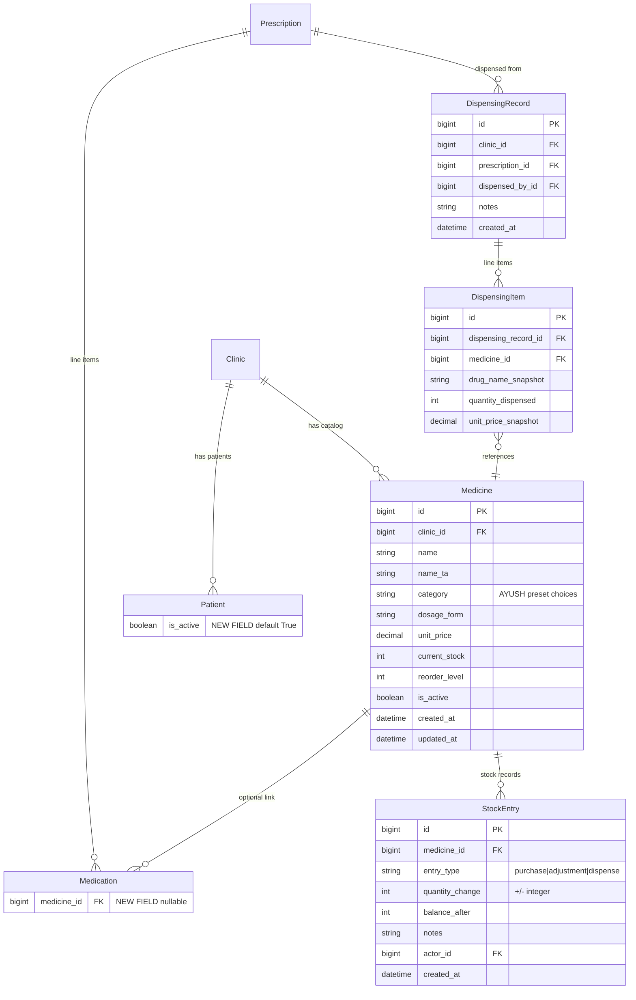

# Phase 6: Pharmacy Catalog, Inventory & Usage Limits

## Overview

Add a clinic-scoped medicine catalog with AYUSH-preset categories, stock tracking with low-stock alerts, prescription autocomplete from the catalog, dispensing with automatic stock deduction, and active-patient usage limits with enforcement and a dashboard.

## Problem Statement / Motivation

Today, doctors type medicine names as free text in prescriptions. There is no shared catalog, no inventory visibility, and no way to track what was actually dispensed. Clinics managing traditional AYUSH formulations (Kashayam, Choornam, Tailam, etc.) need structured categorization. Additionally, the platform needs usage limits to support future tiered pricing — the `active_patient_limit` field already exists on Clinic but nothing enforces it.

## Proposed Solution

1. **New `pharmacy` Django app** with `Medicine`, `StockEntry`, and `DispensingRecord` / `DispensingItem` models
2. **Medicine catalog** with AYUSH-preset category choices, dosage forms, and unit price
3. **Stock tracking** per-medicine (single quantity model, no batch/expiry tracking in this phase)
4. **Prescription autocomplete** — frontend `useDebouncedSearch` hits a medicine search API; `Medication` gets an optional FK to `Medicine` for linkage
5. **Dispensing workflow** — after a prescription is created, a user records dispensed items; stock auto-deducts with `select_for_update()` + `F()` for race-condition safety
6. **Usage limits** — add `is_active` field to `Patient`, enforce limit on patient creation, build a usage dashboard widget

## Technical Approach

### Architecture

```
pharmacy/                    # New Django app
  models.py                  # Medicine, StockEntry, DispensingRecord, DispensingItem
  serializers.py             # List/Detail pairs + dispense serializer
  views.py                   # MedicineViewSet, StockEntryViewSet, DispensingViewSet
  urls.py                    # DefaultRouter registration
  admin.py                   # ModelAdmin for all models
  migrations/

patients/
  migrations/0002_patient_is_active.py   # Add is_active field

prescriptions/
  migrations/0002_medication_medicine_fk.py  # Add nullable FK to Medicine

frontend/src/
  app/(dashboard)/pharmacy/              # Catalog + inventory pages
  app/(dashboard)/settings/              # Usage dashboard widget
  components/pharmacy/                   # MedicineCatalogTable, StockAlert, DispenseModal
  lib/types.ts                           # New type definitions
```

### ERD



### Implementation Phases

#### Phase 6A: Medicine Catalog + Stock Model (Backend)

**Goal:** CRUD for medicines with AYUSH categories, stock tracking, low-stock alerts.

**Models — `pharmacy/models.py`:**

```python
# pharmacy/models.py

class Medicine(models.Model):
    CATEGORY_CHOICES = [
        ("kashayam", "Kashayam / கஷாயம்"),
        ("choornam", "Choornam / சூரணம்"),
        ("lehyam", "Lehyam / லேகியம்"),
        ("tailam", "Tailam / தைலம்"),
        ("arishtam", "Arishtam / அரிஷ்டம்"),
        ("asavam", "Asavam / ஆசவம்"),
        ("gulika", "Gulika / குளிகை"),
        ("parpam", "Parpam / பற்பம்"),
        ("chenduram", "Chenduram / செந்தூரம்"),
        ("nei", "Nei / நெய்"),
        ("tablet", "Tablet"),
        ("capsule", "Capsule"),
        ("syrup", "Syrup"),
        ("external", "External Application"),
        ("other", "Other"),
    ]
    DOSAGE_FORM_CHOICES = [
        ("ml", "Millilitres (ml)"),
        ("g", "Grams (g)"),
        ("tablets", "Tablets"),
        ("capsules", "Capsules"),
        ("drops", "Drops"),
        ("pinch", "Pinch / சிட்டிகை"),
        ("spoon", "Spoon / கரண்டி"),
        ("other", "Other"),
    ]

    clinic = models.ForeignKey(
        "clinics.Clinic", on_delete=models.CASCADE, related_name="medicines"
    )
    name = models.CharField(max_length=255)
    name_ta = models.CharField(max_length=255, blank=True, default="")
    category = models.CharField(max_length=30, choices=CATEGORY_CHOICES)
    dosage_form = models.CharField(max_length=20, choices=DOSAGE_FORM_CHOICES)
    unit_price = models.DecimalField(max_digits=10, decimal_places=2, default=0)
    current_stock = models.IntegerField(default=0)
    reorder_level = models.PositiveIntegerField(default=10)
    is_active = models.BooleanField(default=True)
    created_at = models.DateTimeField(auto_now_add=True)
    updated_at = models.DateTimeField(auto_now=True)

    class Meta:
        ordering = ["name"]
        indexes = [
            models.Index(fields=["clinic", "name"], name="med_clinic_name"),
            models.Index(fields=["clinic", "category"], name="med_clinic_category"),
            models.Index(fields=["clinic", "is_active"], name="med_clinic_active"),
        ]
        constraints = [
            models.UniqueConstraint(
                fields=["clinic", "name"],
                name="unique_medicine_name_per_clinic",
            ),
            models.CheckConstraint(
                check=models.Q(current_stock__gte=0),
                name="medicine_stock_non_negative",
            ),
        ]

    def __str__(self):
        return f"{self.name} ({self.get_category_display()})"
```

```python
class StockEntry(models.Model):
    ENTRY_TYPE_CHOICES = [
        ("purchase", "Purchase"),
        ("adjustment", "Manual Adjustment"),
        ("dispense", "Dispensed"),
    ]

    medicine = models.ForeignKey(
        Medicine, on_delete=models.CASCADE, related_name="stock_entries"
    )
    entry_type = models.CharField(max_length=20, choices=ENTRY_TYPE_CHOICES)
    quantity_change = models.IntegerField()  # positive for purchase, negative for dispense
    balance_after = models.IntegerField()
    notes = models.TextField(blank=True, default="")
    actor = models.ForeignKey(
        settings.AUTH_USER_MODEL, on_delete=models.CASCADE, related_name="stock_entries"
    )
    created_at = models.DateTimeField(auto_now_add=True)

    class Meta:
        ordering = ["-created_at"]
        indexes = [
            models.Index(fields=["medicine", "-created_at"], name="stock_med_created"),
        ]
        verbose_name_plural = "Stock entries"

    def __str__(self):
        return f"{self.get_entry_type_display()} {self.quantity_change:+d} → {self.medicine.name}"
```

**Serializers — `pharmacy/serializers.py`:**

```python
class MedicineListSerializer(serializers.ModelSerializer):
    is_low_stock = serializers.SerializerMethodField()

    class Meta:
        model = Medicine
        fields = ["id", "name", "name_ta", "category", "dosage_form",
                  "unit_price", "current_stock", "reorder_level",
                  "is_active", "is_low_stock"]

    def get_is_low_stock(self, obj):
        return obj.current_stock <= obj.reorder_level


class MedicineDetailSerializer(serializers.ModelSerializer):
    is_low_stock = serializers.SerializerMethodField()
    recent_stock_entries = StockEntrySerializer(
        source="stock_entries", many=True, read_only=True
    )  # last 10 via get_queryset override

    class Meta:
        model = Medicine
        fields = ["id", "name", "name_ta", "category", "dosage_form",
                  "unit_price", "current_stock", "reorder_level",
                  "is_active", "is_low_stock", "recent_stock_entries",
                  "created_at", "updated_at"]
        read_only_fields = ["current_stock", "created_at", "updated_at"]


class StockAdjustmentSerializer(serializers.Serializer):
    """For manual stock purchases/adjustments (not dispensing)."""
    quantity = serializers.IntegerField(min_value=1)
    entry_type = serializers.ChoiceField(choices=["purchase", "adjustment"])
    notes = serializers.CharField(required=False, allow_blank=True, default="")
```

**ViewSet — `pharmacy/views.py`:**

```python
class MedicineViewSet(TenantQuerySetMixin, viewsets.ModelViewSet):
    permission_classes = [IsClinicMember, IsDoctorOrReadOnly]
    filterset_fields = ["category", "is_active"]
    search_fields = ["name", "name_ta"]
    ordering_fields = ["name", "current_stock", "created_at"]
    ordering = ["name"]

    def get_serializer_class(self):
        if self.action == "list":
            return MedicineListSerializer
        return MedicineDetailSerializer

    def get_queryset(self):
        return super().get_queryset().model.objects.filter(clinic=self.request.clinic)

    @action(detail=False, methods=["get"], url_path="low-stock")
    def low_stock(self, request):
        """Return medicines where current_stock <= reorder_level."""
        qs = self.get_queryset().filter(
            is_active=True,
            current_stock__lte=models.F("reorder_level"),
        )
        serializer = MedicineListSerializer(qs, many=True)
        return Response(serializer.data)

    @action(detail=True, methods=["post"], url_path="adjust-stock")
    def adjust_stock(self, request, pk=None):
        """Record a stock purchase or manual adjustment."""
        medicine = self.get_object()
        serializer = StockAdjustmentSerializer(data=request.data)
        serializer.is_valid(raise_exception=True)
        # Use select_for_update + F() for race safety
        with transaction.atomic():
            med = Medicine.objects.select_for_update().get(pk=medicine.pk)
            qty = serializer.validated_data["quantity"]
            med.current_stock = F("current_stock") + qty
            med.save(update_fields=["current_stock", "updated_at"])
            med.refresh_from_db()
            StockEntry.objects.create(
                medicine=med,
                entry_type=serializer.validated_data["entry_type"],
                quantity_change=qty,
                balance_after=med.current_stock,
                notes=serializer.validated_data.get("notes", ""),
                actor=request.user,
            )
        return Response(MedicineDetailSerializer(med).data)
```

**Tasks:**
- [ ] Create `pharmacy` Django app with `Medicine` and `StockEntry` models
- [ ] Add `pharmacy` to `INSTALLED_APPS` in `config/settings/base.py`
- [ ] Register URL at `api/v1/pharmacy/` in `config/urls.py`
- [ ] Write `MedicineViewSet` with CRUD + `low-stock` + `adjust-stock` actions
- [ ] Write serializers (List/Detail split + StockAdjustmentSerializer)
- [ ] Add composite indexes and CHECK constraint for non-negative stock
- [ ] Run `makemigrations` and `migrate`

---

#### Phase 6B: Prescription Autocomplete Integration

**Goal:** Typing a drug name in the prescription form auto-suggests from the clinic's medicine catalog.

**Backend changes:**

1. **Medicine search endpoint** — already handled by `MedicineViewSet` with `search_fields = ["name", "name_ta"]`. DRF `SearchFilter` supports `?search=kash` queries.

2. **Add nullable FK on Medication** — `prescriptions/models.py`:

```python
# prescriptions/migrations/0002_medication_medicine_fk.py
# Adds:
medicine = models.ForeignKey(
    "pharmacy.Medicine",
    on_delete=models.SET_NULL,
    null=True,
    blank=True,
    related_name="medication_usages",
)
```

3. **Update PrescriptionSerializer** — when `medicine_id` is provided, auto-populate `drug_name` from catalog but still store the snapshot.

**Frontend changes:**

1. **MedicineAutocomplete component** — uses existing `useDebouncedSearch` hook hitting `/api/v1/pharmacy/medicines/?search=<query>&is_active=true`
2. **Integrate into PrescriptionBuilder** — replace the plain `drug_name` text input with the autocomplete; selecting a suggestion fills `drug_name`, `dosage_form`, and sets the hidden `medicine_id`
3. **Allow off-catalog entries** — if the typed name doesn't match any suggestion, keep it as free-text (no `medicine_id`)

```tsx
// components/pharmacy/MedicineAutocomplete.tsx
// Uses useDebouncedSearch<Medicine> with endpoint="/api/v1/pharmacy/medicines/"
// On select: fills drug_name + dosage + medicine_id
// On free-type with no selection: keeps drug_name as-is, medicine_id=null
```

**Tasks:**
- [ ] Add `medicine` nullable FK on `Medication` model + migration
- [ ] Update `MedicationSerializer` to accept optional `medicine_id`
- [ ] Create `MedicineAutocomplete` component using `useDebouncedSearch`
- [ ] Integrate autocomplete into `PrescriptionBuilder` form
- [ ] Ensure off-catalog free-text entries still work

---

#### Phase 6C: Dispensing Workflow

**Goal:** After a prescription is created, a user records which medicines were actually dispensed. Stock auto-deducts.

**Models — `pharmacy/models.py`:**

```python
class DispensingRecord(models.Model):
    clinic = models.ForeignKey(
        "clinics.Clinic", on_delete=models.CASCADE, related_name="dispensing_records"
    )
    prescription = models.ForeignKey(
        "prescriptions.Prescription", on_delete=models.CASCADE,
        related_name="dispensing_records",
    )
    dispensed_by = models.ForeignKey(
        settings.AUTH_USER_MODEL, on_delete=models.CASCADE,
        related_name="dispensing_records",
    )
    notes = models.TextField(blank=True, default="")
    created_at = models.DateTimeField(auto_now_add=True)

    class Meta:
        ordering = ["-created_at"]
        indexes = [
            models.Index(
                fields=["clinic", "-created_at"], name="disp_clinic_created"
            ),
            models.Index(
                fields=["prescription"], name="disp_prescription"
            ),
        ]

    def __str__(self):
        return f"Dispensing for Rx #{self.prescription_id} on {self.created_at:%Y-%m-%d}"


class DispensingItem(models.Model):
    dispensing_record = models.ForeignKey(
        DispensingRecord, on_delete=models.CASCADE, related_name="items"
    )
    medicine = models.ForeignKey(
        Medicine, on_delete=models.PROTECT, related_name="dispensing_items"
    )
    drug_name_snapshot = models.CharField(max_length=255)
    quantity_dispensed = models.PositiveIntegerField()
    unit_price_snapshot = models.DecimalField(max_digits=10, decimal_places=2)

    def __str__(self):
        return f"{self.drug_name_snapshot} x{self.quantity_dispensed}"
```

**Dispensing logic (in serializer `create()`):**

```python
# Inside DispensingRecordCreateSerializer.create():
with transaction.atomic():
    record = DispensingRecord.objects.create(
        clinic=clinic, prescription=prescription,
        dispensed_by=request.user, notes=notes,
    )
    for item_data in items:
        med = Medicine.objects.select_for_update().get(
            pk=item_data["medicine_id"], clinic=clinic
        )
        qty = item_data["quantity_dispensed"]
        if med.current_stock < qty:
            raise ValidationError(
                f"Insufficient stock for {med.name}: "
                f"available {med.current_stock}, requested {qty}"
            )
        med.current_stock = F("current_stock") - qty
        med.save(update_fields=["current_stock", "updated_at"])
        med.refresh_from_db()
        DispensingItem.objects.create(
            dispensing_record=record,
            medicine=med,
            drug_name_snapshot=med.name,
            quantity_dispensed=qty,
            unit_price_snapshot=med.unit_price,
        )
        StockEntry.objects.create(
            medicine=med,
            entry_type="dispense",
            quantity_change=-qty,
            balance_after=med.current_stock,
            notes=f"Dispensed for Rx #{prescription.id}",
            actor=request.user,
        )
    return record
```

**Frontend — Dispense modal:**

- Accessible from the prescription detail page via "Dispense" button
- Pre-populates line items from the prescription's medications (those with `medicine_id`)
- User adjusts quantities and confirms
- Shows running stock balance and warns on low/insufficient stock
- After dispensing, shows confirmation with total cost

**Tasks:**
- [ ] Add `DispensingRecord` and `DispensingItem` models + migration
- [ ] Write `DispensingRecordCreateSerializer` with atomic stock deduction
- [ ] Add `DispensingViewSet` with create + list (scoped to prescription)
- [ ] Register dispensing URLs
- [ ] Create `DispenseModal` component
- [ ] Add "Dispense" button to prescription detail page
- [ ] Show dispensing history on prescription detail

---

#### Phase 6D: Usage Limits & Dashboard

**Goal:** Enforce active patient limits and show usage dashboard.

**Backend changes:**

1. **Add `is_active` to Patient** — `patients/migrations/0002_patient_is_active.py`:

```python
is_active = models.BooleanField(default=True)
# Data migration: set all existing patients to is_active=True
```

2. **Enforce limit on patient creation** — in `PatientViewSet.perform_create()`:

```python
def perform_create(self, serializer):
    clinic = self.request.clinic
    if clinic.active_patient_limit:
        active_count = Patient.objects.filter(
            clinic=clinic, is_active=True
        ).count()
        if active_count >= clinic.active_patient_limit:
            raise ValidationError(
                f"Active patient limit reached ({clinic.active_patient_limit}). "
                "Archive inactive patients or contact support to increase your limit."
            )
    serializer.save(clinic=clinic)
```

3. **Also enforce on CSV patient import** — add limit check in `PatientImportService` preview step, showing a warning if import would exceed limit.

4. **Usage dashboard API** — add to `config/views.py`:

```python
# GET /api/v1/usage/
@api_view(["GET"])
@permission_classes([IsAuthenticated, IsClinicOwner])
def usage_dashboard(request):
    clinic = request.clinic
    active_count = Patient.objects.filter(clinic=clinic, is_active=True).count()
    return Response({
        "active_patients": active_count,
        "patient_limit": clinic.active_patient_limit,
        "usage_percentage": round(
            (active_count / clinic.active_patient_limit * 100)
            if clinic.active_patient_limit else 0, 1
        ),
        "medicines_count": Medicine.objects.filter(clinic=clinic, is_active=True).count(),
        "low_stock_count": Medicine.objects.filter(
            clinic=clinic, is_active=True,
            current_stock__lte=F("reorder_level"),
        ).count(),
    })
```

**Frontend changes:**

1. **Patient archive/restore** — add toggle button on patient detail page to set `is_active` true/false. Show archived badge. Filter archived patients out of main list by default, with a toggle to show them.

2. **Usage widget on /settings page** — shows a progress bar with active patients / limit, percentage, and color-coded status (green < 75%, amber 75-90%, red > 90%).

3. **Limit-reached state** — when at limit, disable "Add Patient" button with tooltip explaining why. Show banner on patients list page.

4. **Low-stock alerts** — show a notification badge in the sidebar next to "Pharmacy" link when there are low-stock medicines.

**Tasks:**
- [ ] Add `is_active` field to Patient + data migration (all existing → True)
- [ ] Update `PatientViewSet.perform_create()` with limit enforcement
- [ ] Update `PatientImportService` to warn on limit breach
- [ ] Add patient archive/restore API action
- [ ] Create `/api/v1/usage/` dashboard endpoint
- [ ] Register usage URL in `config/urls.py`
- [ ] Build `UsageDashboard` component for /settings page
- [ ] Add archive toggle UI on patient detail page
- [ ] Add "show archived" filter toggle on patients list
- [ ] Disable "Add Patient" when at limit with tooltip
- [ ] Add low-stock badge to sidebar pharmacy link

---

#### Phase 6E: Frontend Pharmacy Pages

**Goal:** Full pharmacy UI — catalog management, stock management, low-stock alerts.

**Pages:**

1. **`/pharmacy`** — Medicine catalog table with:
   - Search, filter by category, filter by active/inactive
   - Columns: Name, Category, Dosage Form, Stock, Reorder Level, Price, Status
   - Low-stock rows highlighted in amber
   - "Add Medicine" button (doctors/owners only)
   - Click row → detail/edit panel

2. **`/pharmacy/[id]`** — Medicine detail with:
   - Edit form (name, name_ta, category, dosage_form, unit_price, reorder_level)
   - Stock history timeline (from StockEntry records)
   - "Add Stock" button → quantity + notes form
   - Deactivate/reactivate toggle
   - Dispensing history for this medicine

**Components:**

```
components/pharmacy/
  MedicineCatalogTable.tsx    # Sortable, filterable table
  MedicineForm.tsx            # Add/edit medicine form
  StockAdjustmentForm.tsx     # Inline stock add form
  StockHistoryTimeline.tsx    # Chronological stock entries
  LowStockAlert.tsx           # Alert banner for low-stock items
  DispenseModal.tsx           # Modal for recording dispensing
  MedicineAutocomplete.tsx    # Typeahead for prescription form
```

**Tasks:**
- [ ] Add Medicine types to `lib/types.ts`
- [ ] Create `pharmacyApi` in `lib/api.ts`
- [ ] Build `/pharmacy` page with `MedicineCatalogTable`
- [ ] Build `MedicineForm` for add/edit
- [ ] Build `/pharmacy/[id]` detail page
- [ ] Build `StockAdjustmentForm`
- [ ] Build `StockHistoryTimeline`
- [ ] Build `LowStockAlert` banner
- [ ] Add "Pharmacy" link to sidebar navigation with low-stock badge

## Acceptance Criteria

### Functional Requirements

- [ ] **SC1:** Clinic can add medicines with name, AYUSH category, dosage form, and unit price
- [ ] **SC2:** Clinic can record stock (purchase/adjustment) and sees low-stock alert when quantity <= reorder level
- [ ] **SC3:** Typing a drug name in prescription form auto-suggests from the clinic's medicine catalog
- [ ] **SC4:** User can record dispensed medicines after a prescription is created, and stock auto-deducts
- [ ] **SC5:** Clinic owner can view usage dashboard with active patient count, limit, and percentage
- [ ] **SC6:** System blocks creating a new active patient when limit is reached

### Non-Functional Requirements

- [ ] All medicine/stock/dispense data is tenant-isolated (clinic FK + TenantQuerySetMixin)
- [ ] Stock deduction uses `select_for_update()` + `F()` to prevent race conditions
- [ ] `CHECK (current_stock >= 0)` constraint at DB level prevents negative stock
- [ ] Medicine deletion is soft-delete (`is_active=False`), never hard-delete if dispense history exists
- [ ] All new API endpoints follow existing permission patterns
- [ ] Search uses DRF `SearchFilter` with existing `useDebouncedSearch` hook

### Quality Gates

- [ ] All new models have `clinic` FK and composite indexes
- [ ] List/Detail serializer split for all new entities
- [ ] Autocomplete responds < 200ms for catalogs up to 500 medicines
- [ ] Dispensing is atomic — no partial dispense on error

## Permission Matrix

| Action | Owner | Doctor | Therapist | Admin |
|--------|-------|--------|-----------|-------|
| View medicine catalog | Yes | Yes | Yes | Yes |
| Add/edit medicine | Yes | Yes | No | Yes |
| Delete (deactivate) medicine | Yes | Yes | No | Yes |
| Add stock (purchase/adjustment) | Yes | Yes | No | Yes |
| Dispense medicines | Yes | Yes | Yes | Yes |
| View dispensing history | Yes | Yes | Yes | Yes |
| View usage dashboard | Yes | No | No | No |
| Archive/restore patients | Yes | Yes | No | Yes |

## Dependencies & Risks

**Dependencies:**
- Phase 5 (multi-discipline) must be complete — migration ordering
- Existing `Medication` model in `prescriptions` app — adding nullable FK

**Risks:**
- **Concurrent stock deduction** — mitigated with `select_for_update()` + DB CHECK constraint
- **Data migration** — Patient `is_active` field backfill is safe (all existing → True)
- **Medication FK migration** — nullable FK with `SET_NULL` is backwards-compatible

## Implementation Order

```
6A (Medicine + Stock backend)
  → 6E (Pharmacy frontend pages)  ← can start once 6A APIs exist
  → 6B (Autocomplete integration) ← depends on 6A models
     → 6C (Dispensing workflow)    ← depends on 6A + 6B
6D (Usage limits)                  ← independent, can parallel with 6A-6C
```

**Recommended execution:** Start 6A + 6D in parallel, then 6E + 6B, then 6C last.

## References

### Internal References

- Clinic model (has `active_patient_limit`): [clinics/models.py:34](backend/clinics/models.py#L34)
- Patient model (needs `is_active`): [patients/models.py:6](backend/patients/models.py#L6)
- Medication model (needs `medicine` FK): [prescriptions/models.py:40](backend/prescriptions/models.py#L40)
- TenantQuerySetMixin: [clinics/mixins.py](backend/clinics/mixins.py)
- Permission classes: [clinics/permissions.py](backend/clinics/permissions.py)
- useDebouncedSearch hook: [frontend/src/hooks/useDebouncedSearch.ts](frontend/src/hooks/useDebouncedSearch.ts)
- Existing serializer patterns: [prescriptions/serializers.py](backend/prescriptions/serializers.py)
- URL routing: [config/urls.py](backend/config/urls.py)

### Previous Phase Plans

- Phase 5 (Multi-Discipline): `docs/plans/2026-02-28-feat-phase-5-multi-discipline-diagnostic-forms-plan.md`
- Phase 4 (Data Portability): `docs/plans/2026-02-28-feat-phase-4-data-portability-plan.md`
- Multi-tenant brainstorm: `docs/plans/2026-02-27-saas-multi-tenant-brainstorm.md`
