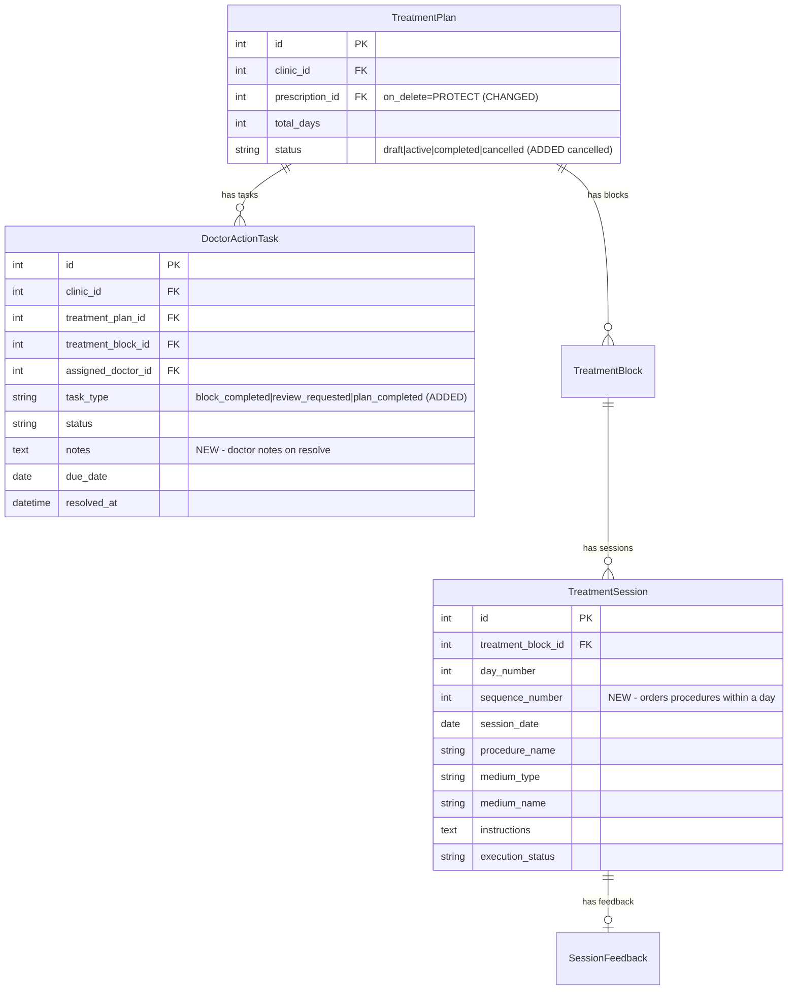

# feat: Treatment Block Workflow — Close Gaps & Ship

## Overview

The treatment block system (TreatmentPlan, TreatmentBlock, TreatmentSession, SessionFeedback, DoctorActionTask) already exists with models, API endpoints, and a two-tab follow-ups page. However, a thorough flow analysis identified **4 critical issues, 7 missing flows, 10 edge cases, and 8 UX gaps** that prevent this from being usable in a real clinic.

This plan closes those gaps in priority order to make the feature shippable.

### Key Decisions (from user)

| Decision | Choice |
|---|---|
| Multiple procedures per day? | Yes — remove unique constraint, add sequence_number |
| Plan creation entry point? | Prescription detail page |
| Plan completion flow? | Auto-complete when final block finishes |
| Review task resolution? | Simple "Mark Reviewed" button |

## Problem Statement

The backend models and basic CRUD work, but doctors and therapists cannot complete real treatment workflows because:

1. **No way to create a plan from the UI** — no button anywhere leads to plan creation
2. **Block creation form only supports 1 procedure** — the hybrid entry model (the core differentiator) is not exposed
3. **One procedure per day limit** — DB constraint blocks real AYUSH treatments (Abhyanga + Vasti same day)
4. **Doctor action tasks accumulate forever** — "review_requested" tasks have no resolution path
5. **Plans never complete** — final block completion creates an unresolvable task
6. **No editing** — doctors cannot correct mistakes on upcoming sessions
7. **Feedback can corrupt completed blocks** — no guard on post-completion overwrites

## Proposed Solution

Seven implementation phases, ordered by dependency and impact:

1. **Backend fixes** — data model corrections and missing endpoints
2. **Plan creation UI** — prescription page entry point
3. **Hybrid block creation UI** — multi-entry block form
4. **Doctor action improvements** — resolve tasks, feedback summaries
5. **Session editing** — doctor can modify upcoming sessions
6. **Plan lifecycle** — list, extend, cancel
7. **Hardening** — edge case guards, UX polish, tests

## Technical Approach

### Architecture (unchanged layers)

```
Prescription Detail Page  ──── NEW: "Start Treatment Plan" CTA
        │
        ▼
TreatmentPlan ── NEW: list, update, auto-complete
   └── TreatmentBlock ── NEW: multi-entry form, edit
         └── TreatmentSession ── CHANGED: remove unique(block,day), add sequence_number
               └── SessionFeedback ── CHANGED: guard completed blocks
                     └── DoctorActionTask ── NEW: resolve endpoint, plan_completed type
```

### Relationship chain (existing)

```
Consultation → Prescription → TreatmentPlan → TreatmentBlock → TreatmentSession → SessionFeedback
                                    └── DoctorActionTask
```

---

## Implementation Phases

### Phase A: Backend Data Model Fixes

**Goal:** Fix schema constraints and add missing fields so the data model supports real clinical workflows.

**Files to modify:**
- `backend/treatments/models.py`
- `backend/treatments/migrations/` (new migration)

**Tasks:**

- [ ] Remove unique constraint `uniq_tsession_block_day` on `(treatment_block, day_number)` — allows multiple procedures per day
- [ ] Add `sequence_number = PositiveSmallIntegerField(default=1)` to `TreatmentSession` — orders procedures within a day
- [ ] Add new unique constraint: `(treatment_block, day_number, sequence_number)` — prevents true duplicates
- [ ] Change `TreatmentPlan.prescription` from `on_delete=CASCADE` to `on_delete=PROTECT` — prevents catastrophic cascade deletion of treatment data when a prescription is deleted
- [ ] Add `PLAN_COMPLETED = "plan_completed"` to `DoctorActionTask.TASK_TYPE_CHOICES`
- [ ] Add `CANCELLED = "cancelled"` to `TreatmentPlan.STATUS_CHOICES`
- [ ] Add unique constraint on `TreatmentPlan`: `(prescription, status)` where `status="active"` — prevents duplicate active plans per prescription (use `UniqueConstraint` with `condition`)
- [ ] Generate and apply migration

**Success criteria:**
- Migration runs cleanly forward and backward
- Multiple sessions with same `(block, day_number)` but different `sequence_number` can coexist
- Deleting a prescription with an active treatment plan raises `ProtectedError`

---

### Phase B: Backend — Missing Endpoints

**Goal:** Add the API endpoints needed for full workflow operation.

**Files to modify:**
- `backend/treatments/views.py`
- `backend/treatments/serializers.py`
- `backend/treatments/urls.py`
- `backend/config/views.py` (follow_ups_list)

**Tasks:**

**B1: Doctor Action Task resolve endpoint**
- [ ] Add `POST /api/v1/treatments/doctor-tasks/{id}/resolve/` — doctor-only
- [ ] Create `DoctorActionTaskViewSet` with `resolve` action
- [ ] Accepts optional `notes` field in request body
- [ ] Sets `status="resolved"`, `resolved_at=now()`
- [ ] Validates: only open tasks can be resolved, only clinic members, only doctors
- [ ] Register in `treatments/urls.py`

**B2: Treatment plan list endpoint**
- [ ] Add `list` action to `TreatmentPlanViewSet`
- [ ] Create `TreatmentPlanListSerializer` (id, prescription_id, patient name, patient record_id, total_days, status, block count, created_at)
- [ ] Filter by `?status=active|completed|cancelled` and `?patient_id=`
- [ ] Order by `-created_at`

**B3: Treatment plan update endpoint**
- [ ] Add `partial_update` action to `TreatmentPlanViewSet`
- [ ] Create `TreatmentPlanUpdateSerializer` — updatable fields: `total_days`, `status`
- [ ] Validation: `total_days` must be >= highest `end_day_number` across all blocks
- [ ] Validation: `status` can only transition `active -> cancelled` (doctor-initiated cancel)
- [ ] Auto-complete (`active -> completed`) handled by feedback flow, not manual update

**B4: Treatment session update endpoint**
- [ ] Add `partial_update` action to `TreatmentSessionViewSet`
- [ ] Create `TreatmentSessionUpdateSerializer` — updatable fields: `procedure_name`, `medium_type`, `medium_name`, `instructions`
- [ ] Guard: only sessions with `execution_status="planned"` can be edited
- [ ] Guard: only doctors can edit (existing `IsDoctorOrReadOnly` covers this)

**B5: Plan auto-completion logic**
- [ ] In `SessionFeedbackSerializer.create_feedback()`, after block completion:
  - Check if `block.end_day_number >= plan.total_days`
  - If yes: set `plan.status = "completed"`, do NOT create a `block_completed` DoctorActionTask
  - Instead create a `plan_completed` DoctorActionTask (informational, auto-resolved or one-click resolve)
- [ ] Guard feedback on completed blocks: if `session.treatment_block.status == "completed"`, raise `ValidationError("Cannot submit feedback for a completed block.")`

**B6: Follow-ups endpoint — include plan_completed tasks**
- [ ] Update `follow_ups_list` in `config/views.py` to include `plan_completed` task type in doctor queue
- [ ] Render with distinct label: "Treatment Complete — {patient name}"

**Success criteria:**
- Doctor can resolve review_requested tasks via API
- Doctor can list all treatment plans filtered by status
- Doctor can update `total_days` on an active plan
- Doctor can edit procedure/medium/instructions on a planned session
- Final block completion auto-completes the plan
- Feedback on completed block sessions is rejected

---

### Phase C: Frontend — Plan Creation from Prescription Page

**Goal:** Doctors can initiate a treatment plan directly from the prescription detail page.

**Files to modify:**
- `frontend/src/app/(dashboard)/prescriptions/[id]/page.tsx`
- `frontend/src/lib/types.ts`

**Files to create:**
- `frontend/src/components/treatments/TreatmentPlanCreateForm.tsx`

**Tasks:**

- [ ] Add "Start Treatment Plan" button on prescription detail page (only visible to doctors, only if no active plan exists for this prescription)
- [ ] On click, expand inline form (consistent with follow-ups inline pattern):
  - Total days (number input, default 15)
  - First block: start_day (default 1), end_day (default 5), start_date (default tomorrow)
  - Entry rows (see Phase D for multi-entry):
    - For MVP in this phase: single entry with procedure_name, medium_type, medium_name, instructions
  - "Create Plan" submit button
- [ ] POST to `/api/v1/treatments/plans/` with `prescription_id`, `total_days`, and `initial_block` payload
- [ ] On success: show success message, optionally link to follow-ups page
- [ ] Add `TreatmentPlan` summary section on prescription detail (if plan exists): status badge, total_days, block count, link to follow-ups
- [ ] Add TypeScript types for create payload to `types.ts`

**Success criteria:**
- Doctor sees "Start Treatment Plan" on prescription page
- Form creates plan + initial block + sessions via single API call
- After creation, plan summary appears on the prescription page

---

### Phase D: Frontend — Hybrid Block Creation Form

**Goal:** Block creation supports multiple entries (the core differentiator from the brainstorm).

**Files to modify:**
- `frontend/src/app/(dashboard)/follow-ups/page.tsx`

**Files to create:**
- `frontend/src/components/treatments/BlockEntryForm.tsx`

**Tasks:**

- [ ] Extract block creation form from follow-ups page into `BlockEntryForm` component
- [ ] Support multiple entries per block with "Add Entry" button:
  - Each entry row: entry_type (day_range | single_day), start_day, end_day (or just day for single_day), procedure_name, medium_type, medium_name, instructions
  - "Remove" button per row (except if only 1 entry)
  - Default first entry prefills from previous block's procedure
- [ ] Entry type toggle per row:
  - `day_range`: procedure applies to all days in the range (expands to N sessions)
  - `single_day`: procedure applies to one specific day (creates 1 session)
- [ ] Visual preview: show which days are covered before submission
- [ ] Validation: all days in block range (start_day to end_day) must be covered by at least one entry
- [ ] Submit entries array to `POST /api/v1/treatments/plans/{id}/blocks/`
- [ ] Reuse the same `BlockEntryForm` in Phase C's plan creation form for the initial block

**Success criteria:**
- Doctor can add 3 entries to a block: "Days 1-5 Abhyanga" + "Days 1-5 Swedana" + "Day 3 Vasti"
- Sessions are created correctly with sequence_number ordering within each day
- Day coverage preview shows no gaps

---

### Phase E: Frontend — Doctor Action Improvements

**Goal:** Doctors can resolve tasks and see feedback summaries to make informed decisions.

**Files to modify:**
- `frontend/src/app/(dashboard)/follow-ups/page.tsx`
- `frontend/src/lib/types.ts`

**Tasks:**

**E1: Resolve review_requested tasks**
- [ ] Add "Mark Reviewed" button on `review_requested` doctor action cards
- [ ] Optional notes textarea (collapsed by default, expandable)
- [ ] POST to `/api/v1/treatments/doctor-tasks/{id}/resolve/`
- [ ] On success: remove card from list or show "Resolved" state

**E2: Block feedback summary in doctor action cards**
- [ ] For `block_completed` and `review_requested` tasks, show a collapsible "Session Feedback" section
- [ ] Display per-session: day number, procedure, done/not_done badge, response score (1-5 with label), therapist notes
- [ ] Highlight sessions with `not_done` or low scores (1-2) in amber/red
- [ ] Response score labels: 1=No response, 2=Mild, 3=Moderate, 4=Good, 5=Excellent

**E3: Plan completion notification**
- [ ] For `plan_completed` tasks, show a summary card: "Treatment plan complete — {patient name} — {total_days} days"
- [ ] Show overall stats: sessions done, sessions missed, average response score
- [ ] Single "Acknowledge" button to resolve

**E4: Patient navigation links**
- [ ] Make patient name/record_id clickable in all follow-up cards (link to `/patients/{id}`)
- [ ] Add "View Plan" link on doctor action cards (link to plan detail — future page or modal)

**Success criteria:**
- Doctor can resolve review_requested tasks with one click
- Doctor sees session-level feedback before creating the next block
- Plan completion shows aggregate stats
- All cards link to patient context

---

### Phase F: Frontend — Session Editing

**Goal:** Doctors can correct procedure/medium/instructions on upcoming (planned) sessions.

**Files to modify:**
- `frontend/src/app/(dashboard)/follow-ups/page.tsx` (or extract to component)

**Tasks:**

- [ ] Add "Edit" icon button on doctor action cards, next to each planned session in the feedback summary
- [ ] On click: inline edit mode for that session row (procedure_name, medium_type, medium_name, instructions become editable)
- [ ] PATCH to `/api/v1/treatments/sessions/{id}/`
- [ ] Guard: edit button only visible for `execution_status="planned"` sessions
- [ ] On success: update card in place, show brief success toast

**Success criteria:**
- Doctor can change oil/procedure for an upcoming session
- Cannot edit already-executed sessions
- Changes reflect immediately in therapist worklist

---

### Phase G: Hardening & Edge Cases

**Goal:** Guard against identified edge cases and improve UX robustness.

**Files to modify:**
- `backend/treatments/serializers.py`
- `backend/treatments/models.py`
- `frontend/src/app/(dashboard)/follow-ups/page.tsx`

**Tasks:**

**G1: Backend guards**
- [ ] Max block size: 30 days (serializer validation)
- [ ] Warn (don't block) if `start_date` is in the past
- [ ] Reject block creation if plan status is not "active"
- [ ] Make feedback submission idempotent: if same therapist re-submits for same session, update gracefully but do NOT re-trigger block completion logic if block already completed

**G2: Frontend UX**
- [ ] Add confirmation dialog before feedback submission ("Mark session as {done/not_done}?")
- [ ] Surface backend validation errors instead of generic messages (parse `response.data` for field-specific errors)
- [ ] Disable form fields during submission to prevent double-submit
- [ ] Add empty states: "No pending sessions today" for therapist, "No open actions" for doctor

**G3: Tests**
- [ ] Test: multiple sessions per day with sequence_number ordering
- [ ] Test: feedback rejection on completed block
- [ ] Test: plan auto-completion on final block
- [ ] Test: doctor task resolution API (resolve, already-resolved, wrong role)
- [ ] Test: session edit (planned OK, done rejected, wrong role rejected)
- [ ] Test: plan update (extend total_days, cancel)
- [ ] Test: cascade protection (delete prescription with active plan -> ProtectedError)
- [ ] Test: duplicate active plan prevention (unique constraint)
- [ ] Test: cross-tenant isolation on all new endpoints

---

## Acceptance Criteria

### Functional Requirements

- [ ] Doctor can create a treatment plan from the prescription detail page
- [ ] Block creation form supports multiple hybrid entries (day-range + single-day)
- [ ] Multiple procedures per day are supported (Abhyanga + Vasti same day)
- [ ] Therapist sees all pending sessions in worklist, submits feedback
- [ ] Block completion auto-triggers doctor action for next block
- [ ] Final block completion auto-completes the plan with summary notification
- [ ] Doctor can resolve "review_requested" tasks with "Mark Reviewed" button
- [ ] Doctor sees session feedback summary before creating next block
- [ ] Doctor can edit procedure/medium/instructions on planned sessions
- [ ] Doctor can extend plan duration (increase total_days)
- [ ] Doctor can cancel an active plan
- [ ] Doctor can list all treatment plans filtered by status

### Non-Functional Requirements

- [ ] All new endpoints respond in < 200ms (p95)
- [ ] No N+1 queries on list/follow-ups endpoints
- [ ] Feedback submission is idempotent
- [ ] Prescription deletion blocked while active plan exists
- [ ] All new endpoints enforce tenant isolation
- [ ] Forms are keyboard-navigable

---

## ERD Changes



**Columns added:** `TreatmentSession.sequence_number`, `DoctorActionTask.notes`
**Constraints changed:** removed `uniq_tsession_block_day`, added `(block, day_number, sequence_number)`
**FK changed:** `TreatmentPlan.prescription` from CASCADE to PROTECT
**Status added:** `TreatmentPlan.cancelled`, `DoctorActionTask.plan_completed`

---

## File Change Summary

### Backend (modify)
- `backend/treatments/models.py` — schema changes (sequence_number, PROTECT, cancelled status, plan_completed type, notes field)
- `backend/treatments/serializers.py` — feedback guard, plan auto-complete, session update serializer, plan update serializer, task resolve serializer, block entry expansion with sequence_number
- `backend/treatments/views.py` — list/update on plans, update on sessions, resolve on tasks
- `backend/treatments/urls.py` — register DoctorActionTaskViewSet
- `backend/treatments/tests.py` — 9+ new test cases
- `backend/config/views.py` — plan_completed in follow-ups

### Backend (create)
- `backend/treatments/migrations/0003_*.py` — schema changes

### Frontend (modify)
- `frontend/src/app/(dashboard)/prescriptions/[id]/page.tsx` — plan creation CTA + summary
- `frontend/src/app/(dashboard)/follow-ups/page.tsx` — resolve button, feedback summary, edit, confirmations, error handling
- `frontend/src/lib/types.ts` — new types for plan create, session update, task resolve

### Frontend (create)
- `frontend/src/components/treatments/TreatmentPlanCreateForm.tsx` — plan creation form
- `frontend/src/components/treatments/BlockEntryForm.tsx` — multi-entry block creation form

---

## Risk Analysis

| Risk | Impact | Likelihood | Mitigation |
|---|---|---|---|
| Removing unique constraint causes duplicate session bugs | Medium | Low | New composite unique on (block, day_number, sequence_number); serializer validates |
| Plan auto-complete race with concurrent feedback | Low | Low | Already inside `transaction.atomic()` |
| PROTECT FK blocks prescription deletion UX | Low | Medium | Show clear error message: "Cannot delete — active treatment plan exists" |
| Multi-entry form complexity | Medium | Medium | Start with Phase C single-entry, upgrade in Phase D |
| Follow-ups page grows too large | Medium | High | Extract components in Phase D (BlockEntryForm) and Phase E |

## Dependencies

- Phase A must complete before all other phases (schema changes)
- Phase B must complete before Phases C-F (API endpoints needed)
- Phase C can run in parallel with Phase D (separate UI surfaces)
- Phase E depends on Phase B1 (resolve endpoint)
- Phase F depends on Phase B4 (session update endpoint)
- Phase G runs last (guards and tests)

## Sources & References

### Internal
- **Brainstorm:** `docs/brainstorms/2026-02-28-ayurveda-siddha-treatment-plan-workflow-brainstorm.md`
- **Prior plan:** `docs/plans/2026-02-28-feat-block-based-treatment-planning-followups-plan.md`
- **Flow analysis:** `docs/analysis/2026-03-01-treatment-block-workflow-flow-analysis.md`
- **Research:** `docs/research/treatment-block-workflow-research.md`
- **Best practices:** `docs/solutions/best-practices/treatment-block-workflow-best-practices.md`
- **Treatment models:** `backend/treatments/models.py`
- **Treatment API:** `backend/treatments/views.py`, `backend/treatments/serializers.py`
- **Follow-ups view:** `backend/config/views.py:83-257`
- **Follow-ups page:** `frontend/src/app/(dashboard)/follow-ups/page.tsx`
- **Permissions:** `backend/clinics/permissions.py`
- **Prescription page:** `frontend/src/app/(dashboard)/prescriptions/[id]/page.tsx`
