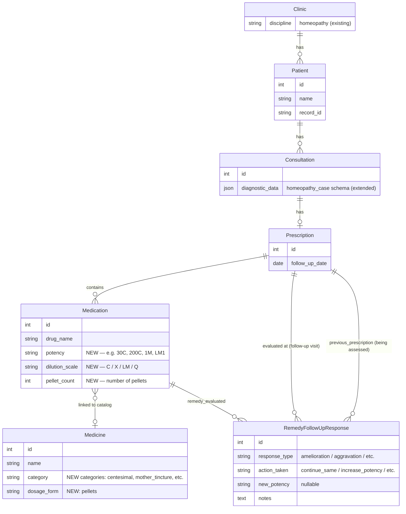

# feat: Homeopathy Clinic Workflow

## Overview

Give homeopathy clinics a first-class workflow within Sivanethram. The discipline is already declared in `Clinic.discipline` but has zero tailored logic — just a bare `notes` field in diagnostic data. This plan delivers three capabilities:

1. **Structured case-taking** — a `homeopathy_case` JSON schema in `diagnostic_data` covering chief complaints with modalities, mental generals, physical generals, and miasmatic classification
2. **Remedy + potency prescribing** — `potency`, `dilution_scale`, and `pellet_count` fields on `Medication`; homeopathic categories in the `Medicine` catalog
3. **Remedy response follow-up** — a new `RemedyFollowUpResponse` model tracking how the patient responded and what action was taken

**Approach:** Hybrid — extend existing models where they fit (diagnostic JSON, Medication, Medicine), add one new model only where a genuinely new concept exists (RemedyFollowUpResponse).

**Target users:** Indian BHMS-qualified homeopaths, both acute and chronic cases.

---

## Problem Statement

When a `Clinic` with `discipline = "homeopathy"` uses Sivanethram today:
- The consultation diagnostic form shows a single `notes` textarea — no structure for case-taking
- The prescription form has no way to record potency (30C, 200C, 1M) or pellet count
- The pharmacy catalog has only Ayurveda/Siddha categories (kashayam, choornam, etc.) — no homeopathic remedy types
- There is no concept of remedy response observation — the closest equivalent is `SessionFeedback` which is therapy-session-oriented and not applicable
- There is no way to view a patient's constitutional remedy timeline

---

## Entity Relationship Diagram



---

## Technical Approach

### Architecture

This feature touches four backend apps and the Next.js frontend. No new Django app is created — changes are additive to existing apps.

| Layer | App | Change |
|---|---|---|
| Backend | `pharmacy` | Add homeopathic categories + pellets dosage form to `Medicine` |
| Backend | `prescriptions` | Add potency fields to `Medication`; add `RemedyFollowUpResponse` model |
| Backend | `consultations` | Change `DISCIPLINE_SCHEMA_KEYS["homeopathy"]` to `"homeopathy_case"` |
| Backend | `patients` | New read-only endpoint: `GET /patients/{id}/remedy-history/` |
| Frontend | Pharmacy UI | Show homeopathic categories in Medicine form for homeopathy clinics |
| Frontend | Consultation UI | New homeopathy case-taking form with structured sections |
| Frontend | Prescription UI | Potency/pellet fields in medication entry (discipline-conditional) |
| Frontend | Follow-up UI | Remedy response form on follow-up consultation |
| Frontend | Patient UI | Constitutional remedy history timeline on patient detail |

### API Contract

#### New endpoints

```
POST   /api/prescriptions/remedy-followup/
GET    /api/prescriptions/remedy-followup/
GET    /api/prescriptions/remedy-followup/{id}/
PATCH  /api/prescriptions/remedy-followup/{id}/
DELETE /api/prescriptions/remedy-followup/{id}/
GET    /api/patients/{id}/remedy-history/
```

#### `RemedyFollowUpResponse` payload

```json
{
  "id": 1,
  "prescription": 42,
  "previous_prescription": 38,
  "remedy_evaluated": 15,
  "response_type": "amelioration",
  "action_taken": "increase_potency",
  "new_potency": "1M",
  "notes": "Patient reports significant improvement in headaches. Upgrading from 200C to 1M.",
  "created_at": "2026-03-14T10:00:00Z"
}
```

**`response_type` choices:** `amelioration`, `aggravation`, `partial_response`, `no_change`, `return_of_old_symptoms`, `new_symptoms`

**`action_taken` choices:** `continue_same`, `increase_potency`, `decrease_potency`, `change_remedy`, `wait_and_watch`, `antidote`

#### `GET /api/patients/{id}/remedy-history/` response

```json
{
  "patient_id": 7,
  "patient_name": "Rajan Kumar",
  "remedy_timeline": [
    {
      "date": "2025-01-15",
      "prescription_id": 22,
      "consultation_id": 21,
      "medications": [
        { "drug_name": "Sulphur", "potency": "200C", "dilution_scale": "C", "pellet_count": 4 }
      ],
      "response_at_next_visit": {
        "response_type": "amelioration",
        "action_taken": "increase_potency",
        "new_potency": "1M",
        "notes": "Good improvement."
      }
    }
  ]
}
```

#### Extended `Medication` serializer fields (added)

```json
{
  "potency": "200C",
  "dilution_scale": "C",
  "pellet_count": 4
}
```

#### Extended `diagnostic_data` schema for homeopathy

```json
{
  "homeopathy_case": {
    "chief_complaints": [
      {
        "complaint": "Chronic headache",
        "duration": "6 months",
        "location": "Right temporal",
        "modalities": {
          "worse": ["heat", "morning", "stooping"],
          "better": ["cold application", "pressure"]
        },
        "concomitants": "Nausea, photophobia"
      }
    ],
    "mental_generals": {
      "mood": "Anxious",
      "fears": "Fear of failure, dark",
      "grief": "",
      "irritability": "Mild",
      "dreams": "Vivid, disturbing",
      "notes": ""
    },
    "physical_generals": {
      "thermals": "chilly",
      "thirst": "excessive",
      "perspiration": "profuse on head",
      "sleep": "disturbed, wakes at 3am",
      "notes": ""
    },
    "miasmatic_classification": "psoric",
    "constitutional_notes": "Calc carb type — fair, chilly, sweaty head, slow",
    "notes": ""
  }
}
```

---

## Implementation Phases

### Phase 1 — Pharmacy: Homeopathic Remedy Categories

**Files to change:**
- `backend/pharmacy/models.py`

**No migration needed.** `CATEGORY_CHOICES` and `DOSAGE_FORM_CHOICES` are Python-level tuples — Django stores the raw key in the DB, so adding new choices is backwards-compatible with zero migration.

**Changes to `CATEGORY_CHOICES`** — append after `("other", "Other")`:

```python
# Homeopathic remedy categories
("mother_tincture", "Mother Tincture (Q)"),
("trituration",     "Trituration (3X / 6X)"),
("centesimal",      "Centesimal Potency (C)"),
("lm_potency",      "LM Potency"),
("biochemic",       "Biochemic Tissue Salt"),
```

**Changes to `DOSAGE_FORM_CHOICES`** — append after `("other", "Other")`:

```python
("pellets", "Pellets / Globules"),
```

**Acceptance criteria:**
- [ ] Five new homeopathy categories visible in Medicine creation for homeopathy clinics
- [ ] `pellets` available as a dosage form
- [ ] Existing Ayurveda/Siddha medicines unaffected

---

### Phase 2 — Prescriptions: Potency Fields on Medication

**Files to change:**
- `backend/prescriptions/models.py`
- `backend/prescriptions/serializers.py`
- `backend/prescriptions/migrations/0003_add_medication_potency_fields.py` (new)

#### `backend/prescriptions/models.py`

Add to `Medication` model (after `sort_order` field):

```python
# Homeopathy-specific fields (nullable for all other disciplines)
DILUTION_SCALE_CHOICES = [
    ("C",  "Centesimal (C)"),
    ("X",  "Decimal (X)"),
    ("LM", "LM Potency"),
    ("Q",  "Mother Tincture (Q)"),
]

potency = models.CharField(max_length=20, blank=True, default="")
dilution_scale = models.CharField(
    max_length=5, choices=DILUTION_SCALE_CHOICES, blank=True, default=""
)
pellet_count = models.PositiveSmallIntegerField(null=True, blank=True)
```

**Note:** `DILUTION_SCALE_CHOICES` should be defined at class level (above `prescription` FK) to follow the pattern of `FREQUENCY_CHOICES`.

#### `backend/prescriptions/serializers.py`

Add `"potency"`, `"dilution_scale"`, `"pellet_count"` to `MedicationSerializer.Meta.fields`.

#### Migration `0003_add_medication_potency_fields.py`

```python
from django.db import migrations, models

class Migration(migrations.Migration):
    dependencies = [
        ("prescriptions", "0002_medication_timing_medication_timing_tamil_and_more"),
    ]

    operations = [
        migrations.AddField(
            model_name="medication",
            name="potency",
            field=models.CharField(blank=True, default="", max_length=20),
        ),
        migrations.AddField(
            model_name="medication",
            name="dilution_scale",
            field=models.CharField(
                blank=True,
                choices=[("C", "Centesimal (C)"), ("X", "Decimal (X)"), ("LM", "LM Potency"), ("Q", "Mother Tincture (Q)")],
                default="",
                max_length=5,
            ),
        ),
        migrations.AddField(
            model_name="medication",
            name="pellet_count",
            field=models.PositiveSmallIntegerField(blank=True, null=True),
        ),
    ]
```

**Acceptance criteria:**
- [ ] `potency`, `dilution_scale`, `pellet_count` fields in DB after migration
- [ ] All three fields in `MedicationSerializer` output and writable via API
- [ ] Existing medications (non-homeopathy) unaffected — fields default to empty/null
- [ ] Full-replace-on-update pattern in `PrescriptionDetailSerializer.update()` handles new fields correctly (no code change needed since it re-creates all medication records from payload)

---

### Phase 3 — Consultations: Homeopathy Case-Taking Schema

**Files to change:**
- `backend/consultations/serializers.py`

**No migration needed.** `diagnostic_data` is a JSONField — the schema exists only at the serializer validation layer.

#### Change `DISCIPLINE_SCHEMA_KEYS` (line 7–13)

```python
# Before
"homeopathy": "notes",

# After
"homeopathy": "homeopathy_case",
```

#### Add `homeopathy_case` schema validator

In `ConsultationDetailSerializer.validate_diagnostic_data()` (currently lines 155–184), the existing logic already enforces that the top-level key must match the clinic's discipline. After the key check, add a structural validator for homeopathy:

```python
# backend/consultations/serializers.py

HOMEOPATHY_COMPLAINT_KEYS = {"complaint", "duration", "location", "modalities", "concomitants"}
HOMEOPATHY_MENTAL_KEYS = {"mood", "fears", "grief", "irritability", "dreams", "notes"}
HOMEOPATHY_PHYSICAL_KEYS = {"thermals", "thirst", "perspiration", "sleep", "notes"}
MIASMATIC_CHOICES = {"psoric", "sycotic", "syphilitic", "tubercular", "cancer", "mixed", "unknown", ""}

def _validate_homeopathy_case(self, data: dict) -> None:
    """Validate structure of homeopathy_case diagnostic_data."""
    case = data.get("homeopathy_case", {})
    if not isinstance(case, dict):
        raise serializers.ValidationError({"diagnostic_data": "homeopathy_case must be an object."})

    # Validate chief_complaints list
    complaints = case.get("chief_complaints", [])
    if not isinstance(complaints, list):
        raise serializers.ValidationError({"diagnostic_data": "chief_complaints must be a list."})

    for i, c in enumerate(complaints):
        if not isinstance(c, dict):
            raise serializers.ValidationError(
                {"diagnostic_data": f"chief_complaints[{i}] must be an object."}
            )

    # Validate miasmatic_classification choice
    miasma = case.get("miasmatic_classification", "")
    if miasma not in MIASMATIC_CHOICES:
        raise serializers.ValidationError(
            {"diagnostic_data": f"Invalid miasmatic_classification: {miasma!r}."}
        )
```

Call `_validate_homeopathy_case(value)` inside `validate_diagnostic_data` when `clinic.discipline == "homeopathy"`.

**Acceptance criteria:**
- [ ] `DISCIPLINE_SCHEMA_KEYS["homeopathy"]` maps to `"homeopathy_case"`
- [ ] Submitting `{"notes": "..."}` for a homeopathy consultation returns `400` (wrong key)
- [ ] Submitting `{"homeopathy_case": {...}}` with invalid `miasmatic_classification` returns `400`
- [ ] Empty `diagnostic_data` (`{}`) still passes (no change to empty-dict short-circuit at line 170)
- [ ] Siddha / Ayurveda consultations completely unaffected

---

### Phase 4 — Prescriptions: RemedyFollowUpResponse Model

**Files to create/change:**
- `backend/prescriptions/models.py` (new model)
- `backend/prescriptions/serializers.py` (new serializer)
- `backend/prescriptions/views.py` (new ViewSet)
- `backend/prescriptions/urls.py` (register new router)
- `backend/prescriptions/migrations/0004_add_remedy_followup_response.py` (new)

#### `backend/prescriptions/models.py` — new model

```python
class RemedyFollowUpResponse(models.Model):
    RESPONSE_TYPE_CHOICES = [
        ("amelioration",          "Amelioration"),
        ("aggravation",           "Aggravation"),
        ("partial_response",      "Partial Response"),
        ("no_change",             "No Change"),
        ("return_of_old_symptoms","Return of Old Symptoms"),
        ("new_symptoms",          "New Symptoms"),
    ]
    ACTION_TAKEN_CHOICES = [
        ("continue_same",    "Continue Same Remedy & Potency"),
        ("increase_potency", "Increase Potency"),
        ("decrease_potency", "Decrease Potency"),
        ("change_remedy",    "Change Remedy"),
        ("wait_and_watch",   "Wait and Watch"),
        ("antidote",         "Antidote"),
    ]

    clinic               = models.ForeignKey("clinics.Clinic", on_delete=models.CASCADE, related_name="remedy_followup_responses")
    prescription         = models.ForeignKey(Prescription, on_delete=models.CASCADE, related_name="remedy_followup_responses")
    previous_prescription= models.ForeignKey(Prescription, on_delete=models.SET_NULL, null=True, blank=True, related_name="next_followup_responses")
    remedy_evaluated     = models.ForeignKey("Medication", on_delete=models.SET_NULL, null=True, blank=True, related_name="followup_responses")
    response_type        = models.CharField(max_length=30, choices=RESPONSE_TYPE_CHOICES)
    action_taken         = models.CharField(max_length=20, choices=ACTION_TAKEN_CHOICES)
    new_potency          = models.CharField(max_length=20, blank=True, default="")
    notes                = models.TextField(blank=True, default="")
    created_at           = models.DateTimeField(auto_now_add=True)
    updated_at           = models.DateTimeField(auto_now=True)

    class Meta:
        ordering = ["-created_at"]
        indexes = [
            models.Index(fields=["clinic", "-created_at"], name="remedy_followup_clinic_date"),
            models.Index(fields=["prescription"],           name="remedy_followup_prescription"),
        ]
```

#### Migration `0004_add_remedy_followup_response.py`

```python
from django.db import migrations, models
import django.db.models.deletion

class Migration(migrations.Migration):
    dependencies = [
        ("clinics", "0001_initial"),
        ("prescriptions", "0003_add_medication_potency_fields"),
    ]

    operations = [
        migrations.CreateModel(
            name="RemedyFollowUpResponse",
            fields=[
                ("id",                    models.BigAutoField(auto_created=True, primary_key=True, serialize=False, verbose_name="ID")),
                ("clinic",                models.ForeignKey("clinics.Clinic", on_delete=django.db.models.deletion.CASCADE, related_name="remedy_followup_responses")),
                ("prescription",          models.ForeignKey("prescriptions.Prescription", on_delete=django.db.models.deletion.CASCADE, related_name="remedy_followup_responses")),
                ("previous_prescription", models.ForeignKey("prescriptions.Prescription", null=True, blank=True, on_delete=django.db.models.deletion.SET_NULL, related_name="next_followup_responses")),
                ("remedy_evaluated",      models.ForeignKey("prescriptions.Medication", null=True, blank=True, on_delete=django.db.models.deletion.SET_NULL, related_name="followup_responses")),
                ("response_type",         models.CharField(choices=[...], max_length=30)),
                ("action_taken",          models.CharField(choices=[...], max_length=20)),
                ("new_potency",           models.CharField(blank=True, default="", max_length=20)),
                ("notes",                 models.TextField(blank=True, default="")),
                ("created_at",            models.DateTimeField(auto_now_add=True)),
                ("updated_at",            models.DateTimeField(auto_now=True)),
            ],
            options={"ordering": ["-created_at"]},
        ),
        migrations.AddIndex(
            model_name="remedyfollowupresponse",
            index=models.Index(fields=["clinic", "-created_at"], name="remedy_followup_clinic_date"),
        ),
        migrations.AddIndex(
            model_name="remedyfollowupresponse",
            index=models.Index(fields=["prescription"], name="remedy_followup_prescription"),
        ),
    ]
```

#### `backend/prescriptions/serializers.py` — new serializer

```python
class RemedyFollowUpResponseSerializer(serializers.ModelSerializer):
    class Meta:
        model = RemedyFollowUpResponse
        fields = [
            "id", "prescription", "previous_prescription", "remedy_evaluated",
            "response_type", "action_taken", "new_potency", "notes",
            "created_at", "updated_at",
        ]
        read_only_fields = ["id", "created_at", "updated_at"]
```

#### `backend/prescriptions/views.py` — new ViewSet

```python
class RemedyFollowUpResponseViewSet(TenantQuerySetMixin, ModelViewSet):
    serializer_class = RemedyFollowUpResponseSerializer
    permission_classes = [IsClinicMember, IsDoctorOrReadOnly]
    filterset_fields = ["prescription", "prescription__consultation__patient"]

    def perform_create(self, serializer):
        serializer.save(clinic=self.request.clinic)
```

#### `backend/prescriptions/urls.py` — register router

```python
router.register(r"remedy-followup", RemedyFollowUpResponseViewSet, basename="remedy-followup")
```

**Acceptance criteria:**
- [ ] `POST /api/prescriptions/remedy-followup/` creates a record scoped to `request.clinic`
- [ ] `GET /api/prescriptions/remedy-followup/?prescription=42` filters correctly
- [ ] `GET /api/prescriptions/remedy-followup/?prescription__consultation__patient=7` returns all follow-up responses for a patient
- [ ] Only clinic members can read; only doctors can write (matches existing `IsDoctorOrReadOnly`)
- [ ] Tenant isolation: response from another clinic never returned

---

### Phase 5 — Patients: Constitutional Remedy History Endpoint

**Files to change:**
- `backend/patients/views.py` (new `@action`)
- `backend/patients/urls.py` (router already handles actions)

No new model or migration needed. This is a computed read-only endpoint derived from prescription history.

#### New action on `PatientViewSet`

```python
@action(detail=True, methods=["get"], url_path="remedy-history")
def remedy_history(self, request, pk=None):
    patient = self.get_object()
    from prescriptions.models import Prescription, Medication

    prescriptions = (
        Prescription.objects.filter(clinic=request.clinic, consultation__patient=patient)
        .prefetch_related("medications", "remedy_followup_responses")
        .select_related("consultation")
        .order_by("consultation__consultation_date")
    )

    timeline = []
    for rx in prescriptions:
        homeo_meds = [
            m for m in rx.medications.all()
            if m.potency or m.dilution_scale or m.pellet_count
        ]
        if not homeo_meds:
            continue

        timeline.append({
            "date": rx.consultation.consultation_date,
            "prescription_id": rx.id,
            "consultation_id": rx.consultation_id,
            "medications": [
                {
                    "drug_name": m.drug_name,
                    "potency": m.potency,
                    "dilution_scale": m.dilution_scale,
                    "pellet_count": m.pellet_count,
                }
                for m in homeo_meds
            ],
            "response_at_next_visit": (
                RemedyFollowUpResponseSerializer(rx.remedy_followup_responses.first()).data
                if rx.remedy_followup_responses.exists()
                else None
            ),
        })

    return Response({
        "patient_id": patient.id,
        "patient_name": patient.name,
        "remedy_timeline": timeline,
    })
```

**Acceptance criteria:**
- [ ] `GET /api/patients/{id}/remedy-history/` returns only prescriptions with potency-bearing medications
- [ ] Chronological order (oldest to newest)
- [ ] Includes `response_at_next_visit` when a `RemedyFollowUpResponse` exists for that prescription
- [ ] Empty timeline `[]` returned for patients with no homeopathic prescriptions
- [ ] Scoped to `request.clinic` — cannot access other clinic's patients

---

### Phase 6 — Frontend: Discipline-Aware UI

> **Note:** Frontend lives in `frontend/` (Next.js 14, TypeScript). All UI changes are discipline-conditional — only visible when `clinic.discipline === "homeopathy"`.

**Files to create/change:**

#### 6a. Pharmacy — Medicine form

- `frontend/src/components/pharmacy/MedicineForm.tsx` (or equivalent)
- **Change:** Filter `CATEGORY_CHOICES` shown based on `clinic.discipline`. For homeopathy clinics, show only homeopathic categories (mother_tincture, trituration, centesimal, lm_potency, biochemic) plus generic (tablet, capsule, syrup, external, other). Hide Ayurveda/Siddha categories.
- Add `pellets` to dosage form options.

#### 6b. Consultation — Homeopathy Case-Taking Form

- `frontend/src/components/consultations/HomeopathyCaseTakingForm.tsx` (new component)
- **Structure:**
  - **Chief Complaints** — dynamic list: add/remove complaint entries. Each entry: `complaint` text, `duration` text, `location` text, **Modalities** section (`worse[]` chips, `better[]` chips), `concomitants` text.
  - **Mental Generals** — grid fields: mood, fears, grief, irritability, dreams, notes
  - **Physical Generals** — grid fields: thermals (chilly/warm/neutral select), thirst (excessive/moderate/thirstless select), perspiration text, sleep text, notes
  - **Miasmatic Classification** — single select: Psoric / Sycotic / Syphilitic / Tubercular / Cancer / Mixed / Unknown
  - **Constitutional Notes** — textarea
- Mount this component inside the existing consultation form when `clinic.discipline === "homeopathy"`, replacing the current generic `diagnostic_data` notes textarea.
- Serializes to the `homeopathy_case` JSON schema.

#### 6c. Prescription — Potency Fields in Medication Entry

- `frontend/src/components/prescriptions/MedicationRow.tsx` (or equivalent)
- **Change:** When `clinic.discipline === "homeopathy"`, show three additional fields per medication row:
  - **Potency** — text input (e.g., "30C", "200C", "1M")
  - **Dilution Scale** — select: C / X / LM / Q
  - **Pellet Count** — number input (default blank)
- These fields are completely hidden for non-homeopathy clinics.

#### 6d. Follow-Up — Remedy Response Form

- `frontend/src/components/prescriptions/RemedyFollowUpForm.tsx` (new component)
- **Trigger:** When creating a new consultation for a homeopathy patient who has a prior prescription with homeopathic medications, surface a "Record Remedy Response" panel.
- **Fields:**
  - Previous prescription (auto-selected from most recent homeopathic prescription)
  - Remedy evaluated (dropdown from that prescription's medications)
  - Response type (radio: Amelioration / Aggravation / Partial / No change / Return of old symptoms / New symptoms)
  - Action taken (radio: Continue same / Increase potency / Decrease potency / Change remedy / Wait & watch / Antidote)
  - New potency (text input — shown only if action_taken is increase_potency or decrease_potency)
  - Notes (textarea)
- Submits to `POST /api/prescriptions/remedy-followup/`

#### 6e. Patient Detail — Constitutional Remedy History

- `frontend/src/components/patients/RemedyHistoryTimeline.tsx` (new component)
- Shown on Patient detail page when `clinic.discipline === "homeopathy"`
- Fetches `GET /api/patients/{id}/remedy-history/`
- Renders a vertical timeline: date → remedies prescribed (drug_name + potency) → response at next visit (badge for response_type, action taken)
- Empty state: "No homeopathic prescriptions recorded yet."

**Acceptance criteria (Phase 6):**
- [ ] Homeopathy case-taking form renders for homeopathy clinics; not visible for Ayurveda/Siddha clinics
- [ ] Potency/pellet fields render in medication rows for homeopathy clinics only
- [ ] Remedy response form auto-surfaces when a patient with prior homeopathic prescriptions creates a new consultation
- [ ] Remedy history timeline shows correctly ordered entries on patient detail
- [ ] All new form data round-trips correctly through the API (create → fetch → display)

---

## Acceptance Criteria Summary

### Functional

- [ ] Homeopathy clinic can record a structured case (chief complaints with modalities, mental/physical generals, miasmatic classification) via the consultation form
- [ ] Each medication in a homeopathy prescription can carry potency, dilution scale, and pellet count
- [ ] Homeopathic remedy categories appear in the Medicine catalog for homeopathy clinics
- [ ] A doctor can record a remedy follow-up response after a patient returns
- [ ] Patient detail shows a constitutional remedy history timeline derived from prescriptions

### Non-Functional

- [ ] All new API endpoints respect multi-tenant scoping (`request.clinic`)
- [ ] No data from other disciplines is affected — existing Ayurveda/Siddha/Siddha clinics see zero change
- [ ] All new DB fields have appropriate defaults (blank/null) — zero breaking migrations
- [ ] Follow-up response endpoint protected by `IsDoctorOrReadOnly` (same as prescriptions)

### Quality Gates

- [ ] Migrations are reversible (no irreversible `RunPython` operations)
- [ ] All new serializer fields covered by existing test patterns (or new tests per project convention)
- [ ] `DISCIPLINE_SCHEMA_KEYS` change tested: old `"notes"` key rejected for homeopathy clinics

---

## Dependencies & Prerequisites

- No external dependencies — all changes use existing Django/DRF patterns
- The `TenantQuerySetMixin` and `IsDoctorOrReadOnly` permission classes used as-is
- `drf-spectacular` (already installed) will auto-generate OpenAPI schema for new endpoints

---

## Risk Analysis

| Risk | Likelihood | Impact | Mitigation |
|---|---|---|---|
| Existing homeopathy clinics had data stored under `"notes"` key | Low | Medium | One-time data migration: rename `"notes"` → `"homeopathy_case": {"notes": value}` in `diagnostic_data` for homeopathy clinics before deploying Phase 3 |
| `Medication` migration fails on large dataset | Low | Low | All three new columns have safe defaults (`""` / `null`) — zero downtime migration |
| Frontend discipline-conditional logic creates dead code paths | Low | Low | Gate all new UI behind `clinic.discipline === "homeopathy"` constant — clean and testable |

### Data Migration Note (Phase 3 prerequisite)

Before deploying the `DISCIPLINE_SCHEMA_KEYS` change, run this one-time data fix for any clinics that already have homeopathy data stored under `"notes"`:

```python
# backend/consultations/management/commands/migrate_homeopathy_diagnostic_data.py
from django.core.management.base import BaseCommand
from consultations.models import Consultation

class Command(BaseCommand):
    def handle(self, *args, **options):
        qs = Consultation.objects.filter(
            clinic__discipline="homeopathy",
            diagnostic_data__has_key="notes",
        )
        for c in qs.iterator():
            old_notes = c.diagnostic_data.pop("notes", "")
            c.diagnostic_data["homeopathy_case"] = {"notes": old_notes}
            c.save(update_fields=["diagnostic_data"])
        self.stdout.write(f"Migrated {qs.count()} consultations.")
```

---

## References

### Internal

- `backend/consultations/serializers.py:7–13` — `DISCIPLINE_SCHEMA_KEYS`
- `backend/consultations/serializers.py:155–184` — `diagnostic_data` validation logic
- `backend/prescriptions/models.py:40–75` — `Medication` model
- `backend/prescriptions/serializers.py:121–143` — create/update pattern with nested medications
- `backend/pharmacy/models.py:6–32` — `CATEGORY_CHOICES`, `DOSAGE_FORM_CHOICES`
- `backend/config/views.py:86–263` — `follow_ups_list` (follow-up queue — homeopathy reuses `legacy` path unchanged)
- `docs/brainstorms/2026-03-14-homeopathy-clinic-workflow-brainstorm.md` — design decisions
- `docs/brainstorms/2026-02-28-ayurveda-siddha-treatment-plan-workflow-brainstorm.md` — analogous prior feature
