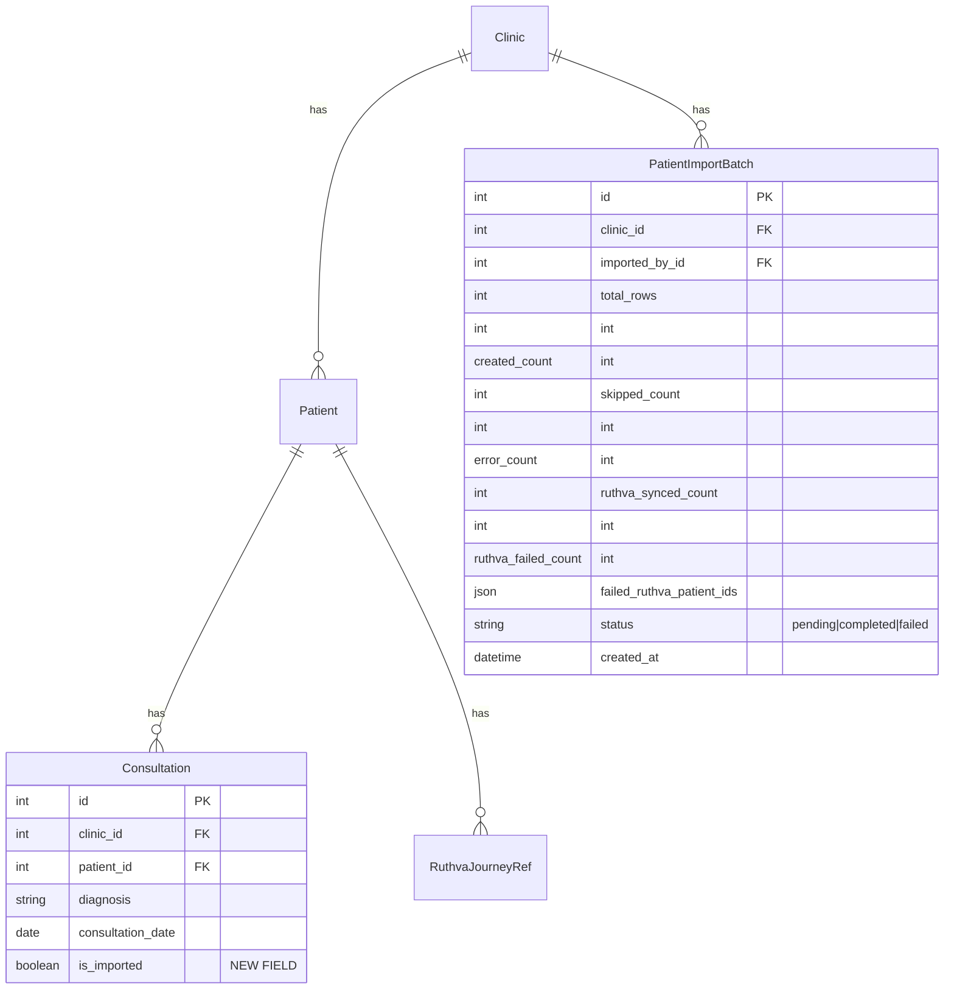

# Bulk Patient Import with Baseline Consultations and Ruthva Sync

## Overview

Enable doctors to import existing patients via CSV with auto-created baseline consultations, Ruthva adherence sync, and bulk management (delete/archive) on the patients list. This saves doctors significant time onboarding their existing patient base into the system.

## Problem Statement

Doctors with existing patient rosters (50-500+ patients) have no efficient way to bring them into the platform. The current import is buried in Settings (owner-only) and only creates patient records — no clinical baseline. Doctors must manually add each patient one by one, then create initial consultation notes separately.

## Proposed Solution

1. **Dedicated `/patients/import` page** with 3-step wizard (Upload → Preview → Results)
2. **Extended CSV import** with `diagnosis`, `last_seen_date`, `next_review_date` columns
3. **Auto-create baseline consultations** from imported diagnosis data
4. **Auto-sync to Ruthva** for adherence tracking when integration is enabled
5. **Bulk actions** on the patients list: multi-select with delete + toggle active/inactive

## Technical Approach

### Architecture

```
CSV Upload
    │
    ▼
┌─────────────────────┐
│  Import Preview API  │  POST /api/v1/patients/import/preview/
│  (validate + preview)│  Extended PatientImportService
└─────────┬───────────┘
          │
          ▼
┌─────────────────────┐
│  Import Confirm API  │  POST /api/v1/patients/import/confirm/
│  @transaction.atomic │
│  ┌────────────────┐  │
│  │ Create Patient  │  │
│  │ Create Consult. │  │  (if diagnosis provided)
│  │ Sync to Ruthva  │  │  (if next_review_date + integration enabled)
│  └────────────────┘  │
└─────────┬───────────┘
          │
          ▼
┌─────────────────────┐
│  Import Results      │  Show created/skipped/failed + Ruthva sync status
│  Retry Sync button   │  For failed Ruthva syncs
└─────────────────────┘
```

### ERD: New/Modified Models



### Implementation Phases

---

#### Phase 1: Backend — Extend Import Service + Baseline Consultations

**Goal:** Extend `PatientImportService` to handle new CSV columns and auto-create baseline consultations.

**Files to modify:**

##### `backend/patients/import_service.py`

Extend `_validate_row()` to parse 3 new optional columns:
- `diagnosis` — free text, optional
- `last_seen_date` — date, optional (parsed with existing `_parse_date()`)
- `next_review_date` — date, optional (parsed with existing `_parse_date()`)

Extend `import_patients()`:
- After `Patient.objects.create()`, if `diagnosis` is present:
  - Create `Consultation` with `diagnosis=diagnosis`, `consultation_date=last_seen_date or today`, `is_imported=True`
  - Handle `UniqueConstraint(clinic, patient, consultation_date)` — if conflict, append " (imported)" to make it the next day or skip consultation creation with warning
- Collect `next_review_date` per patient for Ruthva sync (Phase 3)
- Return extended result with `consultation_created_count`

```python
# backend/patients/import_service.py — pseudo-code for new logic

def import_patients(self, file_content, skip_duplicates=True, user=None):
    # ... existing patient creation loop ...

    patient = Patient.objects.create(clinic=self.clinic, **patient_data)
    self.created_count += 1

    # Auto-create baseline consultation
    if validated["data"].get("diagnosis"):
        consult_date = validated["data"].get("last_seen_date") or date.today()
        try:
            Consultation.objects.create(
                clinic=self.clinic,
                patient=patient,
                conducted_by=user,
                diagnosis=validated["data"]["diagnosis"],
                consultation_date=consult_date,
                is_imported=True,
            )
            self.consultation_created_count += 1
        except IntegrityError:
            # UniqueConstraint conflict — skip with warning
            self.consultation_warnings.append(
                f"Row {validated['line']}: consultation already exists for {consult_date}"
            )
```

##### `backend/consultations/models.py`

Add `is_imported` field:

```python
is_imported = models.BooleanField(
    default=False,
    help_text="True if created via CSV import (baseline record)",
)
```

Migration: `0006_consultation_is_imported.py`

##### `backend/consultations/migrations/0006_consultation_is_imported.py`

New migration to add the `is_imported` BooleanField with `default=False`.

**Validation edge cases:**
- `diagnosis` without `last_seen_date`: use today's date
- `last_seen_date` without `diagnosis`: ignore `last_seen_date` (no consultation to create)
- `next_review_date` in the past: accept but warn in preview ("review date is in the past")
- `last_seen_date` in the future: reject row with error
- Duplicate phones within the same CSV: skip second occurrence, warn in preview

**Tests:**

##### `backend/patients/tests.py`

- Test import with diagnosis + last_seen_date creates consultation
- Test import with diagnosis only (no last_seen_date) uses today
- Test import without diagnosis skips consultation
- Test consultation UniqueConstraint conflict handling
- Test duplicate phone within same CSV
- Test last_seen_date in future rejected
- Test next_review_date in past shows warning

---

#### Phase 2: Backend — Bulk Actions API

**Goal:** Add bulk delete and bulk toggle active/inactive endpoints.

##### `backend/patients/views.py`

Add two new actions to `PatientViewSet`:

```python
@action(detail=False, methods=["post"], url_path="bulk-delete")
def bulk_delete(self, request):
    """Delete multiple patients by ID. Requires IsDoctorOrOwner."""
    ids = request.data.get("ids", [])
    if not ids or len(ids) > 200:
        return Response({"error": "Provide 1-200 patient IDs."}, status=400)

    deleted_count, _ = self.get_queryset().filter(id__in=ids).delete()
    return Response({"deleted": deleted_count})

@action(detail=False, methods=["post"], url_path="bulk-toggle-active")
def bulk_toggle_active(self, request):
    """Toggle is_active for multiple patients."""
    ids = request.data.get("ids", [])
    is_active = request.data.get("is_active")  # True or False
    if not ids or len(ids) > 200 or is_active is None:
        return Response({"error": "Provide IDs and is_active value."}, status=400)

    updated = self.get_queryset().filter(id__in=ids).update(is_active=is_active)
    return Response({"updated": updated})
```

**Permission:** `IsClinicMember` (existing on ViewSet) — doctors and owners can both perform bulk actions. `TenantQuerySetMixin` ensures cross-tenant isolation.

**Security notes:**
- IDs are filtered through `get_queryset()` which applies `TenantQuerySetMixin` — only clinic's own patients can be affected
- Max 200 IDs per request prevents abuse
- Cascade delete will remove related consultations, prescriptions, and RuthvaJourneyRef records

##### `backend/patients/serializers.py`

Add simple request serializers for validation:

```python
class BulkPatientIdsSerializer(serializers.Serializer):
    ids = serializers.ListField(child=serializers.IntegerField(), min_length=1, max_length=200)

class BulkToggleActiveSerializer(BulkPatientIdsSerializer):
    is_active = serializers.BooleanField()
```

**Tests:**

##### `backend/patients/tests.py`

- Test bulk delete removes only clinic's patients (not cross-tenant)
- Test bulk toggle active/inactive
- Test max 200 limit enforced
- Test empty ids rejected
- Test cascade delete cleans up consultations

---

#### Phase 3: Backend — Ruthva Sync on Import

**Goal:** After successful patient import, sync patients with `next_review_date` to Ruthva.

##### `backend/patients/import_service.py`

Add Ruthva sync as a post-import step (outside the atomic transaction so import succeeds regardless):

```python
def sync_to_ruthva(self, patients_with_review_dates, user=None):
    """Sync imported patients to Ruthva. Non-blocking — failures are logged."""
    from integrations.services import RuthvaService
    from django.conf import settings

    if not getattr(settings, 'RUTHVA_API_URL', ''):
        return {"synced": 0, "failed": 0, "failed_patient_ids": []}

    svc = RuthvaService()
    synced = 0
    failed = 0
    failed_patient_ids = []

    for patient, consultation, next_review_date in patients_with_review_dates:
        days_until_review = (next_review_date - date.today()).days
        followup_interval = max(days_until_review, 1)
        duration_days = followup_interval * 4  # ~4 review cycles

        ref, error = svc.start_journey(
            clinic=self.clinic,
            patient=patient,
            consultation=consultation,
            duration_days=duration_days,
            followup_interval_days=followup_interval,
        )
        if error:
            failed += 1
            failed_patient_ids.append(patient.id)
            logger.warning("Ruthva sync failed for patient %s: %s", patient.id, error)
        else:
            synced += 1

    return {"synced": synced, "failed": failed, "failed_patient_ids": failed_patient_ids}
```

##### `backend/patients/views.py`

Update `import_confirm` to call Ruthva sync after import:

```python
@action(detail=False, methods=["post"], url_path="import/confirm")
def import_confirm(self, request):
    # ... existing file handling ...
    svc = PatientImportService(request.clinic)
    result = svc.import_patients(content, skip_duplicates=skip_duplicates, user=request.user)

    # Ruthva sync (non-blocking, outside transaction)
    ruthva_result = svc.sync_to_ruthva(svc.patients_for_ruthva, user=request.user)
    result["ruthva_sync"] = ruthva_result

    return Response(result, status=status.HTTP_201_CREATED)
```

Add retry endpoint:

```python
@action(detail=False, methods=["post"], url_path="import/retry-ruthva-sync")
def retry_ruthva_sync(self, request):
    """Retry Ruthva sync for specific patient IDs."""
    patient_ids = request.data.get("patient_ids", [])
    if not patient_ids:
        return Response({"error": "No patient IDs provided."}, status=400)

    patients = Patient.objects.filter(
        clinic=request.clinic, id__in=patient_ids
    ).select_related()

    svc = PatientImportService(request.clinic)
    results = []
    for patient in patients:
        consultation = patient.consultations.filter(is_imported=True).first()
        next_visit = # derive from patient context or request
        # ... sync logic ...

    return Response(results)
```

**Edge cases:**
- `RUTHVA_API_URL` not configured → skip sync silently, return `synced: 0`
- `next_review_date` in the past → still sync, Ruthva will handle risk level appropriately
- Patient already has active journey in Ruthva → 409 handled by existing `start_journey()` logic
- Network timeout → logged, patient added to `failed_patient_ids` for retry

**Tests:**

##### `backend/patients/tests.py` / `backend/integrations/tests.py`

- Test Ruthva sync called only when RUTHVA_API_URL configured
- Test sync failure doesn't roll back patient import
- Test failed_patient_ids returned correctly
- Test retry endpoint syncs only specified patients
- Mock RuthvaService for unit tests

---

#### Phase 4: Frontend — Dedicated Import Page

**Goal:** Build `/patients/import` with 3-step wizard.

##### `frontend/src/app/(dashboard)/patients/import/page.tsx`

New page with stepper UI:

**Step 1 — Upload:**
- Drag-and-drop CSV upload zone (reuse `FileUploadField` pattern from Settings)
- "Download CSV Template" button
- Brief instructions showing required/optional columns

**Step 2 — Preview:**
- Table showing first 10 rows with all columns
- Error rows highlighted in red with per-row error messages
- Warning rows in yellow (duplicates, past review dates)
- Summary: "X patients will be imported, Y will be skipped (duplicates), Z have errors"
- "Confirm Import" and "Cancel" buttons

**Step 3 — Results:**
- Success summary: "X patients created, Y consultations created"
- Ruthva sync status: "Z synced to Ruthva, W failed"
- If Ruthva failures: list of failed patients with "Retry Sync" button
- "View Patients" button to navigate to patient list
- Soft limit nudge: if clinic now exceeds 200 patients, show upgrade banner

```typescript
// frontend/src/app/(dashboard)/patients/import/page.tsx — component structure
type ImportStep = "upload" | "preview" | "results";

function PatientImportPage() {
  const [step, setStep] = useState<ImportStep>("upload");
  const [file, setFile] = useState<File | null>(null);
  const [preview, setPreview] = useState<ImportPreviewResult | null>(null);
  const [results, setResults] = useState<ImportConfirmResult | null>(null);

  // Step 1: Upload + validate
  // Step 2: Show preview, confirm
  // Step 3: Show results + Ruthva sync status
}
```

##### `frontend/src/lib/api.ts`

Add patient import methods to `dataPortabilityApi`:

```typescript
export const dataPortabilityApi = {
  // ... existing consultation/prescription imports ...

  previewPatientImport: (file: File, skipDuplicates = true) =>
    postCsvImportPreview("/patients/import/preview/", file, skipDuplicates),
  confirmPatientImport: (file: File, skipDuplicates = true) =>
    postCsvImportConfirm("/patients/import/confirm/", file, skipDuplicates),
  retryRuthvaSync: (patientIds: number[]) =>
    api.post("/patients/import/retry-ruthva-sync/", { patient_ids: patientIds }),
};
```

##### `frontend/src/lib/types.ts`

Extend import types:

```typescript
export type ImportConfirmResult = {
  created: number;
  skipped: number;
  errors: ImportPreviewRow[];
  consultation_created_count?: number;
  ruthva_sync?: {
    synced: number;
    failed: number;
    failed_patient_ids: number[];
  };
};
```

##### `frontend/src/components/patients/ImportPreviewTable.tsx`

New component for the preview step, showing extended columns including diagnosis, last_seen_date, next_review_date.

##### `frontend/src/components/patients/ImportResultsSummary.tsx`

New component for the results step with Ruthva sync status and retry button.

**CSV Template** (downloadable):

```csv
name,age,gender,phone,diagnosis,last_seen_date,next_review_date,email,date_of_birth,blood_group,address,whatsapp_number,occupation,allergies,food_habits
Ravi Kumar,45,male,9876543210,Chronic sinusitis,2026-03-01,2026-04-01,ravi@example.com,1981-05-15,B+,Chennai,9876543210,Engineer,,vegetarian
```

---

#### Phase 5: Frontend — Bulk Actions on Patient List

**Goal:** Add multi-select checkboxes and bulk action bar to `PatientTable`.

##### `frontend/src/components/patients/PatientTable.tsx`

Modify existing component:

1. Add checkbox column (header checkbox for select-all on current page)
2. Track `selectedIds: Set<number>` state
3. Show floating action bar when `selectedIds.size > 0`:
   - "X selected" count
   - "Delete Selected" button (red, with confirmation modal)
   - "Archive Selected" / "Activate Selected" button
   - "Clear Selection" button
4. After action: clear selection, refetch data

```typescript
// Pseudo-structure for bulk action bar
{selectedIds.size > 0 && (
  <div className="sticky bottom-4 mx-auto flex items-center gap-3 rounded-lg border bg-white p-3 shadow-lg">
    <span className="text-sm font-medium">{selectedIds.size} selected</span>
    <Button variant="secondary" size="sm" onClick={handleBulkArchive}>
      <EyeOff className="h-4 w-4" /> Archive
    </Button>
    <Button variant="secondary" size="sm" onClick={handleBulkActivate}>
      <Eye className="h-4 w-4" /> Activate
    </Button>
    <Button variant="danger" size="sm" onClick={() => setShowDeleteModal(true)}>
      <Trash2 className="h-4 w-4" /> Delete
    </Button>
  </div>
)}
```

##### `frontend/src/components/ui/ConfirmModal.tsx`

If not already existing — a reusable confirmation modal for destructive actions.

```typescript
type ConfirmModalProps = {
  open: boolean;
  title: string;
  message: string;
  confirmLabel?: string;
  variant?: "danger" | "warning";
  onConfirm: () => void;
  onCancel: () => void;
  isLoading?: boolean;
};
```

**Tests:**
- Checkbox selection/deselection
- Select-all selects only current page
- Bulk delete removes patients and refreshes list
- Bulk toggle updates is_active status
- Confirmation modal prevents accidental actions

---

## Acceptance Criteria

### Functional Requirements

- [ ] Doctor can upload CSV with extended columns (diagnosis, last_seen_date, next_review_date)
- [ ] Preview step shows validation errors, duplicate warnings, and past-review-date warnings
- [ ] Confirm creates patients + baseline consultations (marked `is_imported=True`)
- [ ] Baseline consultation uses `last_seen_date` as `consultation_date` (or today if omitted)
- [ ] Ruthva sync triggers automatically for patients with `next_review_date` when integration is configured
- [ ] Ruthva sync failures don't block patient import
- [ ] Manual "Retry Sync" button works for failed Ruthva patients
- [ ] Soft limit: import proceeds past 200 patients, shows upgrade nudge banner
- [ ] Downloadable CSV template available on import page
- [ ] Multi-select checkboxes on patient list with select-all
- [ ] Bulk delete with confirmation modal
- [ ] Bulk toggle active/inactive
- [ ] Both doctors and owners can access import page
- [ ] Import is fully tenant-isolated (only creates records for request.clinic)

### Non-Functional Requirements

- [ ] Import of 500 patients completes within 30 seconds
- [ ] Atomic transaction: if any patient creation fails, entire import rolls back
- [ ] Ruthva sync is outside the atomic transaction (non-blocking)
- [ ] Bulk actions capped at 200 IDs per request
- [ ] CSV template download is a static file (no API call)

## Dependencies & Prerequisites

- Existing `PatientImportService` (backend/patients/import_service.py)
- Existing `RuthvaService` (backend/integrations/services.py)
- Existing `dataPortabilityApi` pattern (frontend/src/lib/api.ts)
- Ruthva integration configured (`RUTHVA_API_URL`, `RUTHVA_INTEGRATION_SECRET` env vars)

## Risk Analysis & Mitigation

| Risk | Impact | Mitigation |
|------|--------|------------|
| Consultation UniqueConstraint conflict | Medium | Gracefully skip with warning, don't fail entire import |
| Ruthva API timeout during bulk sync | Medium | Sync outside transaction, log failures, offer retry |
| Large CSV performance | Low | Import is already streaming (csv.DictReader), DB writes are batched in transaction |
| Concurrent imports by same clinic | Low | `select_for_update()` on clinic for `record_id` generation already handles this |
| Cross-tenant data leak | Critical | `TenantQuerySetMixin` on all endpoints, `get_queryset()` filtering on bulk actions |

## References & Research

### Internal References

- Import service: `backend/patients/import_service.py`
- Patient views: `backend/patients/views.py:125-153`
- Consultation model: `backend/consultations/models.py:5-87`
- Ruthva service: `backend/integrations/services.py:104-165`
- Ruthva model: `backend/integrations/models.py:4-96`
- Patient table: `frontend/src/components/patients/PatientTable.tsx`
- API layer: `frontend/src/lib/api.ts:117-158`
- Frontend types: `frontend/src/lib/types.ts:387-406`

### Institutional Learnings

- Multi-tenant isolation requires `transaction.atomic()` with `select_for_update()` for critical mutations (docs/solutions/best-practices/phase5-multi-discipline-research.md)
- Patient list stale-after-create bug: ensure `useEffect` dependency tracking refreshes after bulk operations (docs/solutions/ui-bugs/patients-list-stale-after-create.md)
- All user-controlled values rendered in HTML must be escaped (XSS prevention)

### Brainstorm

- docs/brainstorms/2026-03-18-bulk-patient-import-brainstorm.md
