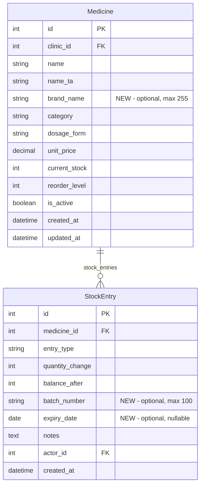

# feat: Add brand name, batch number, and expiry date to pharmacy

## Overview

Enhance the existing pharmacy module with three additions: brand name on medicines, batch number and expiry date on stock entries, and updated permissions so any clinic member can adjust stock. Expiry alerts UI is deferred until per-batch stock tracking is implemented.

## Problem Statement / Motivation

Clinics need to track which manufacturer/brand produces each medicine (e.g., "Kottakkal Arya Vaidya Sala" for "Ashwagandha Churnam") and record batch numbers and expiry dates when purchasing stock. Currently, the pharmacy module lacks these fields. Additionally, stock adjustments are restricted to doctors, but in practice, pharmacists and assistants handle inventory.

## Proposed Solution

Add `brand_name` to `Medicine`, add `batch_number` and `expiry_date` to `StockEntry`, update permissions on the `adjust-stock` action to allow any clinic member, and update all related serializers, frontend types, forms, and display components.

## Key Decisions

| Decision | Choice | Rationale |
|----------|--------|-----------|
| Brand name location | `Medicine` model | Brand is a property of the medicine itself |
| Brand searchable | Yes, in backend `search_fields` and frontend autocomplete + table filter | Doctors search by brand during prescriptions |
| Batch/expiry location | `StockEntry` model | Different purchases can have different batches/expiry dates |
| Expiry date required? | Optional with UI hint on purchases | Avoids blocking staff, nudges good data entry |
| Expiry alerts UI | **Deferred** | Without per-batch stock tracking, alerts would be inaccurate (showing consumed batches) |
| Stock adjust permissions | Any `IsClinicMember` | Pharmacists/assistants handle inventory, not just doctors |
| Batch/expiry on non-purchase entries | Not shown/accepted | Only relevant for purchases |

## ERD Changes

## Technical Considerations

- **Migration safety**: All new fields are nullable/blank — additive-only migration, no data loss risk. Single migration `0002_*.py`.
- **Tenant isolation**: `StockEntry` reaches clinic through `medicine__clinic`. Existing `TenantQuerySetMixin` on `MedicineViewSet` already scopes correctly. The `adjust-stock` action uses `self.get_object()` which respects tenant scoping.
- **Permission change**: Override `get_permissions()` on `MedicineViewSet` to use `IsClinicMember` (without `IsDoctorOrReadOnly`) for the `adjust_stock` action only. All other actions retain doctor-only writes.
- **Frontend type discrepancy**: Existing `MedicineCategory` and `DosageForm` TypeScript types are missing homeopathic categories and `pellets`. Fix this as part of the type updates.
- **Client-side search consistency**: `MedicineCatalogTable` does in-memory filtering on `name` and `name_ta`. Must add `brand_name` to match backend `search_fields` behavior.

## Acceptance Criteria

### Backend

- [x] `Medicine.brand_name` field added (CharField, max_length=255, blank=True, default="")
- [x] `StockEntry.batch_number` field added (CharField, max_length=100, blank=True, default="")
- [x] `StockEntry.expiry_date` field added (DateField, null=True, blank=True)
- [x] Migration `0002_add_brand_batch_expiry.py` created and tested
- [x] `MedicineViewSet.search_fields` updated to `["name", "name_ta", "brand_name"]`
- [x] `MedicineListSerializer` includes `brand_name`
- [x] `MedicineDetailSerializer` includes `brand_name`
- [x] `StockEntrySerializer` includes `batch_number` and `expiry_date`
- [x] `StockAdjustmentSerializer` accepts optional `batch_number` and `expiry_date`
- [x] `adjust_stock` view passes `batch_number` and `expiry_date` to `StockEntry.objects.create()`
- [x] `adjust_stock` action permission changed to `IsClinicMember` (any clinic member can adjust stock)
- [x] All other MedicineViewSet actions retain `IsDoctorOrReadOnly`

### Frontend

- [x] `Medicine` type in `types.ts` includes `brand_name: string`
- [x] `StockEntry` type in `types.ts` includes `batch_number: string` and `expiry_date: string | null`
- [x] Fix missing `MedicineCategory` values: add `mother_tincture`, `trituration`, `centesimal`, `lm_potency`, `biochemic`
- [x] Fix missing `DosageForm` value: add `pellets`
- [x] `MedicineForm.tsx`: add brand name input field (optional, between Name and Tamil Name rows)
- [x] `MedicineCatalogTable.tsx`: show brand name as muted subtitle under medicine name (like `name_ta`)
- [x] `MedicineCatalogTable.tsx`: client-side search filters on `brand_name` in addition to `name` and `name_ta`
- [x] `MedicineAutocomplete.tsx`: show brand name in dropdown (muted, after medicine name, before dosage_form)
- [x] `StockAdjustmentForm.tsx`: add batch number (text input) and expiry date (date input) fields, only shown when entry_type is "purchase"
- [x] `StockAdjustmentForm.tsx`: show hint text "Adding expiry date helps track medicine shelf life" near the expiry field
- [x] Medicine detail page (`pharmacy/[id]/page.tsx`): show brand name in header section
- [x] Medicine detail page: show batch number and expiry date columns in stock history table
- [x] `pharmacyApi.adjustStock()` in `api.ts`: accept `batch_number` and `expiry_date` in payload

## Implementation Sequence

### Phase 1: Backend (no frontend dependencies)

**Files to modify:**

1. `backend/pharmacy/models.py`
   - Add `brand_name` to `Medicine` (after `name_ta`)
   - Add `batch_number` and `expiry_date` to `StockEntry` (after `balance_after`)

2. `backend/pharmacy/serializers.py`
   - Add `brand_name` to `MedicineListSerializer.Meta.fields`
   - Add `brand_name` to `MedicineDetailSerializer.Meta.fields`
   - Add `batch_number`, `expiry_date` to `StockEntrySerializer.Meta.fields`
   - Add `batch_number` (CharField, required=False, default=""), `expiry_date` (DateField, required=False, allow_null=True, default=None) to `StockAdjustmentSerializer`

3. `backend/pharmacy/views.py`
   - Update `search_fields` to `["name", "name_ta", "brand_name"]`
   - Override `get_permissions()` to return `[IsClinicMember()]` when `self.action == "adjust_stock"`
   - Pass `batch_number` and `expiry_date` from validated data to `StockEntry.objects.create()` in `adjust_stock`

4. Run `python manage.py makemigrations pharmacy` to generate `0002_*.py`
5. Run `python manage.py migrate` to apply

### Phase 2: Frontend types and API

**Files to modify:**

6. `frontend/src/lib/types.ts`
   - Add `brand_name: string` to `Medicine` type
   - Add `batch_number: string` and `expiry_date: string | null` to `StockEntry` type
   - Add missing `MedicineCategory` values (5 homeopathic categories)
   - Add missing `DosageForm` value (`pellets`)

7. `frontend/src/lib/api.ts`
   - Update `adjustStock` method signature to include optional `batch_number` and `expiry_date`

### Phase 3: Frontend forms (create/edit flows)

**Files to modify:**

8. `frontend/src/components/pharmacy/MedicineForm.tsx`
   - Add `brand_name` to form state (default "")
   - Add input field for brand name (optional, styled like other text inputs)
   - Include `brand_name` in submit payload

9. `frontend/src/components/pharmacy/StockAdjustmentForm.tsx`
   - Add `batchNumber` and `expiryDate` to form state
   - Conditionally show batch/expiry fields when `entryType === "purchase"`
   - Add hint text near expiry date field
   - Include in `pharmacyApi.adjustStock()` call

### Phase 4: Frontend display (read flows)

**Files to modify:**

10. `frontend/src/components/pharmacy/MedicineCatalogTable.tsx`
    - Show `brand_name` as subtitle under medicine name (muted gray, like `name_ta` styling)
    - Add `brand_name` to client-side search filter logic (line ~33)

11. `frontend/src/components/pharmacy/MedicineAutocomplete.tsx`
    - Show `brand_name` in dropdown items (muted, between name and dosage_form)

12. `frontend/src/app/(dashboard)/pharmacy/[id]/page.tsx`
    - Show brand name in header section (under name/Tamil name)
    - Add Batch and Expiry columns to stock history table

## Out of Scope

- Expiry alerts UI (deferred until per-batch stock tracking exists)
- FEFO dispensing logic (auto-picking oldest expiry first)
- Per-batch stock balances
- DispensingItem batch reference
- Django admin updates (low priority)
- Brand as a separate model/entity
- Bulk import/export

## References

- Brainstorm: `docs/brainstorms/2026-03-18-pharmacy-enhancements-brainstorm.md`
- Existing models: `backend/pharmacy/models.py`
- Existing serializers: `backend/pharmacy/serializers.py:8-59`
- Existing views: `backend/pharmacy/views.py:22-66`
- Frontend types: `frontend/src/lib/types.ts:538-572`
- Frontend API client: `frontend/src/lib/api.ts:173-194`
- Medicine form: `frontend/src/components/pharmacy/MedicineForm.tsx`
- Stock adjustment form: `frontend/src/components/pharmacy/StockAdjustmentForm.tsx`
- Catalog table: `frontend/src/components/pharmacy/MedicineCatalogTable.tsx`
- Autocomplete: `frontend/src/components/pharmacy/MedicineAutocomplete.tsx`
- Detail page: `frontend/src/app/(dashboard)/pharmacy/[id]/page.tsx`
- Institutional learnings: Phase 5 migration patterns, Phase 2 tenant security
