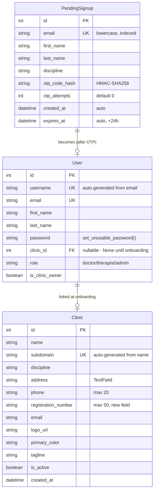

# Progressive Registration & Mandatory Onboarding

## Overview

Replace the current single-step, password-based signup with a progressive, passwordless (OTP-verified) registration flow. The new flow splits registration into two phases: a lightweight signup (4 fields + OTP), then a mandatory onboarding screen for clinic details. The landing page CTA shifts from login to registration as the primary conversion action.

## Problem Statement

1. **High signup friction**: Current form asks for 8 fields (clinic name, subdomain, discipline, username, email, password, first name, last name) — too much for a first impression
2. **Confusing login UX**: Anti-enumeration pattern on login page means unregistered users get no error, don't know why they never receive an OTP, and have no clear path to register
3. **Landing page mismatch**: All CTAs point to `/login`, but the primary goal for new visitors is registration, not login
4. **Password is unnecessary**: The system already uses OTP-based login; collecting a password at signup is redundant

## Proposed Solution

**Phase 1 — Signup (lightweight, 4 fields)**:
`Dr. [First Name] [Last Name]` + Email + Discipline → OTP verification → account created

**Phase 2 — Onboarding (mandatory, post-login)**:
Clinic Name + Phone + Address + Registration Number → clinic created → dashboard unlocked

**Landing page**: Primary CTA becomes "Register Your Clinic" → `/signup`
**Login page**: Add helper text "Don't have an account? Register your clinic →"

## Technical Approach

### Architecture

```
┌─────────────┐     ┌──────────────┐     ┌────────────────┐     ┌───────────┐
│  /signup     │────▶│  OTP verify  │────▶│  /onboarding   │────▶│ /dashboard│
│  (4 fields)  │     │  (inline)    │     │  (4 fields)    │     │           │
│              │     │              │     │  MANDATORY     │     │           │
│  PendingSign │     │  User created│     │  Clinic created│     │           │
│  up stored   │     │  clinic=None │     │  User linked   │     │           │
└─────────────┘     └──────────────┘     └────────────────┘     └───────────┘
```

**Key architectural decisions:**
- **Account created only after OTP verification** — no unverified users in the DB
- **Temporary signup data** stored in a `PendingSignup` model, cleaned up after 24 hours
- **User created with `clinic=None`** at OTP verification; Clinic created during onboarding
- **`username` auto-generated from email** (e.g., `doctor@clinic.com` → `doctor`, with collision suffix)
- **`subdomain` auto-generated from clinic name** during onboarding (e.g., "Green Leaf Clinic" → `green-leaf-clinic`)
- **Fully passwordless** — remove password from signup; existing password login endpoint kept but not exposed in UI
- **Onboarding gate**: `user.clinic_id is None` means onboarding incomplete → redirect to `/onboarding`

### ERD: New & Modified Models



### Implementation Phases

#### Phase 1: Backend — Models & Signup API

**Files to create/modify:**

- `backend/users/models.py` — Add `PendingSignup` model
- `backend/clinics/models.py` — Add `registration_number` field to Clinic
- `backend/users/serializers.py` — New `PendingSignupSerializer`, new `OnboardingSerializer`
- `backend/users/views.py` — New `initiate_signup`, `verify_signup_otp`, `complete_onboarding` views
- `backend/users/urls.py` — New endpoints
- `backend/users/otp.py` — Update email subject for signup vs login
- New migration files

**New endpoints:**

| Endpoint | Method | Purpose | Auth |
|----------|--------|---------|------|
| `/api/v1/auth/initiate-signup/` | POST | Store pending signup + send OTP | AllowAny, rate-limited |
| `/api/v1/auth/verify-signup-otp/` | POST | Verify OTP, create User, issue JWT | AllowAny |
| `/api/v1/auth/complete-onboarding/` | POST | Create Clinic, link to User | Authenticated |
| `/api/v1/auth/onboarding-status/` | GET | Check if onboarding is complete | Authenticated |

**Tasks:**

- [ ] Add `PendingSignup` model to `backend/users/models.py`
  ```python
  class PendingSignup(models.Model):
      email = models.EmailField(unique=True, db_index=True)
      first_name = models.CharField(max_length=150)
      last_name = models.CharField(max_length=150, blank=True, default="")
      discipline = models.CharField(max_length=30, choices=Clinic.DISCIPLINE_CHOICES)
      otp_code_hash = models.CharField(max_length=64)
      otp_attempts = models.PositiveSmallIntegerField(default=0)
      created_at = models.DateTimeField(auto_now_add=True)
      expires_at = models.DateTimeField()

      class Meta:
          ordering = ["-created_at"]

      @property
      def is_expired(self):
          return timezone.now() > self.expires_at

      @property
      def is_locked(self):
          return self.otp_attempts >= 5

      def save(self, *args, **kwargs):
          if not self.expires_at:
              self.expires_at = timezone.now() + timedelta(hours=24)
          super().save(*args, **kwargs)
  ```

- [ ] Add `registration_number` field to Clinic model in `backend/clinics/models.py`
  ```python
  registration_number = models.CharField(max_length=50, blank=True, default="")
  ```

- [ ] Create `PendingSignupSerializer` in `backend/users/serializers.py`
  - Fields: `email`, `first_name`, `last_name`, `discipline`
  - Validate email uniqueness against both `User` and `PendingSignup`
  - Normalize email to lowercase
  - If email exists in `User`: return error "This email is already registered. Sign in instead?"
  - If email exists in `PendingSignup`: delete old pending signup (allow re-registration)

- [ ] Create `initiate_signup` view in `backend/users/views.py`
  - Accept: `first_name`, `last_name`, `email`, `discipline`
  - Delete any existing `PendingSignup` for this email
  - Generate OTP, hash it, store in `PendingSignup`
  - Send OTP via SES with subject "Your verification code is {code}"
  - Rate limit: 5/min per IP (reuse `OTPRequestThrottle`)
  - Always use `transaction.atomic()`
  - Use `html.escape()` for any user data in email templates

- [ ] Create `verify_signup_otp` view in `backend/users/views.py`
  - Accept: `email`, `code`
  - Fetch `PendingSignup` by email
  - Check locked (5+ attempts) → delete, return 429
  - Check expired → delete, return 400
  - Verify OTP with constant-time comparison
  - On success:
    - Create `User` with `clinic=None`, `role="doctor"`, `is_clinic_owner=True`
    - Auto-generate `username` from email prefix (handle collisions with suffix)
    - Call `user.set_unusable_password()`
    - Delete `PendingSignup`
    - Issue JWT tokens (access + refresh)
    - Return tokens + `onboarding_required: true`
  - Wrap in `transaction.atomic()`

- [ ] Create `OnboardingSerializer` in `backend/users/serializers.py`
  - Fields: `clinic_name`, `phone`, `address`, `registration_number`
  - `clinic_name` required
  - `address` required
  - `registration_number` required (free text, max 50)
  - `phone` optional (max 20)
  - Auto-generate `subdomain` from `clinic_name` (slugify, handle collisions)

- [ ] Create `complete_onboarding` view in `backend/users/views.py`
  - Authenticated only
  - Check `request.user.clinic is not None` → return 400 "Already onboarded"
  - Create Clinic with provided fields + discipline from User (stored during signup? — see note below)
  - Link Clinic to User: `user.clinic = clinic; user.save()`
  - Return clinic details + `onboarding_complete: true`
  - Wrap in `transaction.atomic()`

- [ ] **Note on discipline storage**: Since discipline is collected at signup but belongs to the Clinic model, and the Clinic is created at onboarding, the discipline must be stored on the User temporarily. Options:
  - **Option A (recommended)**: Store discipline on `PendingSignup`, copy to User as a temporary field, then move to Clinic at onboarding. But adding a temp field to User is messy.
  - **Option B**: Store discipline on `PendingSignup`, and when creating the User at OTP verification, also pass it through in the JWT claims or response, and the frontend sends it back during onboarding.
  - **Option C**: Just include discipline in the onboarding form too (ask again). Simplest but slightly redundant.
  - **Recommended: Option B** — return `discipline` in the verify-signup-otp response, frontend stores it in auth context and sends it with onboarding.

- [ ] Create `onboarding_status` view — `GET /api/v1/auth/onboarding-status/`
  - Return `{ "onboarding_complete": user.clinic_id is not None }`
  - Or simply include `onboarding_complete` in the existing `GET /api/v1/auth/me/` response

- [ ] Add new URL patterns to `backend/users/urls.py`
  - `path("auth/initiate-signup/", initiate_signup, name="initiate-signup")`
  - `path("auth/verify-signup-otp/", verify_signup_otp, name="verify-signup-otp")`
  - `path("auth/complete-onboarding/", complete_onboarding, name="complete-onboarding")`

- [ ] Update OTP email template in `backend/users/otp.py`
  - Add a `purpose` parameter: `"login"` or `"signup"`
  - Login subject: "Your login code is {code}"
  - Signup subject: "Your verification code is {code}"

- [ ] Create Django migrations
  - Migration for `PendingSignup` model
  - Migration for `registration_number` on Clinic

- [ ] Add management command `cleanup_pending_signups` to delete expired records (>24 hours)

**Success criteria:**
- `POST /api/v1/auth/initiate-signup/` stores pending signup and sends OTP
- `POST /api/v1/auth/verify-signup-otp/` creates user with `clinic=None` and returns JWT
- `POST /api/v1/auth/complete-onboarding/` creates clinic and links to user
- Duplicate email returns clear error with login suggestion
- All mutations wrapped in `transaction.atomic()`
- Email addresses normalized to lowercase

#### Phase 2: Frontend — Signup Page Redesign

**Files to modify:**

- `frontend/src/app/signup/page.tsx` — Complete rewrite
- `frontend/src/components/auth/AuthProvider.tsx` — Add `initiateSignup()`, `verifySignupOTP()`, `completeOnboarding()`
- `frontend/src/lib/types.ts` — Update `SignupRequest`, add `InitiateSignupRequest`, `VerifySignupOTPRequest`, `OnboardingRequest`

**Tasks:**

- [ ] Update `frontend/src/lib/types.ts`
  ```typescript
  export interface InitiateSignupRequest {
    first_name: string;
    last_name?: string;
    email: string;
    discipline: Discipline;
  }

  export interface VerifySignupOTPRequest {
    email: string;
    code: string;
  }

  export interface OnboardingRequest {
    clinic_name: string;
    phone?: string;
    address: string;
    registration_number: string;
    discipline: Discipline;
  }
  ```

- [ ] Add methods to `AuthProvider.tsx`
  - `initiateSignup(data: InitiateSignupRequest)` → calls `/api/v1/auth/initiate-signup/`
  - `verifySignupOTP(data: VerifySignupOTPRequest)` → calls `/api/v1/auth/verify-signup-otp/`, stores tokens, redirects to `/onboarding`
  - `completeOnboarding(data: OnboardingRequest)` → calls `/api/v1/auth/complete-onboarding/`, refreshes user, redirects to `/dashboard`
  - Expose `onboardingComplete` derived from `user?.clinic !== null`

- [ ] Rewrite `frontend/src/app/signup/page.tsx`
  - **Step 1: Signup form**
    - Fixed "Dr." label prefix before first name input
    - Fields: First Name (required), Last Name (optional), Email (required), Discipline dropdown (required)
    - Real-time email availability check (reuse existing debounced check)
    - Duplicate email error: "This email is already registered. [Sign in instead →](/login)"
    - Bottom: "Already have an account? [Sign in](/login)"
    - Submit button: "Create account"
  - **Step 2: OTP verification** (same page, transitions like login page)
    - 6-digit numeric input, `inputMode="numeric"`, `autoComplete="one-time-code"`
    - "Back" button to return to step 1 (allows email correction, triggers new OTP)
    - "Resend" button with 60-second cooldown
    - Spam folder notice
    - Handle 429 (lockout): show error, transition back to step 1
  - Use design token colors (`bg-surface`, `text-brand-*`) instead of raw Tailwind
  - Framer Motion transitions between steps (respect `useReducedMotion`)
  - Lucide React icons

#### Phase 3: Frontend — Onboarding Page

**Files to create/modify:**

- `frontend/src/app/onboarding/page.tsx` — New page
- `frontend/src/components/auth/AuthGuard.tsx` — Add onboarding redirect logic

**Tasks:**

- [ ] Create `frontend/src/app/onboarding/page.tsx`
  - **Must be authenticated** — redirect to `/login` if no token
  - **Must NOT be onboarded** — redirect to `/dashboard` if `user.clinic` exists
  - Fields:
    - Clinic Name (required)
    - Phone Number (optional)
    - Clinic Full Address (required, textarea)
    - Doctor Registration Number (required, free text)
  - Submit button: "Complete setup"
  - No skip button — mandatory
  - Use design token colors
  - Lucide React icons

- [ ] Update `AuthGuard.tsx` to check onboarding status
  - If authenticated but `user.clinic === null` → redirect to `/onboarding`
  - If on `/onboarding` and `user.clinic !== null` → redirect to `/dashboard`
  - The `(dashboard)` layout wraps in `AuthGuard`, so this handles all dashboard routes

- [ ] Post-onboarding prompt
  - After successful onboarding submit, before redirecting to dashboard, show a brief prompt/toast: "Want to add your logo and social links? [Go to Settings →](/settings)"
  - Can be dismissed, redirects to `/dashboard` after 5 seconds or on dismiss

#### Phase 4: Frontend — Landing Page & Login Page Updates

**Files to modify:**

- `frontend/src/components/landing/Hero.tsx` — Change primary CTA
- `frontend/src/components/landing/Navbar.tsx` — Update nav links
- `frontend/src/app/login/page.tsx` — Add helper text

**Tasks:**

- [ ] Update `Hero.tsx`
  - Change primary CTA from "Start using Ruthva" → "Register Your Clinic"
  - Change link from `/login` → `/signup`
  - Keep secondary CTA "See how it works" as-is

- [ ] Update `Navbar.tsx`
  - Change "Dashboard" button to "Register" → `/signup` (for unauthenticated)
  - Keep "Sign In" text link → `/login`

- [ ] Update `frontend/src/app/login/page.tsx`
  - Add persistent helper text below the send-code button:
    ```
    Don't have an account? Register your clinic →
    ```
  - Link "Register your clinic" to `/signup`
  - The existing "New clinic? Register your clinic" link at the bottom can be kept or replaced with this

#### Phase 5: Cleanup & Security

**Tasks:**

- [ ] Add rate limiting to `initiate-signup` endpoint (reuse `OTPRequestThrottle`)
- [ ] Add rate limiting to `check-availability` endpoint (prevent email enumeration at scale)
- [ ] Remove or deprecate the old signup endpoint (`POST /api/v1/auth/signup/`) — keep for now but mark as deprecated
- [ ] Remove old `ClinicSignupSerializer` or keep as deprecated reference
- [ ] Update `frontend/src/lib/types.ts` — mark old `SignupRequest` as deprecated
- [ ] Escape user-controlled data in signup OTP email templates with `html.escape()`
- [ ] Add cleanup management command: `python manage.py cleanup_pending_signups` (delete expired >24h)
- [ ] Test all flows end-to-end

## Acceptance Criteria

### Functional Requirements

- [ ] Landing page primary CTA is "Register Your Clinic" linking to `/signup`
- [ ] Signup form has 4 fields: Dr. prefix + First Name, Last Name, Email, Discipline
- [ ] Signup sends OTP to email, verifies inline, creates account only after verification
- [ ] Duplicate email on signup shows "This email is already registered. Sign in instead?"
- [ ] After signup OTP verification, user is auto-logged in and redirected to `/onboarding`
- [ ] Onboarding form collects: Clinic Name, Phone, Address, Registration Number
- [ ] Onboarding is mandatory — dashboard is inaccessible until complete
- [ ] Post-onboarding shows prompt to add logo/social links in settings
- [ ] Login page has helper text: "Don't have an account? Register your clinic →"
- [ ] Anti-enumeration pattern on login page remains unchanged
- [ ] Returning users who haven't completed onboarding are redirected to `/onboarding`

### Non-Functional Requirements

- [ ] All email addresses normalized to lowercase before storage/comparison
- [ ] All account mutations wrapped in `transaction.atomic()`
- [ ] OTP hashed with HMAC-SHA256 (same as existing login OTP)
- [ ] Signup OTP rate-limited at 5/min per IP
- [ ] `check-availability` endpoint rate-limited
- [ ] User-controlled data escaped in email templates
- [ ] Expired `PendingSignup` records cleaned up after 24 hours
- [ ] `User.set_unusable_password()` called for new signups (no password stored)

### Quality Gates

- [ ] All existing OTP login tests still pass
- [ ] New signup flow tested end-to-end (happy path + edge cases)
- [ ] Onboarding gate tested (unauthenticated, authenticated-but-not-onboarded, fully-onboarded)
- [ ] Duplicate email handling tested
- [ ] OTP expiry and lockout tested
- [ ] Rate limiting verified

## Dependencies & Prerequisites

- Amazon SES configured and working (already in place)
- No new external dependencies needed
- Django migrations must be run before frontend changes are deployed

## Risk Analysis & Mitigation

| Risk | Impact | Mitigation |
|------|--------|------------|
| Existing users can't log in after changes | High | Login flow is not changed — only signup is rewritten |
| PendingSignup table grows unbounded | Low | Cleanup management command deletes expired records |
| Username collision on auto-generation | Medium | Append random suffix on collision; use `email` as fallback |
| Race condition on concurrent signups with same email | Medium | `PendingSignup.email` has `unique=True`; use `update_or_create` |
| Old signup endpoint still accessible | Low | Mark deprecated; remove in next release after verification |

## References & Research

### Internal References
- Brainstorm: `docs/brainstorms/2026-03-18-registration-and-landing-page-brainstorm.md`
- Current signup serializer: `backend/users/serializers.py:38-86`
- Current OTP flow: `backend/users/views.py:38-128`
- OTP utilities: `backend/users/otp.py`
- Auth provider: `frontend/src/components/auth/AuthProvider.tsx`
- Auth guard: `frontend/src/components/auth/AuthGuard.tsx`
- Landing hero: `frontend/src/components/landing/Hero.tsx`
- Landing navbar: `frontend/src/components/landing/Navbar.tsx`
- Login page: `frontend/src/app/login/page.tsx`
- Signup page: `frontend/src/app/signup/page.tsx`
- Security learnings: `docs/solutions/security-issues/phase2-team-management-security-review.md`
- URL collision learnings: `docs/solutions/logic-errors/django-duplicate-url-pattern-shadowing-405.md`

### Security Checklist (from institutional learnings)
- [ ] All email fields normalized to lowercase
- [ ] All mutations wrapped in `transaction.atomic()`
- [ ] Email template data escaped with `html.escape()`
- [ ] Rate limiting on all public auth endpoints
- [ ] No silent error swallowing on email send failures
- [ ] Distinct URL paths for different operations (no shadowing)
